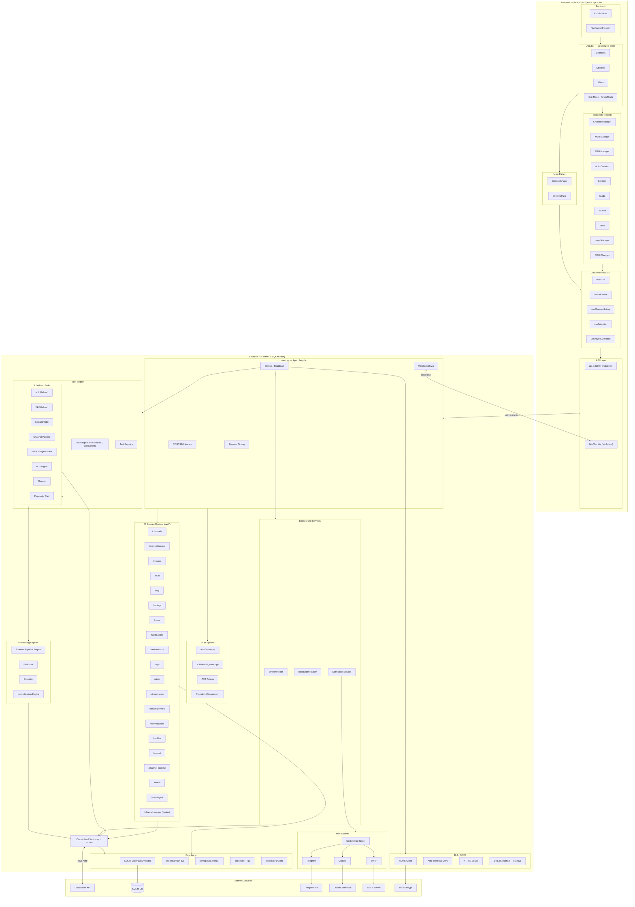
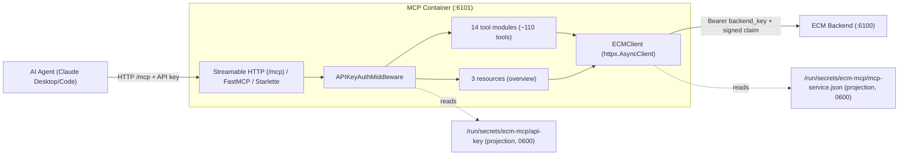

# ECM Architecture

## System Overview



## Request Flow

```
Browser → Frontend (React SPA on :6100/static/ by default)
       → HTTP/JSON → FastAPI (:6100/api/* by default)
                    → CORS middleware → Auth check → Router endpoint
                    → DispatcharrClient → Dispatcharr API (upstream)
                    → SQLAlchemy ORM → SQLite (/config/journal.db)
       → WebSocket → /ws (real-time status updates)
```

## Background Processing

```
Startup → TaskEngine (checks every 60s, max 3 concurrent)
        → M3U Refresh, EPG Refresh, Stream Probe, Channel Pipeline,
          M3U Change Monitor, M3U Digest, Cleanup, Popularity Calc
        → NotificationService → AlertMethods (Discord, SMTP, Telegram)
        → StreamProber (health checks, bitrate sampling)
        → BandwidthTracker (bandwidth stats polling)
        → TLS Renewal (24h check interval)
```

## Key Boundaries

| Boundary | Frontend | Backend |
|-|-|
| State | App.tsx useState (no Redux) | SQLite + in-memory cache |
| Auth | AuthContext + JWT in cookies | JWT validation + session management |
| API | api.ts (100+ named exports) | 20 routers in routers/ |
| Real-time | useStatusWebSocket hook | WebSocket /ws endpoint |
| Config | localStorage (filters, prefs) | /config/settings.json |

### MCP public-key authority and recovery

The owner-only `/run/secrets/ecm-mcp/api-key` projection is the single authority
for the public MCP client key. `settings.json:mcp_api_key` is a compatibility
mirror for older clients and migration only: generic settings saves ignore the
caller's value and copy the independently validated authority back into the
mirror. An explicit empty `api-key` is the durable revocation tombstone.

Dedicated rotate and revoke operations use `.api-key.recovery` as a transient
write-ahead redo record. `prepared` means the authority replacement was not
disclosed as complete and is startup-inert. `recovery-active` means the new
key, including an empty revocation, must be reapplied before a successor
transition can stage. A successor cannot replace that record until the
predecessor authority's parent-directory fsync succeeds, so recovery always
moves forward and never stores a credential pre-image that could resurrect a
revoked key. This is an internal recovery artifact, not an operator control;
manual edits or deletion can remove the only redo evidence for a completed
transition.

Ordinary startup distinguishes an absent artifact from one that is present but
untrusted. Invalid content, mode, owner, link count, file type, or a malformed
recovery record is preserved and cached as degraded state; ECM exposes no key
from that artifact but keeps health and JWT authentication available. Path and
metadata fingerprints invalidate that cache automatically after an operator or
peer repairs/replaces the artifact. Explicit saves, rotations, and revocations
remain fail-closed until the storage is trusted.

---

## Channel Pipeline Internals

`ChannelPipelineEngine` orchestrates a per-stream pipeline. For each stream in scope it builds a `StreamContext`, evaluates it against a rule via `ConditionEvaluator`, and on match hands the matched actions to `ActionExecutor`.

### Trigger model: event-driven, decoupled from M3U refresh (ADR-011)

The Channel Pipeline has **two** entry points, with distinct gating:

- **Manual "Run Now"**: `POST /api/channel-pipeline/run` (and `/rules/{id}/run`;
  the deprecated `/api/auto-creation/...` alias still works, see `docs/api.md`)
  go straight to `engine.run_pipeline`. **Never gated** by the run-on-refresh
  circuit breaker or the refresh watermark.
- **Unattended auto-fire**: `ChannelPipelineTask` (`tasks/channel_pipeline.py`) runs
  on an **INTERVAL schedule (~60s)** and decides for itself whether to run. It
  is the single auto-fire path (one breaker gate, one created-channel cap path,
  one notification style).

M3U refresh **no longer hard-chains** the Channel Pipeline. Instead, on every
successful refresh (scheduled `M3URefreshTask` or the manual single-account
poll in `routers/m3u.py`), the refresh advances a watermark
`last_m3u_refresh_completed_at` in settings.json (Q1: not change-gated). The
`ChannelPipelineTask` AUTO-FIRE GUARD then runs the post-refresh pipeline on its
next tick only when ALL hold: (a) task enabled; (b) `_run_on_refresh_suppressed()`
is False (exo4j breaker clear AND `ECM_DISABLE_RUN_ON_REFRESH` unset, read
fresh); (c) ≥1 `enabled AND run_on_refresh=True` rule exists (only that set
runs); (d) `last_m3u_refresh_completed_at > last_auto_creation_consumed_refresh_at`.
On run it consumes the watermark (advances `last_auto_creation_consumed_refresh_at`)
**before** running, so a crash or overlapping tick cannot re-fire against the
same refresh. Trade-off: ~60s latency after a refresh (Q3); a single failed M3U
account no longer suppresses the Channel Pipeline for the batch. See ADR-011.

```
ChannelPipelineEngine.run_pipeline() / run_rule()
  ├─ _load_existing_data · _load_rules · _fetch_streams · _load_stream_stats
  ├─ _apply_global_filters
  ├─ _probe_unprobed_streams → _batch_probe_streams          (ffprobe fill-in)
  │
  ├─ _process_streams:                                       [main loop, per stream]
  │    ├─ build StreamContext(stream, existing_data, stats)
  │    ├─▶ ConditionEvaluator.evaluate(StreamContext, rule)
  │    │       └─ returns match? action list?
  │    └─▶ ActionExecutor.execute(Action, ExecutionContext)
  │            ├─ _execute_create_channel   _execute_create_group
  │            ├─ _execute_merge_streams    _execute_assign_logo
  │            ├─ _execute_assign_epg       _execute_assign_tvg_id
  │            ├─ _execute_assign_profile   _execute_assign_channel_profile
  │            ├─ _add_stream_to_channel    _update_channel
  │            ├─ _ensure_channel_m3u_counts _match_epg_data
  │            └─ reload_epg_data           verify_epg_assignments
  │            → returns ActionResult
  │
  ├─ _reorder_channel_streams · _reconcile_orphans · _refresh_dummy_epg_and_retry
  └─ rollback_execution   [on failure — undoes created entities]
```

**Data currency (5 DTOs threaded through the pipeline):**

| DTO | Source | Role |
|-|-|-|
| `StreamContext` | `channel_pipeline_evaluator.py` | Stream + existing data + stats: input to evaluation |
| `Action` / `ActionType` | `channel_pipeline_schema.py` | The verb + its parameters |
| `ExecutionContext` | `channel_pipeline_executor.py` | Per-run rollback tracker |
| `ActionResult` | `channel_pipeline_executor.py` | Outcome reported back up the chain |

`ChannelPipelineEngine` has exactly three production collaborators: `ConditionEvaluator`, `ActionExecutor`, and `init_channel_pipeline_engine`. Everything else in its call graph is tests.

### Run terminal status & failure aggregation (y3m6o.1 / GH #720 Part 1)

A run finalizes to exactly one terminal `ChannelPipelineExecution.status`:

| Status | Meaning |
|-|-|
| `completed` | Every executed action succeeded (green). |
| `completed_with_errors` | ≥1 executed action/phase FAILED, but the run was not wholly aborted. Some channels/actions may have succeeded. Distinct from a blanket `failed`. The top-level `run_pipeline` result reports `success=False` and `failed_action_count`. |
| `capped` | The created-channel cap was hit. Takes precedence over `completed_with_errors`, but a compound capped+failed run persists BOTH the cap info AND the failed-action summary in `error_message`, and the result still reports `success=False`. |
| `failed` | The run was wholly aborted by an unrecoverable error. |
| `rolled_back` | A completed run was later reverted via rollback/undo. |
| `abandoned` | The run was left at `running` by a hard restart/OOM kill and crash-reconciled to `abandoned` on next boot by `task_engine._abandon_orphaned_auto_creation_executions` (GH #473 / bd-exo4j). Carries an "Abandoned: run was interrupted…" `error_message` and trips the run-on-refresh circuit breaker until an operator clears it. This transition lives in `task_engine`, NOT the engine's finalization branch, so it is easy to miss when enumerating the terminal set. It is nonetheless a genuinely persisted terminal status. |

The full persisted terminal set is therefore: `completed`, `completed_with_errors`, `capped`, `failed`, `rolled_back`, `abandoned` (transient: `pending`, `running`). Any poller/consumer must treat ALL six as terminal.

**One aggregation chokepoint.** Every executed-action/phase failure is recorded into `results["failed_actions"]`, the ONE list finalization keys on. Per-stream Pass 2 action failures funnel through `_record_failed_action`; the non-Pass-2 phases (Event Sync attach, Event Sync dummy-EPG, Pass 5 deferred-EPG retry, default-profile assignment) funnel through `_record_failed_phase`. Default-profile assignment is best-effort for the channel CREATE (a failed profile PATCH never aborts it) but its failure now escalates into aggregation, so such a run is not green.

**Direct-run vs task success semantics.** The engine's `run_pipeline` result is the honest record: `success = not failed_actions`, and `execution.status` persists `completed_with_errors`. The *task envelope* is intentionally softer (PO decision): the unattended `ChannelPipelineTask` returns `TaskResult(success=True, failed_count=N)` on a failed-action run, so the task engine emits ONE "Completed with Warnings" (with external alerts) rather than a hard "failed". Task History renders `failed_count>0` as an amber warning, never solid green.

**Non-rollbackable profile recovery.** `assign_channel_profile` mutates channel-profile membership, which has no reversible previous-state. It is therefore never recorded as a rollback/snapshot entity. A run that mutated membership persists a `non_reversible_profile_changes` warning; `to_dict` exposes `has_non_reversible_profile_changes`, and the executions UI's Rollback/Undo affordances disclose that membership will NOT be restored. Recovery is manual: re-run the rule (all profile-write paths are idempotent) or fix membership by hand.

## Stream Deduplication Pipeline (v0.17.1)

The interactive stream-to-channel deduplication feature (ADR-008) intercepts three trigger paths: drag-drop, "Add Stream" button, and bulk M3U refresh. It offers the operator a choice to **merge into an existing channel** rather than creating a duplicate.

### Database tables (migration 0014)

Two tables land in `journal.db`:

| Table | Purpose |
|-|-|
| `pending_merges` | Queue of pending dedup decisions. Rows carry `status` ∈ {`pending`, `merged`, `dismissed`}. Terminal rows are retained indefinitely as audit history. |
| `pending_merge_journal` | Discrete audit trail. One row per accept / dismiss / enqueue action, with queryable columns for `actor_token_id`, `action_type`, `trigger_context`, `confidence_score`, and timestamps. Separate from the existing `journal_entries` table. |

The `pending_merges` table uses a partial unique index on `(stream_name, candidate_channel_id) WHERE status='pending'` to prevent duplicate queue rows from repeat M3U imports of the same stream.

### Matcher service

`backend/services/dedup_matcher.py` implements `find_candidate(stream_name, candidates, threshold) -> MatchResult | None` using RapidFuzz `token_set_ratio`. A hard `CONFIDENCE_FLOOR = 0.60` is enforced in the matcher regardless of the operator-configured threshold. The matcher will never emit a candidate below 60% confidence (ADR-008 §D2). The Pydantic validator for `dedup_threshold` in `backend/config.py` imports this constant so the two layers stay locked to the same floor value.

### API surface (`backend/routers/channel_merges.py`)

Four endpoints under `/api/channel-merges/*` (ADR-008 §D1 D4-override, plural-noun path per the style guide):

```
GET  /api/channel-merges/candidates   — synchronous lookup (cacheable, idempotent)
GET  /api/channel-merges              — paginated queue list (status filter: pending/merged/dismissed)
POST /api/channel-merges/{id}/accept  — operator confirms merge (idempotent on terminal merged)
POST /api/channel-merges/{id}/dismiss — operator rejects candidate (idempotent on terminal dismissed)
```

Response envelopes follow the ECM flat-outcome pattern (no top-level `data` wrapper), matching the precedent at `POST /api/channels/merge`.

### Bulk M3U refresh hook (BD-F)

`backend/services/m3u_dedup_hook.py` is wired into `AutoCreationEngine._process_streams()` when `triggered_by='m3u_refresh'`. After the executor's exact and normalized channel-name lookups fail and before a new-channel `create_channel` call, the hook:

1. Calls `dedup_matcher.find_candidate()` with the operator-configured `dedup_threshold`.
2. On a match above the threshold: INSERTs a `pending_merges` row with `trigger_context='m3u_refresh'` and signals the executor to SKIP the new-channel creation.
3. On a collision with an existing pending row (§D5 partial unique index): logs at INFO and returns "skip creation". The existing row stays authoritative.
4. Increments the `ecm_pending_merges_queue_depth_added_total` counter (BD-M locked metric contract).

The hook fires only on the M3U-refresh path. Scheduled / manual Channel Pipeline runs are not affected.

### Interactive trigger flow

For drag-drop and Create-in-group triggers (the latter via the Streams pane
selection strip's "Create in…" menu since build 0161; previously a
right-click context menu):

```
Operator action (drag-drop / Create in… menu)
  └─ Frontend calls GET /api/channel-merges/candidates?stream_name=X&group_id=Y
       └─ Router → dedup_matcher.find_candidate()
            ├─ candidate found → StreamDedupModal displayed
            │    ├─ operator clicks "Merge into existing channel"
            │    │    └─ POST /api/channel-merges/{id}/accept
            │    │         → Dispatcharr merge call → pending_merge_journal row
            │    └─ operator clicks "Create new channel"
            │         └─ POST /api/channel-merges/{id}/dismiss → pending_merge_journal row
            └─ no candidate → new-channel creation proceeds as normal
```

### MCP tools (BD-O / BD-P)

Three new tools in `mcp-server/tools/dedup.py` expose the dedup queue to AI agents (ADR-008 §D7):

| Tool | Mirrors |
|-|-|
| `list_pending_channel_merges(group_id?, status?)` | `GET /api/channel-merges?status=…` |
| `accept_channel_merge(merge_id)` | `POST /api/channel-merges/{id}/accept` |
| `dismiss_channel_merge(merge_id)` | `POST /api/channel-merges/{id}/dismiss` |

The existing `add_stream` MCP tool is extended (BD-P) with a `dedup_action` parameter: `prompt` (return candidates for agent decision), `force_new` (skip dedup), or `merge_if_found` (auto-accept if above threshold). MCP-driven actions record `trigger_context='mcp_tool'` in the audit journal.

### Boundaries

The interactive dedup pipeline and the Channel Pipeline feature's own collision detection (`match_scope_target_group` / separate-not-merge, migration 0002 / bd-r9mtd) are **independent systems** that do not share a matcher. The interactive dedup path is the *attended* (operator-driven) surface; the Channel Pipeline feature is the *unattended* surface. A shared matcher service is a deferred backlog candidate.

See also: ADR-008 (`docs/adr/ADR-008-interactive-stream-dedup.md`), API reference (`docs/api.md` → Channel Merges section), operator guide (`docs/user_guide/channels-streams/stream-dedup.md`).

---

## Normalization ↔ Channel Pipeline Coupling

The normalization and Channel Pipeline subsystems are architecturally independent and coupled only via a singleton factory:

```
ChannelPipelineEngine._process_streams()
    └─ calls get_normalization_engine()         [singleton factory]
            └─ returns NormalizationEngine
                    ├─ normalize()              [public API]
                    ├─ extract_core_name()
                    ├─ test_rule() / test_rules_batch()
                    ├─ get_all_rules() / invalidate_cache()
                    └─ [internals: _load_rules, _match_condition, _match_compound_conditions,
                                    _match_tag_group, _apply_action, _apply_else_action,
                                    _apply_rules_single_pass, _apply_legacy_custom_tags]
```

The Channel Pipeline treats normalization as an opaque service: it obtains the engine via the factory and calls `normalize()`. No shared types, no shared state. The only other production caller of `NormalizationEngine` is `scripts/normalization_canary.py`.

## Frontend Edit-Commit UX Pattern

UI changes are not applied immediately. They're staged in memory, undo/redo-tracked, then flushed to the backend as a single bulk operation:

```
User interaction
  └─ useEditMode              [stages change in memory]
       │
       ├─ useChangeHistory    [undo/redo]
       │
       └─ on commit:
            ├─ api.bulkCommit()              → POST /api/channels/bulk-commit
            ├─ api.bulkMergeChannels()       → POST /api/channels/bulk-merge
            └─ api.bulkAssignChannelNumbers() → POST /api/channels/assign-numbers
                  └─ backend applies N operations, one at a time
```

Why: the channel list spans 27k+ streams. Per-change network calls would be unusably slow and would prevent the preview-and-commit UX entirely. Staging enables undo/redo, preview diffs, pre-commit validation, and a readable account of what landed when a bulk run goes wrong.

**The commit is not atomic, and nothing downstream should assume it is.** Dispatcharr exposes no transaction and no conditional update, so a bulk commit is N independent writes. Everything below about accounting, numbering order and compensation exists because that is the substrate. `POST /api/channels/bulk-commit` is also not one request per session: an Apply All issues one request for the creates and then one per 200 further operations, correlated by a shared `X-ECM-Batch-Id`.

**Lazy per-group stream loading** is a related optimization: the 27k streams are never loaded at once. Streams are fetched on demand per channel group as the user navigates.

### Edit Mode exit guard: what it covers

The active staged ledger lives in React state and is mirrored to `sessionStorage` so an interrupted session can be offered for explicit restore. Leaving Channel Manager still requires an operator decision: the exit guard offers **Apply**, **Discard** or **Keep Editing** before navigation tears down the active tree. What follows is its **observable behaviour**, which is the stable part; the mechanism behind it is under active change and is deliberately not described here.

| Way out | Guarded? | Behaviour with staged changes |
|-|-|-|
| Clicking ECM's own navigation away from Channel Manager | Yes | Exit dialog |
| In-app links that change route (Notification Center → task editor, **Clean up empty groups**) | Yes (bead `enhancedchannelmanager-6fi7p`) | Exit dialog |
| Browser **Back** / **Forward** | Yes (bead `enhancedchannelmanager-6fi7p`) | Exit dialog. Choosing to leave replays the history transition, so the operator lands on the entry they navigated to with surrounding entries intact; **Keep Editing** leaves them on Channel Manager, still in Edit Mode |
| **Sign Out** in the user menu | Yes (epic `enhancedchannelmanager-r93hq`) | Exit dialog. **Apply** applies and *then* signs out; **Keep Editing** cancels the sign-out |
| Navigating *to* Channel Manager | No, deliberately | Edit Mode survives it, so there is nothing to confirm |
| Closing the tab or reloading the page | Partly | The browser's own `beforeunload` prompt fires (`App.tsx`). This is a genuine page unload, not an in-app transition, so it is a separate mechanism with browser-controlled wording |

Two design points worth carrying forward:

- **The sign-out guard is not the route guard with a different caller.** The route guard exempts a destination of `channel-manager` because Edit Mode survives that navigation. Nothing survives a sign-out, so the sign-out guard has no such exemption, and it has no "exit Edit Mode and continue" case either: with nothing staged the tree unmounts regardless, so there is nothing to tidy.
- **A deferred navigation can leave state behind.** A caller that writes handoff state before requesting a route change (the Notification Center writes which scheduled task to open) must be able to take it back when the operator chooses **Keep Editing**. Otherwise the cancelled intent survives in `sessionStorage` and hijacks the next visit to any Settings page. Any new deferred-navigation caller inherits this obligation.

Before extending the guard, read the current implementation rather than this table: the coverage above is settled, the internals are in flight.

### The staged ledger: one persisted unit, three derived views

`stagedOperations` is **the** staged mutation state and the list Apply will send. Persistence serialises that list plus the undo grouping described below; every other staged view is reconstructed (`frontend/src/utils/stagedLedgerStorage.ts`).

`stagedGroups` and `stagedSideEffects` are **derived from it**, recomputed rather than maintained alongside it. That is a correctness property, not a tidiness one: the two were previously updated in parallel with the operation list, and an Undo that took an operation back could leave its group or side effect behind. Deriving them makes that class of drift unrepresentable.

**One companion is not derived, and it is not a derivation defect: the undo *grouping*.** `stagedOperations` records *what* will be applied; the undo stack records *how the operator grouped it*. Setting profile membership across twenty channels is twenty operations and one undo entry. `stagedOperationCount` is the undo-entry count, and the exit guard tests it before it will open the Apply dialog at all, so the two possible derivations are both wrong: one entry per operation would report twenty changes for one action, and none would make Apply unreachable. The grouping is therefore persisted alongside the operations as `undoGroups`.

Survival rules, all of them deliberate:

| Property | Behaviour |
|-|-|
| Storage | `sessionStorage`, so the ledger dies with the tab rather than sitting on disk |
| Key | **Fixed**, not per-operator: a foreign ledger has to be *findable* in order to be destroyed |
| Operator binding | Stamped with `auth_provider#user.id`. A ledger belonging to a different operator is **destroyed, not withheld**, in the first-render lazy initializer before the persistence effect can run |
| Age bound | 12 hours, covering an interrupted session while making "restored days later", where every id has had time to move, impossible |
| Restore | **Offered, never automatic**, because part of a ledger may fail staleness checks and a silent restore drops the operator into Edit Mode holding a quietly smaller ledger with Apply as the next action |
| Format version | A persisted record from an older shape is discarded rather than migrated. Version 3 adds bulk-create `expectedStreamIds`; version 2 is rejected because a create-only record cannot reveal whether stream intent was lost |

The baseline snapshot is deliberately **not** persisted. A restored session re-captures it from the current lineup, so concurrency checks compare against today's server state rather than a stale one.

### Router history: the `ecmRouteIndex` / `ecmRouteEpoch` contract

`useHashRoute` keeps two values in `window.history.state` on every entry it creates:

- **`ecmRouteIndex`** is an **ordinal within a numbering run**, not a global position in the browser's history stack. The router cannot see the real stack, so it numbers only the entries it created itself.
- **`ecmRouteEpoch`** identifies the run. It increments whenever the router has to re-anchor, which happens when it accepts an entry it never numbered or when a correction chase spends its budget.

**Deltas are only ever computed inside one run.** A delta across an epoch boundary is *refused* rather than computed wrongly, and callers fall back to navigating by hash. This is what makes the Edit Mode exit guard able to replay a vetoed Back or Forward: it needs to know how far to travel, and a wrong delta moves the operator somewhere they never asked to go.

The practical consequence for anyone touching routing code is the rule in [`docs/style_guide.md`](style_guide.md#frontend-react): **never pass `null` as the state argument to `replaceState` on a route entry.** It un-numbers the entry the operator is standing on, and an unnumbered entry is exactly the case the guard cannot rewind by delta.

### Channel numbering: preflight, ordering, compensation

Four mechanisms, in the order a commit meets them.

**1. Final-state preflight, run on both sides.** Validating staged numbering operations one at a time misses collisions that only the combined result produces. So both sides materialise the proposed final lineup (server state plus every staged create, update, move, delete and range assignment) and validate *that*.

| | Browser | Server |
|-|-|-|
| Modules | `frontend/src/utils/channelNumberPlan.ts` | `backend/channel_number_plan.py` |
| Can name | the staged operations the operator recognises | the request's own operations |
| Covers | the ECM UI | any caller, including ones that never touch the UI |
| If the lineup cannot be read | **refuses**, and nothing is sent | reports `numbering_preflight_unavailable` and lets `continueOnError` decide |

The asymmetry in that last row is intentional. The browser has already run its own check by the time it sends, so ECM's Apply sends `continueOnError: true`; a third-party caller has not, so the default refuses.

**These are two hand-mirrored implementations, not one shared contract.** The magnitude constants and the placement algorithm are duplicated across the language boundary and cross-referenced only in comments. There is no parity test between them. Treat the agreement as a maintained convention and the highest drift risk in this area, not as a guarantee.

**2. Write ordering (`order_numbering_writes`, `backend/channel_number_apply.py`).** Ordering does not make a swap *possible*: duplicate numbers are legal upstream, so any order eventually converges. It makes every intermediate state one the operator would recognise, which is what makes a half-finished run readable.

The pass builds edges from each write's target slot to every write still leaving that slot, then emits everything unblocked, repeatedly. When nothing is unblocked, there is a cycle, and one member must be released early onto a transiently shared number. **The member chosen is the earliest-submitted member of the *discovered* cycle**, not the walk's starting node, which may be a chain feeding into the cycle rather than part of it. Termination is guaranteed because each pass emits at least one write and no write is emitted twice; the ordering invariant is verified exhaustively over every plan shape fitting in four channels and four numbers.

Cycles are logged and go nowhere else. They are not surfaced in the envelope or the UI, so nothing tells the operator a number was transiently shared.

**3. Compensation.** When some numbering writes landed and others failed, a compensating write back to each channel's pre-run value is **attempted**, replayed newest-first (the landed set is a prefix of the safe order, so walking it backwards is itself a safe order). Where a compensating write also fails, the channel and the exact remedial step surface as `numberingRecovery` on the envelope, and the UI folds them into the existing "Some Changes Were Not Applied" dialog rather than inventing a new surface.

**This is best effort, not a rollback**, and the boundary matters: a compensating write is attempted for every write that landed, but nothing guarantees it succeeds. It also does not run at all on the crash and cancellation paths, which sit outside the block that performs it.

**4. Pre-Apply read and reconcile.** Before Apply writes anything, the browser re-reads the lineup and compares **baseline against server**, scoped to the channels this session will actually write. Re-asserting the same value is not exempt, because agreeing by accident is not agreeing.

Where a number moved underneath the session, the operator answers per channel. There is **no default selection** and Apply stays disabled until every row is answered, because a pre-ticked "keep mine" is a silent overwrite wearing a checkbox. Two rules fall out of that reconciliation and are easy to get wrong:

- **A range renumber is dropped whole, never partially.** Its numbers run in sequence, so keeping the server's value for one member would move every channel after it to a number the operator was never shown.
- **An automatic rename travels with a surrendered number.** If the staged name is exactly what the numbering-driven rename would have produced, it is withdrawn alongside the number. A name the operator *typed* is untouched, because it is not what the rename would have produced.

**A created channel whose number a later staged operation owns is created unnumbered**, and placed by that operation. The create is still emitted, because everything naming its temp id depends on it existing; only the number and its duplicate consent come off. Dispatcharr therefore picks a number at creation and the owning write moves it. The deliberate trade: if that owning write fails, the channel exists on Dispatcharr's number rather than on a superseded number the operator typed.

### `backend/bulk_commit_accounting.py`: the accounting authority

Bulk commit reports counters an integrator acts on, and for a long time no single place enforced that they were consistent. Three review rounds fixed three reproductions of the same defect before the *property* was enforced in one place, over every operation type. `OperationLedger` is that place.

It is the **sole writer of `operationsApplied` and `operationsFailed`**. A branch in `routers/channels.py` cannot get the counters wrong by forgetting to increment, because it has nothing to increment; `finalize_bulk_commit_result` derives `success` and `partial` from the ledger alone.

It is also the **sole queue for journal rows**. Both of its "a write landed" methods take a required journal row, so there is no way to record a landed upstream write without also recording what to journal about it. A write that genuinely has nothing to record must say so by name, with a reason, through `nothing_to_journal`: an explicit sentence a reviewer can disagree with, rather than an omission nobody can see.

**Be precise about that second role: the ledger is the queue, not the writer.** Rows are drained and written by a separate module-level function, and the batch summary row bypasses the ledger entirely and is counted by hand. `journalRowsUnwritten` on the envelope is likewise not a ledger concept; it is the count of rows the journal refused, plus one if the summary row also failed.

Enforcement is by raised exception, never by assertion or log line. `bulk_commit_accounting_violations` audits the finished envelope and `finalize_bulk_commit_result` raises `BulkCommitAccountingError` on any violation, so a self-contradictory envelope cannot ship quietly. The invariants are stated in full in the module docstring; the two that most affect callers are that every operation resolves to exactly one outcome, and that an operation whose upstream write landed is never reported as a total failure, because reporting one as a failure is what makes an integrator retry and create the entity twice.

One limit is deliberately not papered over: an operation with more than one upstream side effect can land the first and fail the second. `deleteChannelGroup` reparents a group's channels and then deletes the group. The envelope has one outcome per operation and cannot express "the channels moved but the group is still there", so such an operation is reported as a failure, because marking it applied would be the worse lie. What the journal rules recover is visibility: the partial side effect is recorded per moved channel.

## MCP Server

A separate container (`mcp-server/`, default port 6101) exposes ECM operations to AI agents via the Model Context Protocol. Runs as a Starlette app with the Streamable HTTP transport: a single `/mcp` endpoint. Claude Desktop (via the `mcp-remote` bridge) and Claude Code connect over HTTP.



**Tool modules (13 domains):** `channels`, `channel_groups`, `streams`, `m3u`, `epg`, `channel_pipeline`, `tasks`, `stats`, `system`, `notifications`, `profiles`, `normalization`, `dedup`.

**Resources (read-only):** `ecm://stats/overview`, `ecm://channels/summary`, `ecm://tasks/status`.

**Auth model (three distinct credentials):**

- **Inbound (MCP client → MCP server):** the public client key, named `mcp_api_key` in API and UI terminology, has its sole live authority at `/run/secrets/ecm-mcp/api-key` and is accepted only as `Authorization: Bearer`; query credentials are rejected. The sidecar has no `/config` mount, so it cannot read `settings.json`, `auth_settings.json`, the journal, TLS keys, or backups (`enhancedchannelmanager-04c0u.8`). The key is re-read on every request, so rotation and revocation take effect without restart. Compose publishes MCP on host loopback by default. The explicit remote overlay requires HTTPS as reported by an operator-configured trusted proxy. Exact Host and browser Origin allowlists protect every route, and the MCP SDK independently repeats both checks at its transport boundary. Uvicorn's raw-target access log is disabled; a bounded MCP access log records only method, decoded path (never query), and status.
- **Outbound (MCP server → ECM backend):** a *different*, never-disclosed `backend_key` from the owner-only `mcp-service.json` projection, plus a request-bound single-use claim signed with a third credential, `confirmation_key` (`enhancedchannelmanager-04c0u.7`). The public `mcp_api_key` is never accepted by the backend's sidecar principal. `ECMClient` recreates the httpx client on key change.

**Sidecar credential projection.** ECM writes `api-key` and `mcp-service.json` under `MCP_SECRETS_DIR` (`/run/secrets/ecm-mcp` in the current Compose deployment) with mode `0600` and the backend's own uid. The sidecar runs under the same `PUID`/`PGID`, which is the only reason it can read them; `get_mcp_backend_credentials_status()` fails readiness on any other owner or mode. The three credentials are independently generated; none is derived from another.

**Dispatcharr settings and MCP compatibility mirror (bd-jmi1c, GH #273).** `/config/settings.json` holds the Dispatcharr connection fields and a compatibility mirror of the public MCP key. It is not the source of live MCP authentication. The lexical similarity of the legacy Dispatcharr alias and the MCP mirror was the root cause of GH #273 (operators copying the MCP key into the Dispatcharr token slot):

| Field | Role | Used by |
|-|-|-|
| `dispatcharr_api_key` (canonical, v0.17.1+) | Dispatcharr REST API token | `backend/dispatcharr_client.py` → X-API-Key header on outbound calls to Dispatcharr |
| `api_key` (deprecated alias) | Same Dispatcharr REST API token, mirrored from `dispatcharr_api_key` on save for one release of back-compat | External scripts that read `settings.json` directly. **Removed in v0.19.0 per `enhancedchannelmanager-ewm4h`** |
| `mcp_api_key` | Compatibility mirror of the public MCP client key | Older clients and legacy migration only; never the sidecar's live authority or an MCP→ECM backend credential |

The rename in v0.17.1 (`api_key` → `dispatcharr_api_key`) eliminates the Dispatcharr field-name collision; `load_settings()` migrates legacy → canonical on first read with a one-time-per-process WARN, and `save_settings()` mirrors canonical → legacy on write so external readers stay current until the legacy field is removed. Separately, generic settings saves discard submitted or manually edited `mcp_api_key` values and repair the mirror from the independently validated `api-key` authority. The sidecar's private backend and confirmation credentials live only in `mcp-service.json`. The MCP mirror and Dispatcharr key remain credential-class data: every export path (`routers/backup.py` ZIP export, `routers/channel_pipeline.py` debug bundle, YAML export) MUST redact them via the shared `_SETTINGS_CREDENTIAL_FIELDS` tuple in `backup.py`. See the README setup section for the operator-facing migration walkthrough.

**Compound tools:** most tools wrap a single ECM endpoint, but some orchestrate multiple calls. Examples:

- `set_logo_from_epg(channel_ids)` (per channel): read channel → read EPG entry → create-or-find logo → PATCH channel.
- `build_channel_lineup(channels, group_id, provider_id, market)`: bulk-create channels via `/bulk-commit`, fetch the created channels, fuzzy-match streams per channel using shared `_score_match` / `_generate_variants` helpers from `tools/streams.py`, then assign matched streams.

**Deployment:** `ECM_URL=http://ecm:6100` uses the internal Docker network. ECM mounts the dedicated `ecm-mcp-secrets` volume read-write at `/run/secrets/ecm-mcp`; the sidecar mounts that volume read-only and does not mount `/config`. Operators generate, rotate, and revoke the public key only under *Settings → MCP Integration* and copy generated or regenerated values directly from the UI into clients.

## User Attribution Pipeline

On each bandwidth poll (~5s cadence), the `BandwidthTracker` (persisted
path) and the on-demand `/api/stats/channels` enrichment (live path)
cross-reference active stream sessions against the live-sessions API of
each configured media server (Emby, Plex, Jellyfin). Attribution is
**networking-agnostic**: it works whether ECM observes a connection's
source as the configured server IP, the host IP, a Docker bridge gateway
(`172.18.0.1`), a NAT'd address, or a container IP. This was redesigned in
bd-mlcla; the brittle source-IP gate it replaced is described under
*Superseded model* below.

### How it works (per channel)

The unit of reconciliation is a channel, not a single `(channel, ip)`
pair. For each channel:

1. **Resolvers return the matched-user SET for any IP** (no gate). Each
   per-source resolver runs a tiered match against its cached session
   list (Tier 1 channel-name → Tier 2 channel-number → Tier 3 fuzzy
   stream-name) and returns every matched session, sorted most-recent
   first. The IP is no longer a reject condition; it is demoted to a
   ranking hint (see step 3). **Tier 3 fuzzy stays server-IP-gated**
   internally to avoid VOD/library false positives. Fuzzy matching is
   only trusted for connections that egress through the server IP.
2. **Eligible connections** = the channel's Dispatcharr `/proxy/ts/status`
   connections that do **not** carry a per-client identity. A connection is
   excluded (kept out of media-server reconciliation and attributed via the
   bd-gy5nd provider/hostname path instead) when it has a **Dispatcharr
   ACCOUNT identity**: a positive `user_id` (and resolved `username`) on the
   client dict, meaning the viewer authenticated to Dispatcharr with a real
   sub-account (e.g. `kmfelmer`, `user_id=3`). Anonymous connections are
   Dispatcharr `user_id` `"0"` / `0` / `None`, which is how Dispatcharr
   serves EVERY media-server pull (the transcoding proxy AND NAT'd
   browser-direct playback); they carry no account identity and **are** eligible.
   This per-connection account-identity test is the discriminator: it
   replaces both the old per-IP gate and the (incorrect, bd-4w9w6)
   channel-upstream-URL discriminator. The channel's **upstream provider
   URL** (`ch["url"]`, e.g. `https://provider/live/<user>/<pass>/<id>.ts`) is
   the operator's PROVIDER ACCOUNT, shared by every viewer of the channel; it
   feeds the bd-gy5nd provider/hostname label but is **not** a per-client
   identity and does **not** exclude any connection from reconciliation. The
   provider label and the media-server user are independent surfaces. A
   viewer can watch an XC-sourced channel through Emby/Plex/Jellyfin and
   carries both.

   > **bd-4w9w6 correction:** the original bd-mlcla wiring derived a
   > per-connection `has_url_identity` flag from the channel-upstream URL and
   > excluded the connection when it embedded XC credentials. Because nearly
   > every XC-sourced channel has such a URL, that excluded essentially all
   > media-server-mediated viewers, silently dropping every match to "User
   > #0" (the live TSN5/Jellyfin bug). The discriminator was conflating the
   > channel's upstream source with the client's identity.
   >
   > **bd-rools correction (re-fix for the bd-cat70 direct-client
   > cross-attribution):** bd-4w9w6 first set `has_url_identity=False`
   > unconditionally, which fixed User #0 but (because the resolver is no
   > longer IP-gated and returns the channel's full matched-user set for ANY
   > source IP) re-exposed the bd-cat70 cross-attribution: a genuine direct
   > XC subscriber sharing a channel with a media-server viewer would, via the
   > B1 direct-first ordering, ABSORB that media-server user (`kmfelmer`'s row
   > showing `MotWakorb`; the real viewer dropped to User #0). The real
   > per-client signal is the **Dispatcharr account identity** (`user_id` /
   > `username` on the `/proxy/ts/status` client dict), implemented as the
   > `Connection.has_account_identity` flag set at both call sites
   > (`routers.stats._build_attribution_connections` and
   > `bandwidth_tracker._build_persisted_connection`). An account-identity
   > connection is excluded from `eligible_connections()` and never flagged
   > `is_server_proxy`; `has_url_identity` remains `False` at both call sites.
3. **IP is a ranking hint only, never a gate.** Connections whose source
   IP falls in the trusted/infrastructure set sort first when pairing
   users to connections. The trusted set is the union of: the resolved
   media-server IP(s), the operator-configured `trusted_media_networks`
   setting (CIDRs or bare IPs), and auto-detected local Docker bridge
   gateways. Getting the ranking wrong can only change tie-break order,
   never which users attribute: an unknown IP is ranked lower, not
   rejected.
4. **Set reconciliation** assigns users to connections with three
   structural guarantees: each candidate user is consumed **at most once**
   (anti-collapse: one user can never land on two connections, the
   bd-ost8o regression); assignment is **per-connection** (anti-broadcast:
   never stamp one user onto every connection, the bd-cat70 *fan-out*
   form); and surplus users (`users > connections`) surface only in the
   channel-level viewer list, never as a synthesized phantom connection.

   > Note the two distinct bd-cat70 shapes. The **fan-out** form (one
   > resolver hit broadcast to every connection) is prevented here, by the
   > per-connection at-most-once assignment. The **direct-client
   > cross-attribution** form (a genuine direct XC subscriber absorbing a
   > media-server viewer it shares a channel with) is NOT prevented by the
   > assignment model. A non-IP-gated resolver would happily offer the
   > subscriber the media-server users, and B1 direct-first ordering would
   > pair them. That form is prevented one step earlier, by the
   > **account-identity discriminator** in step 2: the subscriber carries a
   > Dispatcharr account identity and is excluded from
   > `eligible_connections()` before assignment runs (bd-rools).
5. **Server-proxy carries the remainder** (bd-mlcla B1 + bd-r5f0c.9). A
   connection whose source IP equals the resolved server IP is the media
   server's own transcoding proxy pull, which can carry multiple upstream
   viewers on one Dispatcharr connection. The **direct (non-proxy)
   connections are reconciled first**, each consuming a distinct user; the
   server-proxy connection then carries the **remaining (unconsumed)**
   users as its rollup. This guarantees a browser-direct viewer sharing a
   channel with a proxy pull always gets its own distinct name whenever an
   unconsumed matching user exists. The proxy never suppresses it to
   "User #0". A proxy serving N app-viewers with no direct connection still
   carries the full set unchanged. (The `is_server_proxy` flag is exact
   source-IP-equality with no corroborating signal, so a browser-direct
   connection whose observed IP happens to equal the server IP (e.g. a
   browser run on the media-server host) is mis-flagged as the proxy;
   the direct-first ordering bounds the blast radius to that one
   connection's display label, never another viewer's attribution.)
6. **Option-B rollup for unresolvable ties.** When a group of 2+ direct
   connections shares one IP-priority bucket (no signal to order them) AND
   is offered 2+ distinct candidate users, the connection-to-user mapping
   is genuinely ambiguous. Rather than pin a possibly-wrong single name to
   each row, every connection in the group renders a
   `"N viewers: <comma-separated list>"` rollup label. The channel-level
   distinct set remains exactly correct; only the per-connection identity
   is shown as a rollup.

The reconciler lives in
[`backend/services/attribution_reconciler.py`](../backend/services/attribution_reconciler.py)
(`reconcile_channel`); the live path wires it through
`routers/stats.py:_enrich_one_source` and the persisted path through
`bandwidth_tracker.py:_resolve_attributions`.

### Output surfaces

The bandwidth tracker writes the viewer list (JSON-encoded) to
`session_telemetry.<source>_viewers`, and the most-recent viewer's name
(or the Option-B rollup label) to the legacy
`session_telemetry.<source>_user_name` column. The `/api/stats/channels`
endpoint surfaces both per channel and per client; prefer the array form.

### Persisted-path same-NAT-IP limitation

The **live** path (`/api/stats/channels`) keys connections by Dispatcharr's
stable per-connection `client_id`, so it distinguishes two browser-direct
viewers even behind the same NAT IP. The **persisted** path
(`session_telemetry`) keys rows by `(channel, ip)`, so two browser-direct
viewers behind the **same NAT IP** collapse to **one telemetry row**. The
persisted path attributes that row to the single top-ranked matched user
(the second viewer is not persisted on this path; it still surfaces on the
live Stats page and in the channel-level viewer list). This is a known
limitation, not a bug: per-`client_id` telemetry granularity is future
work. The collapse is pinned by
`tests/unit/test_bandwidth_tracker_mlcla_attribution.py::test_n1_same_nat_ip_collapses_to_one_telemetry_row`
so it cannot silently drift.

### Caching & failure isolation

Each source has a 5-second TTL cache of upstream sessions with
thundering-herd lock + stale-fallback on upstream failure. The resolver
never raises. Upstream failures degrade the row's attribution to NULL
without affecting the telemetry write. The three resolvers run via
`asyncio.gather` with per-source 2s timeouts: a slow Plex does not stall
Emby or Jellyfin attribution.

### Superseded model (pre-bd-mlcla)

Earlier builds short-circuited the resolver when the client IP did not
match the upstream media server's IP (`if ecm_session_ip != server_ip:
return []`) and broadcast a single resolver hit to every connection on the
channel. Both assumptions broke under Docker networking: browser-direct
playback NAT'd through a bridge gateway (`172.18.0.1`) was rejected as
"User #0" (bd-mlcla / bd-podx3), and channel-name-only matching with no
per-connection identity collapsed every viewer onto one user (bd-ost8o) or
broadcast one user to all (bd-cat70 fan-out). The set-reconciliation model
above replaces both: IP is a ranking hint, identity comes from
per-connection set assignment. The separate bd-cat70 direct-client
cross-attribution form (a genuine direct subscriber absorbing a media-server
viewer) is held off by the account-identity discriminator in step 2, not by
the assignment model (bd-rools).

```
Per-source resolvers (services/{emby,plex,jellyfin}_resolver.py)
  resolve_<source>_users(ip, stream_name, channel_name, channel_number)
    → [{user_id, user_name, last_activity_date}, ...]
      Tier 1 channel-name → Tier 2 channel-number → Tier 3 fuzzy (server-IP-only)
      NO IP gate (any IP returns the channel's matched-user SET)

services/attribution_reconciler.py :: reconcile_channel(connections, users)
  • eligible = connections without a URL-identity (XC/M3U creds excluded)
  • IP ranks (trusted set: server IP ∪ trusted_media_networks ∪ bridge gateways)
  • direct connections reconciled FIRST (each user consumed ≤ once)
  • server-proxy connection carries the REMAINING users (bd-mlcla B1)
  • genuinely-ambiguous group → "N viewers: …" rollup (Option B)

Persisted path: BandwidthTracker (poll ~5s) → _resolve_attributions
  keys (channel, ip)  → writes session_telemetry:
       emby_viewers / plex_viewers / jellyfin_viewers (TEXT, JSON list)
       emby_user_name / plex_user_name / jellyfin_user_name (TEXT, legacy
         — most-recent viewer or the Option-B rollup label)
  ⚠ same-NAT-IP devices collapse to one row (live path keeps client_id)

Live path: GET /api/stats/channels → _enrich_channels_with_attribution
  keys client_id (full per-connection granularity)
    → surfaces *_viewers arrays + *_user_name fields per channel AND per client
    → attribution_source precedence: Emby > Plex > Jellyfin > Dispatcharr
```

Operator setup: see [`docs/user_guide/integrations/index.md`](user_guide/integrations/index.md).
API field reference: see [Enhanced Stats § Per-channel attribution fields](api.md).

---

## External API Contract: Dispatcharr

`backend/dispatcharr_client.py` makes **73 named calls** into Dispatcharr's HTTP API, covering **4 of Dispatcharr's 13 Django apps**. The table below maps each ECM domain to the Dispatcharr app that serves it.

| Dispatcharr app | ECM calls | Method count |
|-|-|-|
| `apps/channels/` | channels, channel groups, channel profiles, streams, stream groups, stream profiles, profile channels, logos, server groups | 34 |
| `apps/m3u/` | M3U accounts, M3U profiles, M3U filters, M3U group settings, refresh | 20 |
| `apps/epg/` | EPG sources, EPG data, EPG grid, trigger import | 10 |
| `apps/accounts/` + proxy runtime | `get_users`, `stop_channel`, `stop_client`, `get_system_events` | 4 |
| *Not used by ECM* | `hdhr`, `vod`, `backups`, `plugins`, `dashboard`, `output`, `connect` (core) | 0 |

All 73 calls funnel through `DispatcharrClient._request()`, which handles the JWT-or-API-key auth lifecycle (`_login`, `_refresh_access_token`, `_ensure_authenticated`).

**Contract symmetry check (cross-repo graph):** 47 of 73 ECM client methods have direct camelCase counterparts in Dispatcharr's own frontend (`frontend/src/api.js`). The remaining 26 are mostly CRUD operations on DRF `ModelViewSet`s (Django REST Framework auto-generates list/retrieve/create/update/destroy endpoints without explicit function definitions, so there's nothing for a graph to match against) plus a handful of specialized M3U refresh and EPG import triggers. The two clients being parallel is strong evidence that the API contract is stable.

**Drift candidates (watch these for breakage in Dispatcharr releases):** `get_all_m3u_group_settings`, `update_m3u_group_settings`, `get_epg_grid`, `trigger_epg_import`, `refresh_m3u_vod`, `find_logo_by_url`, `bulk_update_profile_channels`. These don't have direct frontend equivalents in Dispatcharr, so they may be ECM-specific uses of backend endpoints the UI doesn't exercise. They are more likely to break silently.

**Upstream schema source:** `GET /api/schema/?format=json` (drf-spectacular; the endpoint defaults to YAML, so `?format=json` is required). See `docs/dispatcharr_api.md` for the fetch pattern, the "how to verify a path against the live schema" note, and known endpoint conventions.
