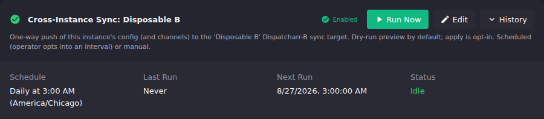

# Cross-Instance Sync

UI path: **Settings → Backup & Restore → Cross-Instance Sync**.

---

## Two semantics you must understand before you start

**ONE-WAY.** Sync replicates from A to B on a schedule. B is a managed replica. Edits you make directly on B are overwritten by A on the next sync cycle. Do not use B as a working instance if you intend sync to keep running.

**PROVIDER CREDENTIALS ARE SENT ON EVERY CYCLE.** Every scheduled sync pushes your source and channel definitions *and* the provider credentials that make them work: the M3U account username and password, the credentials inside a plain-M3U or Xtream Codes URL, and the credentials inside every stream address. B therefore authenticates against your provider and serves video on its own, with nothing for you to type on B — and when you change your provider password on A, B picks the new one up on its next scheduled sync.

**What it costs, stated plainly:** the replica is a place your provider credential lives. Its database, its backups, its logs and its own generated stream URLs all hold it. If you turn certificate checking off for a target, those credentials cross the network in clear, on every cycle, not once. ECM does not stop you — that call is yours — but it warns on the target and writes an audit row every time.

**The one thing you still type,** and only once: a **Schedules Direct** password. Dispatcharr never gives that value back to anything, so there is nothing on A to read; if you have a Schedules Direct EPG source, the sync-target form asks for it and stores it encrypted, then re-sends it every cycle. If you have no Schedules Direct source, the field is not shown and you type nothing at all.

---

## What sync is

Cross-instance sync is a recurring, automated one-way push of configuration from ECM-A (your primary instance) to a second Dispatcharr instance B (your replica). It is *not* a backup. It does not produce a restorable file. It does not merge changes bidirectionally. It continuously converges B toward A.

**Use sync when you want:**
- A DR/standby instance that stays current without manual effort.
- A second site whose lineup tracks your primary automatically.

**Do not use sync to:**
- Replace backups: sync does not capture a point-in-time snapshot you can restore from. Take regular encrypted backups as well.
- Replicate user accounts: users are never synced (see [What never syncs](#what-syncs-vs-what-never-does)).

---

## What syncs vs. what never does

### Synced every cycle

| Category | Notes |
|-|-|
| M3U accounts | Source URL, settings **and credentials**. An **Xtream Codes** account's `username` and `password` cross as themselves; a **plain-M3U** account's whole playlist URL crosses intact, credentials and all, because that account type has no password field and the secret is inside the address. Nothing is left for you to re-enter. An HDHomeRun-style LAN tuner URL carries no credential and crosses as it always did. |
| EPG sources | Source URL, settings **and credentials**. An Xtream Codes guide URL (`xmltv.php?username=…&password=…`) crosses whole, so B's guide fills in without you touching it. The one exception is a **Schedules Direct** source: Dispatcharr marks that password write-only and never returns it, so there is nothing on A to copy — supply it once on the sync target and it is sent every cycle with everything else. |
| Server groups | Dispatcharr's server groups — the grouping that makes several M3U accounts share one provider's connection limit. Synced before the M3U accounts, so each account arrives on B already pointing at B's own copy of its group and the shared connection limit works without you touching anything. If a group somehow cannot be matched on B the account is still created, just without one, and the sync report names it so you can re-assign it. |
| Core settings | Dispatcharr's global settings, blob by blob. **Stream settings** (default user agent, default stream profile, output format), **DVR settings** (recording path templates, comskip options, pre/post offsets, series rules), **system settings** (timezone, event history cap, region, catch-up), **user-limit settings** (what to do when a connection limit is hit), **proxy settings** (buffering and timeout tuning) and **backup settings** (Dispatcharr's own backup schedule and retention) all cross. Where a stream setting points at a user agent or a stream profile, the replica is pointed at *its* copy — never at the primary's row number. **Network access is never copied** — see below. If B is on slower hardware, or you do not want B running its own backup job, you can decline `proxy_settings` or `backup_settings` for that target individually without losing the rest — **there is no toggle for this on the Cross-Instance Sync card yet**; it is set with `PUT /api/sync-targets/{id}` and a `core_settings_excluded` list. |
| Channel groups | Group names and ordering. |
| Channel profiles | Profile definitions. |
| User agents | The custom user-agent strings an M3U account fetches with and a stream profile plays through. Synced first, before both, so each one's user-agent link is re-pointed at B's copy. Distinct from user *accounts*, which are never synced. |
| Stream profiles | Profile definitions, including their user-agent link. |
| Channels (+ embedded streams) | Channel names, numbers, groups, and their stream assignments. **Stream URLs cross whole**, including the Xtream Codes `…/live/<username>/<password>/<id>.ts` form where the credential is part of the address — so B's channels are bound to addresses that play, on the same cycle, with no second pass and nothing to re-enter. On B every synced stream is filed under a single account named `ECM Custom Streams (DBAS restore)`, **not** under the replicated provider account it comes from — see [that section below](#on-b-every-synced-stream-belongs-to-an-account-called-ecm-custom-streams-dbas-restore) for why. |

### Synced on a slower clock

| Category | Notes |
|-|-|
| Logos | **On by default**, but not on every cycle: a new sync target replicates logos once every 24 hours (`logo_sync_interval_hours` on the target; set it to `0` for every cycle — **the interval has no toggle on the card yet**, only the on/off switch does, so changing it means `PUT /api/sync-targets/{id}`). Everything else follows the separate recurring task schedule configured under **Settings → Scheduled Tasks** — only logos are throttled, because copying images is the one expensive part of a cycle and artwork changes rarely. A target created before ECM v0.18.1 keeps whatever you had it set to; the new default applies to targets you create from now on. Each target row on the Cross-Instance Sync card carries a **Logos off / Logos on** toggle next to its enable/disable switch; click it to turn logo replication off (or back on) for that target. The setting is stored on the target, so it survives a reload and applies to that target's later runs. A target that has never run a logo pass replicates logos on its very next cycle rather than waiting out the 24 hours, so a freshly built replica arrives with its artwork. Covers all three places a logo can live: the files in ECM's own `/config/uploads/logos/`, the logos Dispatcharr hosts (where a logo you upload through Logo Manager actually lives), and the ones your provider supplies as a web address — which on an Xtream Codes lineup is usually nearly all of them. The first two travel as image files; the third travels as the address itself, so B points at the same picture A does without either instance re-hosting it. Where two of them describe the same logo, the one holding real image bytes is the one that travels. Only logos B is missing are created (matched by id, name, then filename); sync never deletes or bulk-clears B's existing logos. Because sync runs unattended, the image fetching is time-bounded per image and per cycle — a very large logo set that runs out of budget is reported as missed logos for that cycle and picked up on the next one. A provider address that carries your account's username or password **is** copied now, like every other credential-bearing address, so those logos arrive and load on B. |

### Never synced

| Category | Why |
|-|-|
| **Users** | Continuous one-way push of `users` would overwrite B's privilege flags and could lock out B's operator. This exclusion is permanent and code-enforced. It cannot be configured away. |
| **Network access** | Dispatcharr's per-endpoint IP allowlists (which networks may reach the UI, the streams, the Xtream Codes API and the M3U/EPG output). These describe where the instance sits, so copying the primary's allowlist onto a replica somewhere else either locks you out of the replica or opens it up, depending on which way the two differ. This exclusion is code-enforced and cannot be configured away. |
| **ECM's own secrets** | ECM's settings secrets, alert-method secrets (SMTP passwords, bot tokens, webhooks), and the credentials of your cloud-storage and sync targets. These are not provider credentials and have no business on a replica; they are redacted before transmission and always will be. Your *provider* credentials are a different matter and now cross every cycle — see the row for M3U accounts above. |

---

## Setup walkthrough

### Step 1: Add a sync target

1. Go to **Settings → Backup & Restore**.
2. Find the **Cross-Instance Sync** card.
3. Click **Add sync target**.
4. Fill in the fields:

| Field | What goes here |
|-|-|
| **Name** | A label for this target (e.g., `DR standby`, `remote site`). |
| **Base URL** | The base URL of Dispatcharr-B's API (e.g., `http://192.168.1.50:9191`). Dispatcharr's default port is `9191`; nothing in this stack has ever served `8080`. |
| **Username / Password** | Credentials ECM-A uses to authenticate against Dispatcharr-B's API. This is not what B syncs. It is how A reaches B. |
| **Allow insecure TLS** | Disable TLS verification for self-signed certs. Use only on isolated LANs where you control both endpoints. Every sync cycle using this option is logged. |

5. Click **Create target**.

The target appears in the list and starts **Enabled**. This target-row control
allows runs to reach B; it does not create or enable a recurring schedule.

ECM also creates a matching **Cross-Instance Sync: `<target>`** task
automatically. Task creation is best-effort: if it is missing from **Scheduled
Tasks**, restart ECM to run the startup reconciliation, then reload the page. If
it is still missing, check the ECM log for `Failed to register sync` and
fix that registration error before scheduling sync.

### Step 2: Run a preview

Before configuring a schedule, run a manual dry-run to confirm A can reach B and the configuration looks correct.

1. On the target row, click **Sync now (preview)**.
2. ECM runs a dry-run (no changes are written to B). The results show what would be created, updated, or skipped.
3. Review the preview. If you see unexpected conflicts, see [Troubleshooting](#troubleshooting).
4. After a successful preview, **Apply** appears. **Destructive warning: Apply makes A the source of truth and overwrites matching edits on B.** Click it only when B is ready to be converged to A.
5. Accept the browser's native confirmation only after you have read the source-wins warning. This confirmation is browser chrome and is therefore intentionally not pictured. A failed preview does not make **Apply** available.

After a successful apply, the target row shows the last sync timestamp and the outcome.

### Step 3: Enable a sync schedule

1. Go to **Settings → Scheduled Tasks**.
2. Find **Cross-Instance Sync: `<target>`**, where `<target>` is the name you gave the sync target, and click **Edit**.
3. Turn on **Enable task**.
4. Under **Schedules**, click **Add Schedule**.
5. Choose an interval or calendar schedule and leave **Enable this schedule** on.
6. Under **Task Parameters**, turn on **Apply changes on every scheduled run**. ECM requires this explicit choice; it will not save a recurring preview-only schedule.
7. Click **Add Schedule**, then save the task settings.

ECM now applies the sync automatically on that schedule. Automatic execution
requires all three gates: the target row is **Enabled**, the per-target task is
enabled, and at least one child schedule is enabled. Manual runs from the target
row still start with **Sync now (preview)**.

If you have several sync targets, they sync independently and can run at the same time. A slow or unreachable target never delays the others. ECM never runs two syncs against the *same* target at once (a second attempt while one is in progress is refused and simply runs on its next interval), and it caps how many targets sync simultaneously (3 by default; the `ECM_SYNC_MAX_CONCURRENT` environment variable adjusts it, and extra targets wait their turn rather than being skipped).

### The kill switch

The **Enabled** toggle on each target row is the target kill switch. Turning it
off prevents new manual and scheduled runs for that target. It does not cancel
an apply that is already executing. The target definition (URL and credentials)
and its separate Scheduled Tasks configuration are preserved. Turning the
target back on permits runs again; the scheduled task and at least one child
schedule must also remain enabled for automatic runs to resume.

---

## End-to-end operator walkthrough

Use this flow to build and verify a fresh B without treating ECM's run counters
as the final proof:

1. **Stand up Dispatcharr-B.** Create its operator account and confirm you can log in. B may otherwise be empty.
2. **Create the target on ECM-A.** Use B's base URL and API credentials, then leave the new target **Enabled**.
3. **Preview.** Click **Sync now (preview)** and review the create, update, skip, conflict, and failure results. Stop if the plan is unexpected.
4. **Apply.** Click the newly available **Apply**, read the native confirmation, and confirm the source-wins write.
5. **Verify on B, not only in A's notification.** Log in to B and check the expected channel groups, channels, stream assignments, profiles, logos, M3U accounts, and EPG sources. Refresh B's EPG source, then confirm representative mapped channels show usable programme data; source existence alone is not enough. Open representative channels and verify that a stream actually plays; an HTTP response alone is not proof of video.
6. **Repeat preview and apply without changing A.** The repeat preview should plan no new destination objects. Repeat-run update counters can still be non-zero, so do not require `updated 0`.
7. **Check repeat stability on B.** Recheck the same representative groups, channels, stream assignments, profiles, logos, and programme data. Confirm the repeat did not create duplicates, remove links, or change those items unexpectedly. This proves only the B state you inspected stayed stable; proving full A/B equivalence requires a separate category-by-category A-vs-B comparison.
8. **Configure the recurring task.** Under **Settings → Scheduled Tasks**, edit **Cross-Instance Sync: `<target>`**, enable the task, add an enabled schedule, and enable **Apply changes on every scheduled run**.

**Expected repeat-run result:** the preview plans no new destination objects and
the inspected B state remains stable. A repeat apply may report updates, so a
zero-update counter is not required. Do not claim full A/B equivalence unless
you compared the same fields in both instances.

**The encrypted-backup seeding step this list used to start with is no longer needed.** It existed
because sync could not carry credentials, so B had to get them from a backup or by hand. Sync
carries them now, so an empty B converges to a working standby on its first apply. Taking an
encrypted backup is still worth doing — it is a restorable point-in-time snapshot, which sync is
not — but it is a backup, not a prerequisite.

From then on sync keeps B current — credentials included. A new M3U or EPG source added on A arrives on B complete and working on the next cycle, and so does a changed provider password. There is nothing to re-enter on B, ever.

---

## What credentials cross, by source type

There is no separate action to run and nothing to click. Every scheduled sync carries
these, and a change to any of them on A reaches B on the next cycle.

| Type | What crosses |
|-|-|
| **Xtream Codes M3U** | `username` and `password`, as themselves. |
| **Plain-M3U** whose credential is in the URL (`get.php?username=…&password=…`) | The whole `server_url`. This type has no password field at all — the address *is* the credential. |
| **Plain-M3U** pointing at a LAN tuner (HDHomeRun) | Nothing to carry; there is no credential. The address crosses as it always did. |
| **XMLTV EPG** (`xmltv.php?username=…&password=…`) | The whole `url`. |
| **Stream addresses** | Whole, including the Xtream Codes `…/live/<username>/<password>/<id>.ts` form. This is what lets B's channels play on the same cycle they are created. |
| **Provider logo addresses** | Whole, so B loads the same artwork A does. |
| **Schedules Direct EPG** | `username` automatically. The **password** is the one value you supply, because Dispatcharr marks it write-only and never returns it — there is nothing on A to read, which is *unreadable*, not *unset*. Enter it once in the sync-target form (the field appears only if you actually have a Schedules Direct source) and it is stored encrypted and re-sent every cycle. Because the replica does not return it either, ECM can confirm it **wrote** the value but never that the replica holds a **working** one: a mistyped password shows up as B's EPG source failing to fetch, and the fix is to correct it on the target. Skip it and B still **serves video** — streams come from M3U accounts — it just has no guide data from that source. |
| **Anything else** | Does not cross. ECM's own settings secrets, alert-method secrets (SMTP passwords, bot tokens, webhooks), cloud-storage and sync-target credentials, and Dispatcharr users are redacted or excluded exactly as they always have been. |

### Rotation needs no mechanism

Change your provider password on A and the next scheduled sync carries the new one to
B. There is no action to remember, no marker to clear, and no state that can be stale:
B is given the current value every time, so "the standby's credential went out of date"
is not a condition that can arise between cycles.

### Certificate checking, and the risk that is yours

ECM does **not** refuse to send credentials to a target with **Allow insecure TLS**
turned on. It used to; that refusal was removed deliberately. Your instances, your
network, your call.

What ECM does instead: the target row shows a **Certificate check off** badge saying
that credentials cross in clear, the card's banner says the same, and **every**
credential-carrying cycle logs a warning and an audit row. If you leave certificate
checking off, understand that this is a recurring exposure on your sync interval — not
a one-time one — and that the remedy is one setting: install a valid certificate on B
and turn verification back on.

### Every cycle is audited

Each sync run writes one `sync_outbound` journal entry recording which target, which
categories, the counts, the outcome, whether TLS was verified, **how many provider
records carried a credential**, and which ones by name and field name. Never a value,
never a fragment of one. Under per-cycle transmission that entry is the only record
of how often a secret moved, which is why it is written on every terminal route —
including the runs that abort before sending anything, which record that they sent
nothing.

### What you cannot undo

There is no de-provision action, because there is no one-time provisioning to undo.
If you want a replica to stop holding your provider credential, the order that
actually works is:

1. **Delete the sync target on A**, or turn its **Enable** kill switch off, so no
   further cycle re-sends it.
2. **Clear the credentials on B yourself**, on B's own provider accounts.
3. **Rotate the credential at your provider.** This is the only step that ends the
   exposure. Everything B produced while it held the credential — its stream rows
   (which carry it in their path segments), its backups, its logs, anything downstream
   that consumed its output — still holds it, and none of that is retractable.

Doing 1 and 2 without 3 stops B re-authenticating; it does not make the credential
secret again.

---

## Conflicts

Sync uses a **source-wins** policy: when a configuration item exists on both A and B with matching identity, A's version is applied to B.

One case surfaces as a conflict rather than a silent overwrite: **a channel with no channel number that ambiguously matches a no-number channel on B** (same name, both with null channel numbers). ECM cannot safely determine whether these are the same channel, so it skips the item and surfaces a `CONFLICT` result in the sync report. Assign channel numbers on A to resolve the ambiguity, then re-sync.

**What "overwritten by A" means in practice** (live-validated): sync converges by *recreate*, not by pruning. If you **delete** an item on B, the next cycle recreates it from A (a deleted channel comes back with its streams re-attached). If you **rename** an item on B, the next cycle recreates A's version alongside it. The renamed copy is now a B-local extra that sync will **not** delete (sync never deletes anything on B). Clean up B-local extras by hand if they matter to you, or avoid editing B directly.

---

## Troubleshooting

### Sync is failing or B appears to have drifted

Check whether the `ECMSyncStalledTargetDrift` alert has fired. This alert triggers when the sync task has not recorded a full success in approximately 3 hours (3 missed cycles on the hourly cadence). Follow the [Sync Target Stalled / Target Drift runbook](https://github.com/MotWakorb/enhancedchannelmanager/blob/main/docs/runbooks/sync-target-stalled-drift.md) for step-by-step diagnosis.

Common causes:
- **B is unreachable**: confirm connectivity to `base_url` from the ECM container.
- **Credentials rotated/revoked**: if B's API credentials changed after the sync schedule was set up, ECM aborts the run at the credential-freshness check. Edit the sync target, update the credentials, save, and trigger a manual sync.
- **Automatic sync does not start**: check all three gates. The target row must show **Enabled**; in **Scheduled Tasks**, **Enable task** must be on; and at least one schedule must have **Enable this schedule** on. Also confirm that schedule has **Apply changes on every scheduled run** enabled.
- **Per-target task is missing**: restart ECM to run startup reconciliation, reload **Scheduled Tasks**, and look again for **Cross-Instance Sync: `<target>`**. If it is still absent, check the ECM log for `Failed to register sync` and correct the reported registration error.
- **Partial-apply loop**: the sync runs but a category keeps failing on apply (not B unreachable, but a recurring mix/rollback). Pull the most recent sync report from the task history; identify the failing category.

### The sync reports "Completed with Warnings"

The sync ran, wrote its changes to B, and rolled nothing back — but the result
was not clean, so ECM does not call it a success. The most common reason is a
channel on B left holding **no playable stream**: the channel exists, but not one
of the streams attached to it has a URL behind it, so playing it fails. The
notification and the task-history entry name how many channels are affected;
the sync report in task history names each one.

**Resolution:** attach a real stream to each named channel on B, or fix the
matching problem on A (usually a stream that A's provider no longer carries) and
re-sync.

This is a warning, not a failure — nothing was undone, and everything else in the
run was applied. If a target has a shortfall you already know about and accept,
turn off **Warning** alerts for that target's sync task in the scheduled-task
alert settings. That silences the external alert (email/Discord/Telegram) while
leaving the outcome, the in-app notification and the task history honest. Do not
expect the target row to show a full sync timestamp for such a run: only a clean
success records "B was current as of this time".

### Conflict on a channel with no channel number

A channel on A has no channel number, and B already has a channel with the same name and also no number. ECM cannot safely decide these are the same channel. **Resolution:** assign a channel number to the channel on A, then re-sync.

### B has credentials for sources that A can't provide

No longer a thing you have to fix. Sync sends A's provider credentials on every cycle
and overwrites B's, so a source that works on A works on B. If a source works on B and
not on A, fix it on A — B converges on whatever A holds.

### Most of B's channels have no programme data, and B's EPG source says "No URL provided"

This was expected on an Xtream Codes provider before v0.18.2 and is **not** expected
now: the guide URL crosses whole, credentials included, so B's source has an address to
fetch from on the first cycle.

If you still see it, the cause is one of:

- **A Schedules Direct source.** Its password is the one value that cannot be copied
  off A. Enter it on the sync target (Settings → Backup & Restore → Cross-Instance
  Sync → edit the target) and it is sent on the next cycle.
- **A source that is broken on A too.** B mirrors A; check A first.
- **B has not run its own EPG download yet.** The address arriving is not the same as
  the guide being fetched. Give B a refresh.

### B's streams show `***REDACTED***` in their URL and will not play

**This was fixed in v0.18.2 and should no longer happen.** Stream addresses now cross
whole, credentials and all, so B's channels are bound to URLs that play on the same
cycle that creates them. The two-step recovery this section used to describe — enter
the credentials on B, then wait for one more cycle to re-bind the channels off the
placeholders — is gone along with the placeholders.

If you are looking at `***REDACTED***` in a stream URL on B, one of these is true:

- **B has not synced since you upgraded A.** The placeholders are what a *previous*
  cycle wrote; they are B's data, not something the new cycle removes on sight. Run one
  sync (preview, then apply). The cycle rewrites each channel's stream onto the real
  address.
- **A itself is holding a redacted URL** — for instance B was itself restored from a
  standard (redacted) backup artifact. A backup artifact still redacts credentials, and
  always will: that is a file that can be attached to a support ticket. Check the URL on
  A.

An Xtream Codes stream URL puts the username and password in the address itself —
`http://provider/live/<username>/<password>/<id>.ts` — so the credential *is* part of
the address, and carrying the address means carrying the credential. That is now
deliberate and stated: see [Two semantics](#two-semantics-you-must-understand-before-you-start).

### On B, every synced stream belongs to an account called "ECM Custom Streams (DBAS restore)"

Expected, and worth knowing before it surprises you. Open B's M3U Manager after a sync and you will see the provider accounts sync replicated — your Xtream Codes account, your Standard M3U account — each showing **no streams**, plus a fourth account named `ECM Custom Streams (DBAS restore)` holding **all** of them.

Sync does not make B fetch from your providers. Re-triggering every provider's playlist download on B on each cycle would hammer them and is deliberately not done, so B has no stream of its own to attach a replicated channel to. Sync therefore creates each stream directly and files it under that one account, which exists precisely to hold streams that have no provider account on the destination to belong to.

The consequence to plan around: **B's account list does not tell you which provider supplies which stream.** Read that from A, which is the instance actually talking to your providers. B's copy is a mirror of A's lineup, not an independent subscriber.

The streams under that account **play** — they carry your provider credential in their addresses like A's do. What the account does not give you is provider attribution on B. If you want B's streams filed under B's own provider accounts instead, refresh each provider account on B: it ingests the same addresses under its own account, and the next sync cycle re-matches the channels onto them and drops the stand-ins it no longer needs. That is tidier, and it is optional.

### The "Allow insecure TLS" warning

If you enabled **Allow insecure TLS** on a target, every sync cycle logs a warning and an audit row, and the target's row shows a **Certificate check off** badge. This is expected behaviour and it is not going to stop: it is the record that your provider credentials are crossing an unverified connection in clear, on every cycle. ECM does not block it. The remedy is to install a valid certificate on B and turn verification back on, which is always allowed.

---

## Going deeper

- [Security threat model, Addendum D](https://github.com/MotWakorb/enhancedchannelmanager/blob/main/docs/security/threat_model_dbas_import.md#11-addendum-d-cross-instance-live-sync-v0181-one-way-ab-config-replication), covering STRIDE analysis of the sync egress surface: what is and is not redacted, why provider credentials cross on every cycle and what that risk is, why users never sync, SSRF controls.
- [Runbook: ECMSyncStalledTargetDrift](https://github.com/MotWakorb/enhancedchannelmanager/blob/main/docs/runbooks/sync-target-stalled-drift.md): step-by-step when the sync stalls alert fires.
