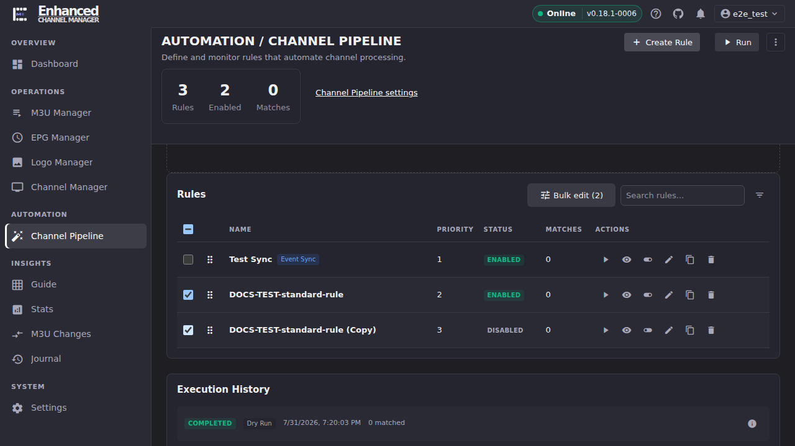
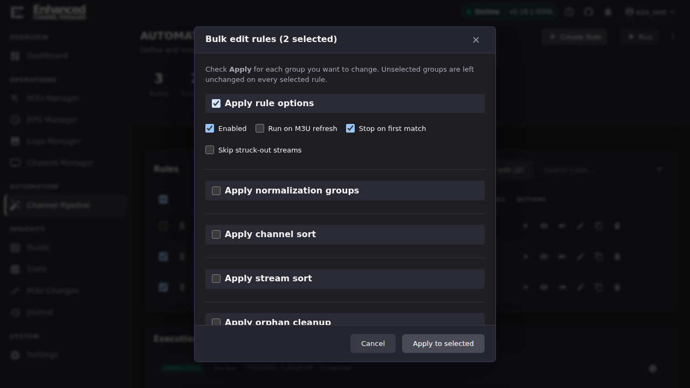

# Bulk-Edit Multiple Rules

**Bulk edit** applies a chosen set of settings to every rule you select, in
one action. It's built around an explicit **Apply** checkbox per setting
group, so nothing changes on a selected rule unless you deliberately turned
that group on.

## Common tasks

### Change a setting on several rules at once

1. In the **Rules** table, check the box next to each rule you want to
   change. The **Bulk edit** button in the table header shows a running
   count as you select.

   

2. Click **Bulk edit (N)**.
3. In the **Bulk edit rules** dialog, check **Apply** for each group of
   settings you actually want to change. Read the note at the top: *"Check
   Apply for each group you want to change. Unselected groups are left
   unchanged on every selected rule."* An unchecked group is invisible to
   the bulk edit. The rules keep whatever that setting already was.
4. Expand a checked group to set the values. **Apply rule options**, for
   example, reveals **Enabled**, **Run on M3U refresh**, **Stop on first
   match**, and **Skip struck-out streams**: the same Output & Run
   toggles described in [Rules overview](rules-overview.md#understand-the-rest-of-the-wizard).

   

5. Click **Apply to selected**.

**Result:** every rule you selected now has the checked groups' values,
and only those groups. A rule's conditions, actions, and any setting group
you left unchecked are untouched.

### What you can bulk-edit

| Group | What it sets |
|-|-|
| Apply rule options | Enabled, Run on M3U refresh, Stop on first match, Skip struck-out streams |
| Apply normalization groups | Which normalization rule groups apply to channel names |
| Apply channel sort | The Channel Sort setting (see [Channel Sort vs. Channel Numbering](sort-vs-numbering.md)) |
| Apply stream sort | The Stream Sort setting |
| Apply orphan cleanup | What happens to channels that stop matching |
| Apply Merge Streams: remove streams that no longer match | Whether a Merge Streams action removes streams that stopped matching |

Conditions and actions themselves are **not** bulk-editable. Bulk edit only
touches the rule-level settings above. To change conditions or actions
across multiple rules, edit each rule individually, or
[duplicate a rule](clone-a-rule.md) that already has the shape you want and
adjust the copy.

## Going deeper

- [Rules overview](rules-overview.md): what each Output & Run toggle
  controls on a single rule.
- [Duplicate a rule to reuse it](clone-a-rule.md): for changes bulk edit
  doesn't cover (conditions, actions).
- [Channel Sort vs. Channel Numbering](sort-vs-numbering.md).
