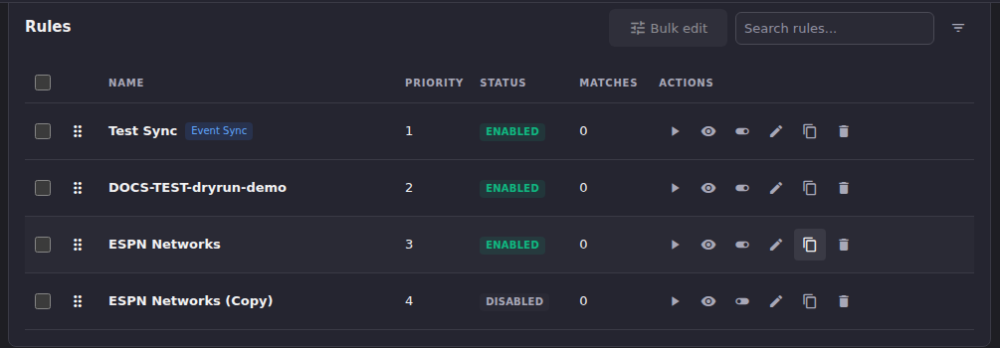

# Duplicate a Rule to Reuse It

**Duplicate** copies a rule's conditions, actions, and settings into a new
rule you can then adjust, instead of starting from an empty dialog every
time. This is the fastest way to build a family of similar rules (one per
provider group, one per region, and so on).

## Common tasks

### Duplicate a rule and adjust the copy

1. In the **Rules** table, find the rule you want to copy and click its
   **Duplicate** icon (the copy icon in the Actions column).
2. Look for the new row. It's named `<original name> (Copy)` and appears
   in the table right after the original, with the next available priority
   number.

   

3. **The duplicate saves as DISABLED**, even if the original was enabled.
   This is deliberate. It gives you a chance to review and adjust the copy
   before it can affect real streams.
4. Click **Edit** on the duplicate to open it, rename it to something that
   describes what makes it different from the original, and change
   whatever needs to differ: usually the condition's value (a different
   stream group) or the Create Channel action's target group.
5. When you're satisfied, toggle the duplicate to **Enabled** (the toggle
   icon in its row, or the **Enabled** checkbox at the top of the edit
   dialog).

**Result:** you have two independent rules that started from the same
Logic, Targeting, and Output & Run settings, and can now diverge. Editing
one never affects the other. Duplication is a one-time copy, not a link.

## Going deeper

- [Rules overview](rules-overview.md): the rule dialog and its tabs, for
  what to change on the copy.
- [Build conditions and actions](conditions-and-actions.md): the
  condition/action catalogue, for retargeting the copy.
- [Bulk-edit multiple rules](bulk-rule-settings.md): for changing a
  setting across the original and several duplicates at once, instead of
  editing each one.
