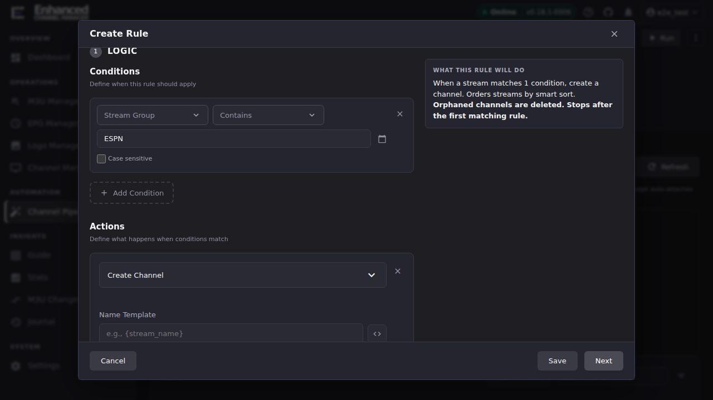
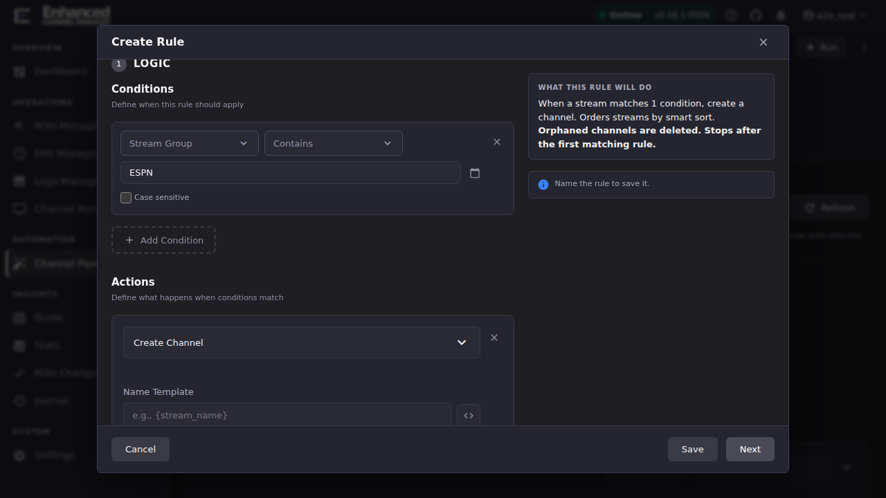

# Build Conditions and Actions

A Standard rule's Logic step has two lists: **Conditions** decide which
streams the rule applies to, and **Actions** decide what happens to a
matching stream. This page is the catalogue tour. See
[Rules overview](rules-overview.md) for how the Logic step fits into the
rest of the rule dialog.

## Common tasks

### Add a condition to target the right streams

1. In the rule dialog's **1 Logic** step, click **Add Condition**.
2. Pick a **field** from the first dropdown: what to compare. The full
   list:

   | Field | Compares against |
   |-|-|
   | Stream Name | The stream's display name |
   | Stream Group | The M3U group the stream belongs to |
   | Stream Group Is | Exact match on the M3U group (vs. Stream Group's substring-style operators) |
   | TVG-ID | The stream's `tvg-id` attribute |
   | M3U Account | Which M3U provider account the stream came from |
   | Logo | The stream's logo URL |
   | Quality | Parsed quality tag (e.g. HD, 4K) |
   | Codec | Parsed codec |
   | Audio Tracks | Parsed audio track info |
   | Channel | An existing channel (for rules that act on already-created channels) |
   | Channel Name | An existing channel's name |
   | Channel Group | An existing channel's group |
   | Normalized Match in Group | Whether the stream's normalized name matches an existing channel in a specific group |
   | Normalized Match (Any Group) | Same, but searching every group |
   | Channel Streams | The number of streams already attached to a channel |
   | Always | Unconditionally true: matches every stream |
   | Never | Unconditionally false: matches nothing (see the [`RULE_HAS_NO_HOPE_OF_MATCHING`](debugging-rules.md#rule_has_no_hope_of_matching) analyzer finding for the trap this creates) |

3. Pick an **operator**. For text fields (Stream Name, Stream Group, and
   similar) the choices are **Contains**, **Does Not Contain**, **Begins
   With**, **Ends With**, **Matches (Regex)**, **Does Not Match (Regex)**.
   If you reach for regex, read
   [Debugging rules](debugging-rules.md#the-eight-finding-codes) first.
   Two of the eight analyzer finding codes exist specifically because
   **Contains** and **Matches (Regex)** are easy to confuse.
4. Enter the **value** to compare against, and toggle **Case sensitive** if
   the comparison should not ignore case (off by default).
5. Click **Add Condition** again for a second condition. Multiple
   conditions in one row are ANDed together; use **Add Condition** to start
   a new OR branch (the same AND-binds-tighter-than-OR structure documented
   in
   [Debugging rules: `ANDOR_DROPS_GUARD`](debugging-rules.md#andor_drops_guard)
   applies here, so repeat any guard condition in every branch).

**Result:** the **What this rule will do** panel updates to describe the
condition in plain English, e.g. *"When a stream matches 1 condition..."*
This confirms the rule engine parsed what you meant before you add an action.

### Add an action to do something with a match

1. Click **Add Action**, then pick an **Action type** from the dropdown.
   The catalogue, in the order the picker groups them:

   | Action | What it does |
   |-|-|
   | Create Channel | Create a new channel for the stream |
   | Create Group | Create a new channel group |
   | Merge Streams | Merge the stream into an existing channel |
   | Assign Logo | Assign a logo to the channel |
   | Assign TVG-ID | Set the TVG-ID for the channel |
   | Assign EPG | Assign an EPG data source |
   | Assign Profile | Assign a stream profile |
   | Set Channel Profile | Enable the selected channel profile(s) and remove the channel from all others (exclusive membership) |
   | Set Channel Number | Set the channel number |
   | Set Variable | Define a reusable variable from stream data |
   | Remove From Channel | Remove this stream from its current channel |
   | Set Stream Priority | Move the stream to lowest or highest priority within its channel |
   | Probe Streams | Queue streams for probing after the pipeline run completes |
   | Sort Group | Alphabetically sort and renumber a group's channels, once per group after processing; see [Channel Sort vs. Channel Numbering](sort-vs-numbering.md#sort-group-the-action-built-for-this) |
   | Skip | Skip this stream: do not process it further |
   | Stop Processing | Stop processing further rules for this stream |
   | Log Match | Log when a stream matches, without changing anything |

2. Fill in the fields that appear for the action you picked. **Create
   Channel**, the most common first action, needs:

   

   - **Name Template**: required. Use `{stream_name}` to keep the
     stream's own name, or build a template with the `<>` variable-picker
     button next to the field.
   - **Target Group**: required (or add a **Create Group** action earlier
     in the same rule to create one on the fly). Saving without one shows
     *"Create Channel requires a target group (or a prior Create Group
     action)"* inline.
   - **If already exists**: what to do when a channel with that name
     already exists, choose **Skip**, **Merge**, or **Merge only**.
   - **Channel Numbering**: **Auto (sequential from 1)** by default, or a
     fixed starting number. This is the setting behind the "Auto gotcha" in
     [Channel Sort vs. Channel Numbering](sort-vs-numbering.md#the-auto-gotcha).
     Read that page before relying on Channel Sort to renumber channels.

**Result:** with a condition and an action both filled in, the summary
panel names the concrete effect (e.g. *"When a stream matches 1 condition,
create a channel."*), and the dialog's **Save** button stops showing "Add a
condition and an action to save it."

## Worked example

Condition: **Stream Group** → **Contains** → `ESPN`. Action: **Create
Channel** → Name Template `{stream_name}` → a target group. This is the
minimum viable rule: any stream whose M3U group name contains "ESPN"
becomes its own channel, named after the stream.

## Going deeper

- [Rules overview](rules-overview.md): where Logic fits in the rule
  dialog, and the Targeting / Output & Run tabs.
- [Debugging rules](debugging-rules.md): the rule analyzer's eight finding
  codes, most of which are condition/regex mistakes.
- [Fuzzy matching for Local/OTA channels](fuzzy-locals-matching.md): a
  scored-matching mode for Merge Streams, layered on top of the operators
  above.
- [Channel Sort vs. Channel Numbering](sort-vs-numbering.md): the
  Sort Group action and the Create Channel numbering interaction, in full.
- [`docs/api.md`](https://github.com/MotWakorb/enhancedchannelmanager/blob/main/docs/api.md): the `/channel-pipeline` router, including
  the JSON shape a condition/action serializes to.
