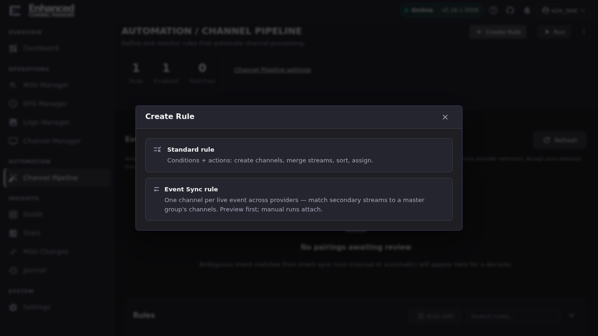
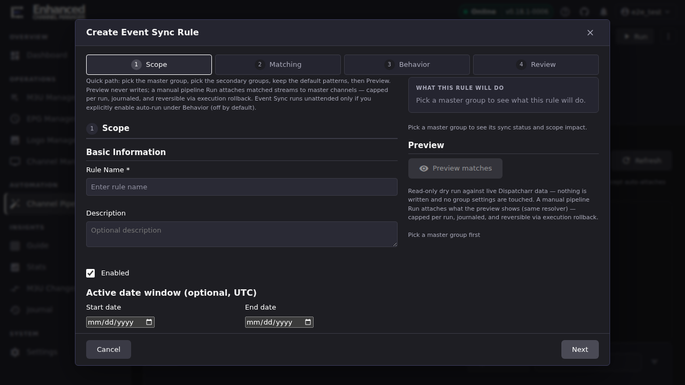

# Event Sync Quick Start

Event Sync is a second rule kind alongside the Standard rule covered in
[Rules overview](rules-overview.md): instead of conditions and actions, it
matches secondary providers' event streams onto one "master" provider's
channels. This page is a thin quick-start pointing at
[`docs/event_sync.md`](https://github.com/MotWakorb/enhancedchannelmanager/blob/main/docs/event_sync.md), which already has the full
walkthrough, the pattern cookbook, and the troubleshooting reference. Read
this page to get oriented and reach your first preview, then follow the
link for depth.

## Common tasks

### Get to Event Sync and preview your first match

1. Open **Channel Pipeline** in the left navigation, then click **Create
   Rule**.
2. In the **Create Rule** dialog, pick **Event Sync rule**: the second
   option, described as *"One channel per live event across providers —
   match secondary streams to a master group's channels."* This is a
   different rule kind from the Standard rule covered in
   [Rules overview](rules-overview.md); its dialog is a 4-step wizard
   (**Scope → Matching → Behavior → Review**) instead of the Standard
   rule's Logic/Targeting/Output & Run tabs.

   

3. On the **Scope** step, name the rule, then pick a **Master group** (the
   ONE provider group whose channels Dispatcharr already owns,
   `auto_channel_sync` ON) and one or more **Secondary groups**, the
   other providers' matching event groups. The picker shows each group's
   live auto-sync status inline, so you can see at a glance which group
   qualifies as a master.

   

4. Move through **Matching** (parse patterns, the shipped defaults cover
   most provider name shapes) and **Behavior** (leave auto-run off for your
   first rule), then click **Preview matches** on the **Review** step.

**Result:** a read-only report of what the rule would do: how many
streams would attach, how many are ambiguous or unmatched, and per-stream
match detail, with nothing written to Dispatcharr. Save the rule once the
preview looks right, then run it from the Channel Pipeline page's **Run**
button to actually attach matched streams.

## What to read next

[`docs/event_sync.md`](https://github.com/MotWakorb/enhancedchannelmanager/blob/main/docs/event_sync.md) is the complete guide and
covers everything past this first preview:

- [Quick start: Consolidate event groups across providers](https://github.com/MotWakorb/enhancedchannelmanager/blob/main/docs/event_sync.md#quick-start-consolidate-event-groups-across-providers):
  the same walkthrough as above, in more depth, including turning off
  `auto_channel_sync` on your secondary providers (skipping this step is
  the most common cause of "I still see duplicate channels").
- [Pattern cookbook](https://github.com/MotWakorb/enhancedchannelmanager/blob/main/docs/event_sync.md#pattern-cookbook): if the shipped
  parse patterns don't fit your providers' naming.
- [Threshold and bands](https://github.com/MotWakorb/enhancedchannelmanager/blob/main/docs/event_sync.md#threshold-and-bands): how a
  match becomes an auto-attach vs. an ambiguous review item.
- [Troubleshooting](https://github.com/MotWakorb/enhancedchannelmanager/blob/main/docs/event_sync.md#troubleshooting): duplicate
  channels still appearing, nothing matching, and events missing entirely.
- [Undo a bad event_sync run](https://github.com/MotWakorb/enhancedchannelmanager/blob/main/docs/event_sync.md#undo-a-bad-event_sync-run):
  every live run is reversible by execution id.

## How Event Sync relates to Standard rules

Event Sync rules live in the same **Rules** table as Standard rules and
share the same run/test/duplicate/delete actions, but they don't use
conditions or actions. The scope, matching, and behavior settings above
are the whole rule. [Bulk-edit](bulk-rule-settings.md) and
[dry-run testing](test-a-rule.md) apply to both rule kinds; the
condition/action catalogue in
[Build conditions and actions](conditions-and-actions.md) applies to
Standard rules only.

## Going deeper

- [`docs/event_sync.md`](https://github.com/MotWakorb/enhancedchannelmanager/blob/main/docs/event_sync.md): the full developer- and
  operator-facing guide.
- [Rules overview](rules-overview.md): the Standard rule dialog, for
  comparison.
- [Test a rule before enabling it](test-a-rule.md): dry-run testing, which
  Event Sync rules also support.
