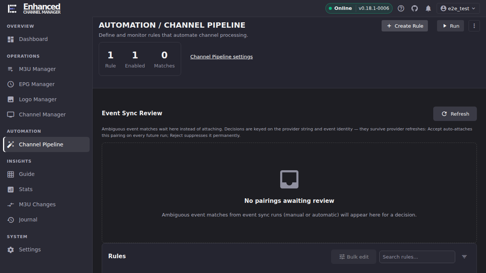
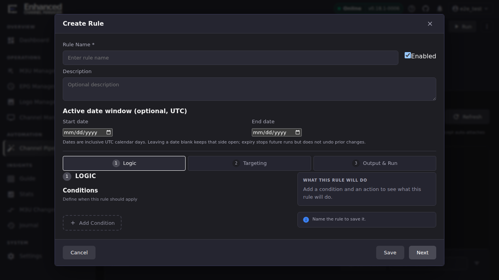

# Channel Pipeline Rules Overview

The Channel Pipeline turns incoming M3U streams into channels automatically,
by running your saved rules against every stream each time it processes. This
page covers what a rule is made of and how to create your first one. For the
condition/action catalogue, see
[Build conditions and actions](conditions-and-actions.md).

## Common tasks

### Create your first Standard rule

1. Open **Channel Pipeline** in the left navigation.

   

2. Click **Create Rule** (top right).
3. In the **Create Rule** dialog, choose **Standard rule**, conditions plus
   actions: create channels, merge streams, sort, assign. The other option,
   **Event Sync rule**, is a different rule kind covered in
   [Event Sync quick start](event-sync-quickstart.md); don't pick it for a
   general-purpose rule.

   

4. Type a **Rule Name**. This is required before the rule can save. Leave
   **Enabled** checked (default) unless you want to build the rule now and
   turn it on later.
5. Work through the three tabs at the top of the dialog: **1 Logic**,
   **2 Targeting**, **3 Output & Run**. Logic is where conditions and actions
   live (see [Build conditions and actions](conditions-and-actions.md)). A
   brand-new rule opens here with an empty Conditions list and an empty
   Actions list.

   

6. Watch the **What this rule will do** panel on the right as you build the
   rule. It updates live in plain English. For example: *"When a stream
   matches 1 condition, create a channel. Orders streams by smart sort.
   Orphaned channels are deleted. Stops after the first matching rule."*
   Use it to sanity-check the rule before you save, not just the individual
   fields.
7. Click **Save**. If a required field is missing (no rule name, an action
   missing a target group, and so on), the dialog stays open and shows the
   specific error inline next to the field. Fix it and click Save again.

**Result:** the rule appears in the **Rules** table with a priority number,
an **ENABLED** status badge, and a **Matches** count (0 until it has run).
Closing the dialog without saving after making changes prompts a "You have
unsaved changes" confirmation, so an accidental close never silently
discards work.

### Understand the rest of the wizard

The Targeting and Output & Run tabs shape *how* a rule's actions behave.
You don't need them for a minimal rule, but know what they control:

| Tab | Controls |
|-|-|
| **2 Targeting** | Merge lookup scope (whether "does a channel with this name already exist?" searches only this rule's target group or every group), manual-channel protection, spacing/case sensitivity in merge matching, and which normalization rule groups apply to channel names. |
| **3 Output & Run** | Channel Sort and Stream Sort (processing/renumbering order, see [Channel Sort vs. Channel Numbering](sort-vs-numbering.md) for the full explanation and the Auto-numbering gotcha), Orphan Cleanup (what happens to channels that stop matching), and the Run behavior toggles: **Run on M3U refresh**, **Stop on first match**, **Skip struck-out streams**. |

**Priority and execution order.** Every rule has a **Priority** number shown
in the Rules table, and by default a rule with **Stop on first match** stops
the *whole* rule set at the first rule that matches a given stream, which
means order matters. Rules can be reordered by dragging the handle in the
table. **Don't reorder rules while a search or filter is active in the
Rules table.** Reordering a filtered subset does not currently preserve the
global priority order correctly for rules hidden by the filter. Clear the
search box and any active filter first, then drag.

**Result:** you know which tab to open for a given change without
re-reading the whole dialog each time.

## Beyond the rule dialog

The Channel Pipeline page's toolbar has four more always-visible buttons
alongside **Run** (there is no hidden or overflow menu) that act on the
whole rule set rather than one rule: **Dry Run** (preview every enabled rule
against live streams, nothing written), **Import**, **Export**, and
**Pipeline Debug Bundle** (a support bundle you can hand to someone helping
you, or run through the rule analyzer; see [Debugging
rules](debugging-rules.md#bundle-mode)).

**Export** downloads every rule as a YAML file; **Import** takes that file
back and creates matching rules. Use this for backing up your rule set
outside ECM, checking it into version control, or copying a tuned rule set
to another instance.

### What happens to channels a rule stops matching

A rule's Output & Run tab includes **Orphan Cleanup**: what to do with
channels the rule previously created once its conditions no longer match the
streams that created them.

| Option | Behavior |
|-|-|
| **Delete** | Remove the orphaned channels entirely. |
| **Move to Uncategorized** | Move them out of managed groups instead of deleting them. |
| **Delete & Cleanup Groups** | Delete the channels, then remove any group left empty as a result. |
| **None** | Leave orphaned channels exactly where they are; skip reconciliation. |

**Result:** this runs as part of the rule's own execution, not as a separate
step. [Bulk-edit multiple rules](bulk-rule-settings.md) can set the same
choice across several rules at once via **Apply orphan cleanup**.

### Exclude streams before any rule ever sees them

**Settings → Channel Pipeline** (the same admin-only page that hosts the
[Runaway Safety Cap](runaway-safety-cap.md)) also has a **Global Exclusion
Filters** section: an **M3U Group Dropdown** to choose which M3U groups are
even eligible for rule evaluation, and **Exclusion Patterns**, regex
patterns that exclude matching streams before any rule runs. Both apply
globally, across every rule, so you don't have to repeat the same exclusion
condition inside each rule you write.

## Going deeper

- [Build conditions and actions](conditions-and-actions.md): the condition
  and action catalogue with worked examples.
- [Test a rule before enabling it](test-a-rule.md): the per-rule dry-run
  workflow.
- [Bulk-edit multiple rules](bulk-rule-settings.md): changing a setting
  across many rules at once.
- [Duplicate a rule to reuse it](clone-a-rule.md).
- [Channel Sort vs. Channel Numbering](sort-vs-numbering.md): the Output &
  Run tab's Channel Sort field, explained in full.
- [Debugging rules](debugging-rules.md): when a rule doesn't fire the way
  you expected.
- [Runaway safety cap](runaway-safety-cap.md): the per-run cap on channels
  created, and what "capped" means on a run.
