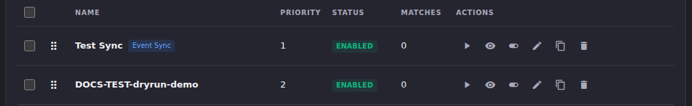
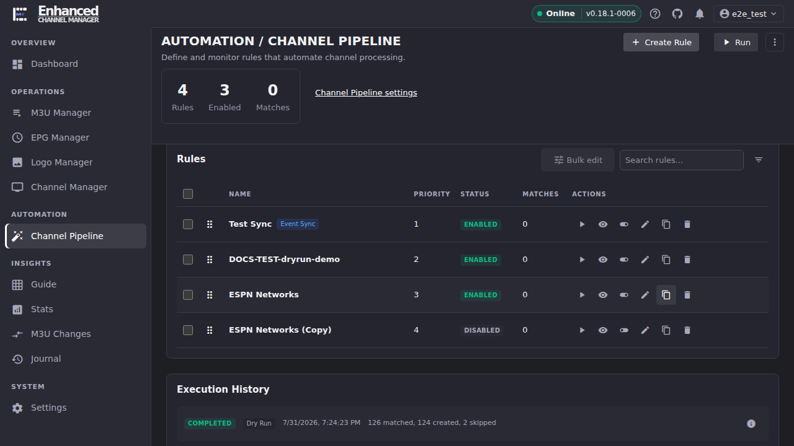

# Test a Rule Before Enabling It (Dry Run)

Every rule in the **Rules** table has a per-rule **Test** button that runs
the rule as a dry run. It evaluates every stream against the rule's
conditions and actions and reports what would happen, without creating,
merging, or deleting anything. This is the fast, safe way to check a rule
before you flip it on for real.

## Common tasks

### Test a single rule

1. Find the rule's row in the **Rules** table on the Channel Pipeline page.
   Each row has a run of icon buttons in the **Actions** column: **Run**
   (▶), **Test** (the eye icon), **Toggle enabled**, **Edit**,
   **Duplicate**, and **Delete**.

   

2. Click the **Test** (eye) icon: its tooltip reads "Test (dry run)".
   You do not need to save changes first if you're testing a rule you just
   built in the dialog; save it, then test the saved version.
3. Watch **Execution History**, further down the page. A new entry appears
   immediately with status **RUNNING** and kind **Dry Run**.

**Result:** the entry's status becomes **COMPLETED** and shows a match
count, e.g. *"0 matched"* or *"47 matched"*. Nothing in your channel lineup
changed. A dry run only ever reads streams and evaluates conditions.

### Read the result

- **A non-zero match count** means the rule's conditions found streams that
  qualify. A completed dry run breaks this down further (e.g. *"126
  matched, 124 created, 2 skipped"*), using the same wording a live run
  would use for its real result.
- **Read "created" as "would create," not "created."** A dry run performs
  zero writes. This is enforced the same way for both the per-rule Test
  button and the pipeline-wide **Dry Run** toolbar button. The counts in a
  dry-run result describe what a live Run would do if you ran it right now
  with the same data, not something that already happened. If you want to
  double-check, look the target group up in Channel Manager. A dry run
  never adds anything there.
- **`0 matched`** most often means a condition typo, an operator mismatch
  (e.g. `Matches (Regex)` selected but the value isn't actually a regex), or
  a `Never` condition left over from disabling the rule earlier. Before
  assuming the streams themselves are the problem, run the **rule
  analyzer**. It catches the "this rule can never match anything" class of
  bug in seconds without needing sample data. See
  [Debugging rules](debugging-rules.md) for the full diagnostic flow and
  the eight finding codes it checks for.
- Click the **info** icon on an Execution History entry to see the run's
  details.

**Result:** you know whether to trust the rule as written, or go fix a
condition before enabling it.

## Test vs. the rule analyzer vs. Run

| | Test (this page) | Rule analyzer | Run |
|-|-|-|-|
| **Scope** | One rule, against live streams | All saved rules, static config only | One rule or the whole rule set, for real |
| **Touches the DB?** | Read-only | Read-only (or nothing, in bundle mode) | Writes: creates/merges/deletes channels |
| **Catches** | "This rule doesn't match the streams I expected" | "This rule can never work, regardless of streams" | N/A: this is the live run |
| **When to use it** | After the analyzer is clean, to confirm the rule matches what you expect | First: cheap, catches structural bugs before you touch real data | Once Test confirms the expected matches |

The Channel Pipeline page's toolbar also has a whole-pipeline **Dry Run**
button (there is no menu to open it from; it sits alongside Run, Import,
Export, and Pipeline Debug Bundle, always visible), which previews every
enabled rule together in one pass. This is useful when rule order and
interaction matter, not just one rule in isolation.

## Going deeper

- [Debugging rules](debugging-rules.md): the rule analyzer, its eight
  finding codes, and when to reach for it instead of (or before) a dry run.
- [Rules overview](rules-overview.md): the rule dialog and its Logic,
  Targeting, and Output & Run tabs.
- [Bulk-edit multiple rules](bulk-rule-settings.md).
- [`docs/api.md`](https://github.com/MotWakorb/enhancedchannelmanager/blob/main/docs/api.md): the `/channel-pipeline/run` endpoint's
  `dry_run` parameter, for testing via the API or MCP directly.
