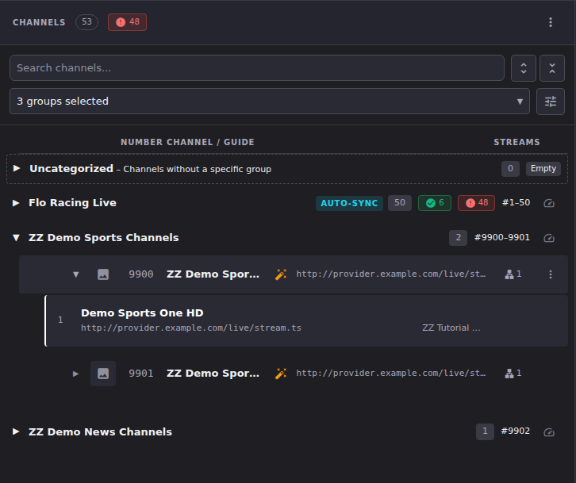
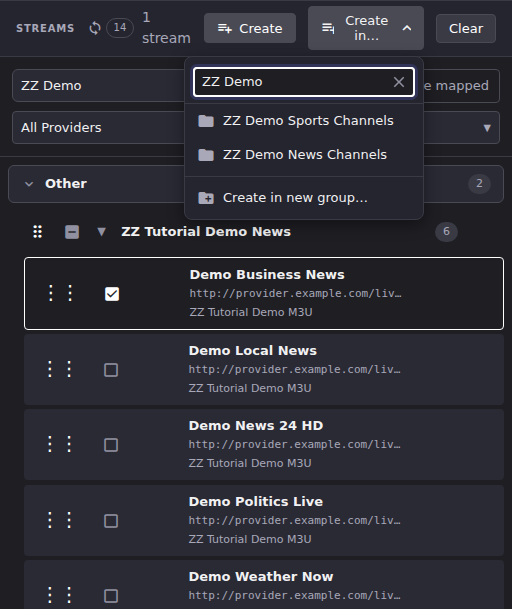

# Assign Streams to Channels

This article covers getting streams onto channels: dragging one onto a channel you already have, building new channels out of a selection, changing the order a channel tries its streams in, and taking a stream back off.

Everything here needs **Edit Mode**. Outside Edit Mode the Streams panel renders no selection checkboxes and no drag handles, the **Create** and **Create in…** buttons do not exist, and a stream dropped on a channel is ignored. Turn Edit Mode on first (see [Channel Manager](channels-overview.md)), and remember that every action in this article is *staged*: it reaches Dispatcharr only when you click **Done → Apply All**.

## Common tasks

### Add a stream to an existing channel

1. With Edit Mode on, find the stream in the Streams panel.
2. Drag it by its handle (the `⋮⋮` grip on the left of the row) onto the channel row you want it on. To move more than one at once, tick their checkboxes first and drag any one of them.

**Result:** The stream is appended to that channel's stream list as a staged change: the change counter next to **Edit Mode** goes up by one per stream, and the undo stack gains an entry per stream. Expand the channel to see the new stream in place.

Where you drop decides what happens. Dropping on a **channel row** adds the stream to that channel, which is what this task describes. Dropping on a **channel group header** (or between two channels) means "make a new channel here" instead, and takes you to the Create Channels dialog covered below.

### Build new channels out of a stream selection

1. With Edit Mode on, tick the checkbox on each stream you want. Ticking a group header's checkbox selects everything in that group.
2. Two buttons appear in the Streams panel header next to the selection count:
    - **Create** opens the Create Channels dialog without a target group pre-chosen.
    - **Create in…** opens a filterable list of your enabled channel groups, plus **Create in new group…** pinned at the bottom. Picking one opens the same dialog with that group already set as the target.

3. In the dialog, set the **Starting Channel Number** and review the preview list, then click **Create N Channels**.

Dragging streams (or a whole stream group) onto the Channels panel is the same workflow by another route: it opens the same dialog, pre-filled with the group you dropped into and the next free channel number in it.

On this path, and only on this path, ECM may decide the stream you are about to turn into a new channel looks like a channel you already have, and interrupt with a merge prompt. See [Stream Deduplication](stream-dedup.md). Dropping onto an existing channel row never raises that prompt, because you have already told ECM which channel you mean.

**Result:** The channels appear in the Channels panel immediately but nothing has reached Dispatcharr. The whole batch is one staged change set, discarded by **Cancel** and committed by **Apply All** like any other Edit Mode work.

Two things about that dialog are worth knowing before you use it at scale:

- **It does not create one channel per stream.** ECM runs every selected stream name through the normalization engine, strips quality suffixes from the result, and groups streams that collapse to the same base name into a *single* channel with several streams. That is why a selection of eight streams can preview as five channels: the HD, FHD and 4K variants of one service became one channel with three streams. The preview list shows a "N streams" badge on any channel built from more than one stream, so check the preview rather than the selection count.
- **Normalization is what decides the channel name.** If the names come out wrong, the fix is a normalization rule, not a manual rename of every channel afterwards. See [Normalization](../normalization/index.md).
- **The "Normalization Rules" toggle changes how many channels you get, not just what they are called.** The dialog has a collapsible **Normalization Rules** section with a toggle and a preview. It starts in whatever position **Settings → Channel Normalization → "Apply normalization by default when creating channels"** sets, which is off unless you have turned it on, and you can flip it per operation. The name normalization produces is also the key ECM merges streams on, so with a rule that strips a country prefix, `US: CNN` and `CNN` become one channel with two streams when the toggle is on, and stay two separate channels when it is off. Flipping it therefore moves the channel count, the channel numbers the batch claims, and the size of any push-down conflict. The count on the **Create N Channels** button and the number range above it both follow the toggle, so set it before you read them.
- **If the preview says it could not reach the normalization engine, believe it.** A failed normalization run and a deliberate raw-name run used to look identical. Now the preview says so, and going ahead raises a **Normalization failed** notification. The channels are still created, under the raw provider names, so review them before **Apply All** rather than assuming your rules ran.
- **The toggle does not affect duplicate detection.** The merge prompt described in [Stream Deduplication](stream-dedup.md) reads the raw provider name and applies its own separate cleaner, so turning normalization off does not make ECM any more likely to create a duplicate channel.

### Change the order a channel tries its streams in

A channel's streams are an ordered list, numbered from 1 in the expanded channel row. Put the stream you most want played at the top.

1. With Edit Mode on, expand the channel to reveal its stream list.
2. Either drag a stream by its `⋮⋮` handle to a new position, or sort the whole list at once: open the channel group's **Group actions** menu (the ⋮ on the group header) and choose **Sort Streams**, then a mode.
3. The modes offered are **Smart Sort**, **By Resolution**, **By Bitrate**, **By Framerate**, **By M3U Priority**, **By Audio Channels**, **By Custom Streams** and **By Catch-up**. Only the criteria you have ticked under **Settings → Channel Defaults → Smart Sort Priority** appear in the menu, and the order you put them in there is the order **Smart Sort** applies them.

**Result:** The reordering is staged, like everything else here. The same sort modes are available for a multi-channel selection (**More → Sort Streams** in the selection toolbar) and for every channel at once (**More actions → Sort All Streams** above the Channels panel).

Sorting by a quality criterion only works if ECM knows the quality, which means the streams must have been probed. If a sort reports that nothing was reordered, probe the streams first and try again.

### Remove a stream from a channel

1. With Edit Mode on, expand the channel.
2. Click **Remove stream** (the minus-in-a-circle icon) at the right of the stream row.

**Result:** The stream leaves that channel's list as a staged change. It is not deleted. Once the removal is applied, it is an unassigned stream again and reappears in the Streams panel even with **Hide mapped** on.

### Deal with a stream your provider has dropped

When Dispatcharr's playlist refresh stops matching a stream that a channel still uses, ECM shows a **STALE** badge on that stream's row inside the channel. Nothing is removed automatically, and the stream may still play for a while.

1. Expand the channel and look for the **STALE** badge.
2. Find the replacement in the Streams panel (searching for the channel name is usually enough) and drag it onto the channel.
3. Remove the stale stream with the **Remove stream** button.

**Result:** The channel now carries a stream the provider still lists. Both halves are staged, so review the count on **Done** before you apply.

## Going deeper

- [Channel Manager](channels-overview.md): Edit Mode, staging, undo/redo and checkpoints, which everything above rides on.
- [Streams](streams-overview.md): reading and filtering the Streams panel before you act on it.
- [Stream Deduplication](stream-dedup.md): the prompt that interrupts an assignment when the stream looks like an existing channel.
- [Normalization](../normalization/index.md): the rules that decide what the created channels are called and which streams collapse together.
- [`docs/api.md`](https://github.com/MotWakorb/enhancedchannelmanager/blob/main/docs/api.md): the stream-assignment endpoints behind Apply All.
