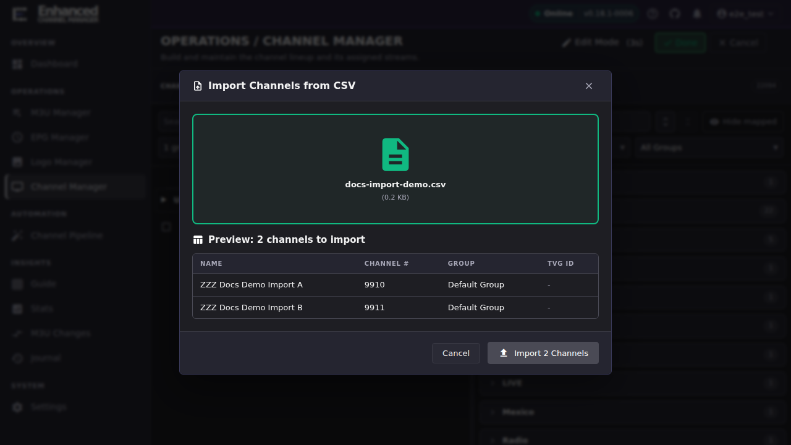
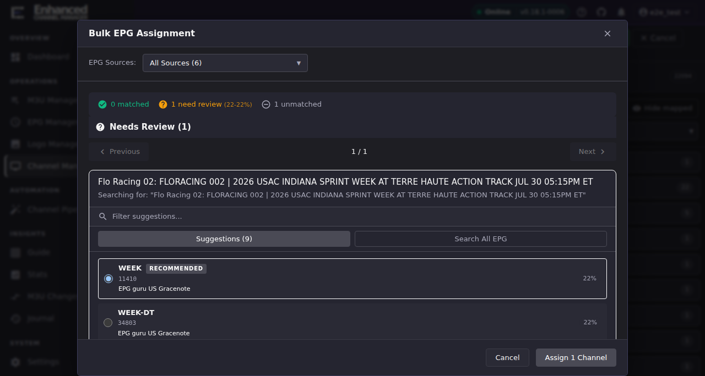
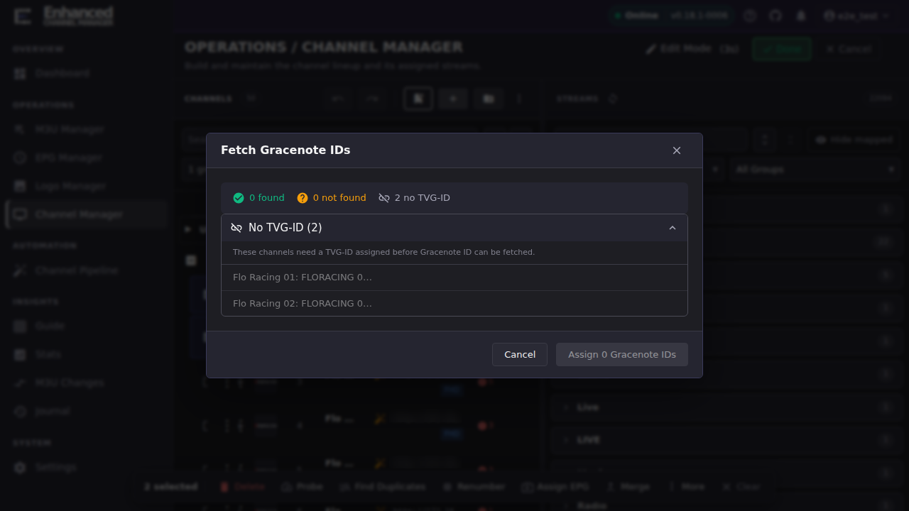
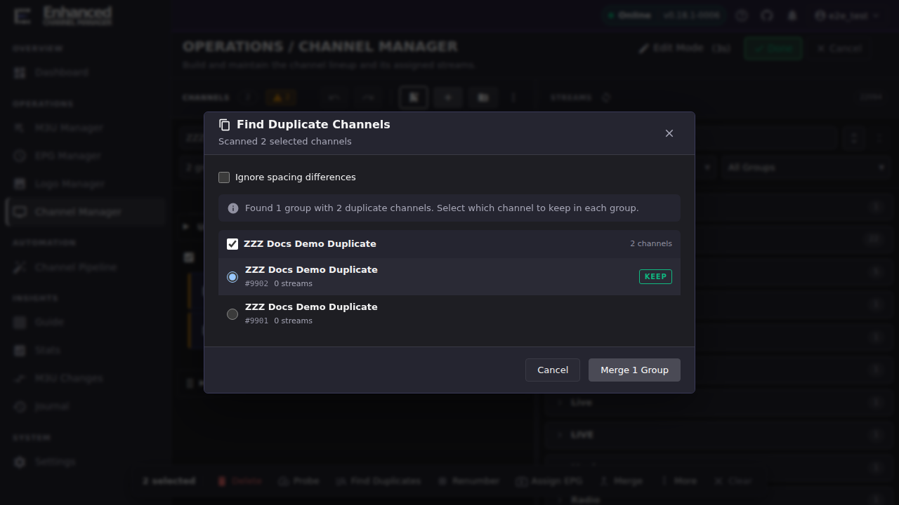
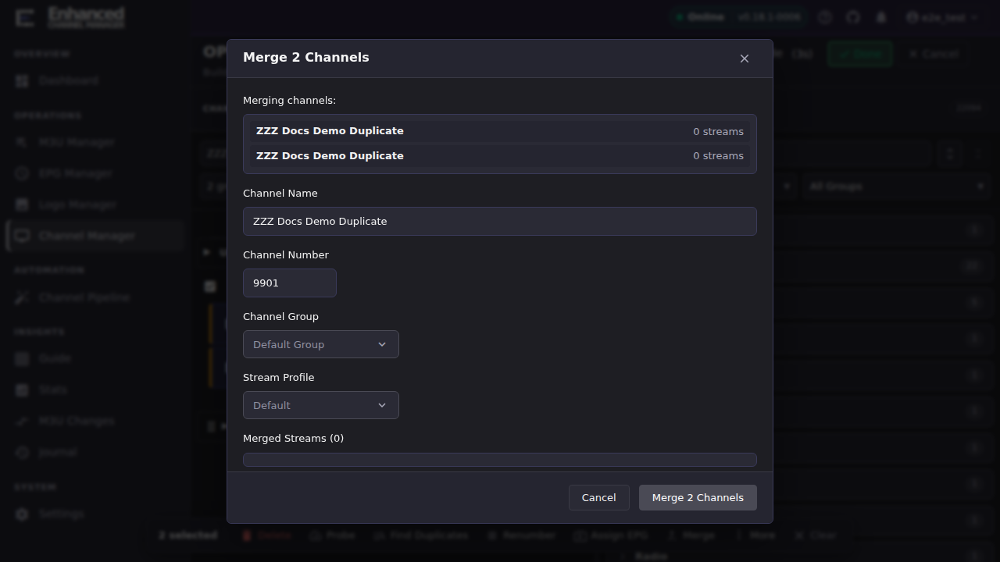

# Bulk Channel Operations

Bulk operations save time, but they multiply mistakes at the same rate they multiply changes. Before you run anything here at scale, read **[Understand what's reversible](#understand-whats-reversible)** below. Some of these actions live inside [Edit Mode's](channels-overview.md) staging model and can be discarded; others write to Dispatcharr the moment you confirm them, staged session or not.

## Common tasks

### Understand what's reversible

Row checkboxes only exist in **Edit Mode**: turn it on first. With Edit Mode on, select two or more channels in the Channels panel (their row checkboxes) to reveal a floating selection toolbar at the bottom of the panel: **Delete**, **Probe**, **Find Duplicates**, **Renumber**, **Assign EPG**, **Merge**, and a **More** menu (grouped into MOVE / SELECTION / PROFILES headers) with Move to group, Normalize Names, **Set Logo from M3U**, **Set Logo from EPG**, Sort Streams, **Fetch Gracenote IDs**, and **Profile visibility**.

These actions fall into two groups, verified directly against this build.

**Almost everything is now staged.** Actions that used to write straight through (setting logos in bulk, changing profile visibility, clearing probe stats, restoring a hidden group) now wait for **Apply All** like everything else:

| Staged: reversible while in Edit Mode |
|-|
| **Delete** (bulk toolbar): its own confirmation dialog says *"Changes can be undone while in edit mode."* |
| **Assign EPG** (bulk EPG matching), **Fetch Gracenote IDs** |
| **Normalize Names**, **Sort Streams**, **Move to group** |
| **Set Logo from M3U**, **Set Logo from EPG** |
| **Profile visibility** (enabling or disabling channels in a profile) |
| **Clear probe stats** |
| **Restore a hidden channel group** |
| **Create new channel group**, renaming and deleting groups |

**Four things still write immediately, and every one of them now says so on screen** at the moment you act, rather than leaving you to remember:

| Immediate: writes to Dispatcharr right away | What you see |
|-|-|
| **Merge**, via either the toolbar's **Merge** button or **Find Duplicates**' merge action | A notice in the dialog stating the merge is not staged and cannot be undone by Discard, Cancel or Undo, plus an **"I understand this cannot be discarded"** checkbox you must tick before the merge button enables |
| **Import Channels from CSV** | The same notice and checkbox, stating that the channels and groups it creates are written straight to Dispatcharr |
| **Probe** (three entry points: a single channel's **Channel actions** menu, the selection toolbar's **Probe**, and a group menu's **Probe Group**) | A short note reading *"Probing applies immediately"*, explaining that it writes the stream stats it measures. No checkbox: probing is not destructive |
| **Creating, renaming or deleting a channel profile** | A note in the profiles list saying profile administration applies immediately, and that enabling or disabling channels *inside* a profile does stage |

The right-hand group is not covered by **Cancel** or **Discard**. If you merge two channels or import a CSV by mistake, Edit Mode's undo stack has nothing to give back. You're correcting the result directly in Channel Manager (or Dispatcharr), not reverting a stage. Keep this table in mind through the rest of this page.

!!! note "The screenshots below predate the on-screen notices"
    The dialog screenshots in this article were captured before the immediacy notices and their acknowledgement checkboxes were added, so the Merge and Import CSV dialogs pictured show no notice. The text describes what a current build shows; the images are otherwise still accurate.

One small exception worth knowing about **Set Logo from M3U** and **Set Logo from EPG**: the *assignment* to the channel is staged, but the logo record itself is added to your Logo Manager library straight away. Discarding the session leaves the channel's logo untouched and leaves the new artwork behind as an unused entry. Clean those up with Logo Manager's **Unused only** filter.

### Import channels from a CSV file

1. Enter **Edit Mode**, then open **More actions** (⋮) above the Channels panel and choose **Import CSV**.
2. If you don't already have a file, use **CSV Template** in the same menu first. It downloads a starter file with the required `name` column and the optional columns (`channel_number`, `group_name`, `tvg_id`, `gracenote_id`, `logo_url`, `stream_urls`, semicolon-separated for multiple streams).
3. Drop your `.csv` file onto the dialog, or click it to browse.

**Result:** ECM parses the file and shows a preview table (name, channel number, group, TVG ID) before anything is created, along with the row count in the confirm button (e.g., "Import 2 Channels").

4. Review the preview, then click **Import N Channels**.

Before the button enables, tick the **I understand this cannot be discarded** checkbox on the notice above it. That notice is the dialog telling you this import is one of the actions that is *not* staged.

**Result:** The channels are created in Dispatcharr immediately. Closing the dialog or clicking **Cancel** in Edit Mode afterward will not undo an import that already ran; if you imported the wrong file, delete the resulting channels directly.

### Assign EPG to multiple channels at once

1. Select the channels you want to match (row checkboxes), then click **Assign EPG** in the selection toolbar.
2. Choose which EPG sources to match against (**Select All**, or pick specific sources), then click **Match N Channels**.

**Result:** ECM analyzes every selected channel against the chosen sources and sorts the outcome into three buckets: **matched** (a single confident match), **need review** (more than one plausible match, shown with a confidence percentage), and **unmatched**.

3. For channels that need review, choose **Review Changes** to decide per channel, or **Accept Best Guesses** to take ECM's top-ranked candidate for every conflict in one click.
4. In **Review Changes**, each channel shows its match candidates ranked by confidence, labeled with the source they came from (for example, "EPG guru US Gracenote") and a percentage score. Pick a candidate, or **Skip this channel** to leave it unmatched, then step through with **Next**.

5. Click **Assign N Channel(s)** to finish.

**Result:** This action *is* staged. This was verified by checking the channel's stored EPG ID immediately after assigning and again after discarding: the assignment only reaches Dispatcharr when you exit Edit Mode with **Apply All**. Discarding (or clicking **Cancel**) throws the match away exactly like a staged channel creation.

### Fetch Gracenote IDs

**Gracenote ID** (Dispatcharr's `tvc-guide-stationid`) is a station identifier some guide providers use for lineup matching. ECM can fetch it automatically, but only for channels that already have an EPG match (a TVG-ID). Fetching reads the `<gnid>` (or `<lcn>` as a fallback) from that channel's matched XMLTV guide entry.

1. Select one or more channels that already have a TVG-ID assigned (see the previous task if they don't yet).
2. Open **More** in the selection toolbar and choose **Fetch Gracenote IDs**.

**Result:** ECM reports how many channels it found an ID for, how many it could not find one for, and how many were skipped because they have no TVG-ID yet:

If a channel already has a *different* Gracenote ID stored, what happens next depends on **Settings → Appearance → Gracenote ID Conflict Handling**: **Ask me what to do** (the default, which shows a conflict dialog per channel), **Skip channels with existing IDs**, or **Automatically overwrite existing IDs**.

### Find and merge duplicate channels

1. Select the channels you suspect are duplicates (or select a whole group), then click **Find Duplicates** in the selection toolbar.
2. Optionally check **Ignore spacing differences** if the duplicates only differ by whitespace.

**Result:** ECM groups channels that resolve to the same name and shows which one it would **KEEP** by default (you can change the selection per group), or reports "No duplicate channels found" if nothing matched.

3. Review the KEEP choice for each group. Inside Edit Mode, tick the **I understand this cannot be discarded** checkbox on the notice above the buttons, then click **Merge N Group(s)**.

**Result:** ECM merges every duplicate group immediately. This is *not* staged, even if you're inside an active Edit Mode session. The kept channel absorbs the other channel's streams; the other channel is deleted.

### Merge specific channels manually

Use this when you want to combine channels that **Find Duplicates** wouldn't flag on name alone. For example: two differently-named channels carrying the same event.

1. Select the channels to combine, then click **Merge** in the selection toolbar.
2. In the **Merge N Channels** dialog, review the channel name, channel number, channel group, and stream profile the merged channel will use (all editable) and the combined stream list.
3. Inside Edit Mode, tick the **I understand this cannot be discarded** checkbox on the notice above the buttons. It states plainly that the source channels are deleted once their streams have moved.
4. Click **Merge N Channels** to confirm.

**Result:** ECM creates one merged channel with the streams from every source channel and deletes the sources. This happens immediately, regardless of Edit Mode. There is no undo for this from inside ECM; recovering from a bad merge means recreating the split manually. Treat the confirmation dialog as your last checkpoint, the same way [Stream Deduplication](stream-dedup.md#resolving-merges-in-bulk) describes for the Pending Merges queue's **Merge all**.

## Resolving pending merges from an M3U refresh

If your provider's stream names are close enough to an existing channel that ECM flags them automatically during an M3U refresh, that's a different, larger workflow with its own queue, confidence threshold, and bulk controls. See **[Stream Deduplication](stream-dedup.md)**, which covers the **Pending Merges** page in full, including its own bulk **Merge all** / **Clear all** and per-row error recovery.

## Going deeper

- [Channel Manager](channels-overview.md): Edit Mode, staging, and the undo/redo/checkpoint model these bulk actions plug into.
- [Stream Deduplication](stream-dedup.md): the Pending Merges queue, confidence threshold, and MCP tools for the automatic (M3U-refresh-triggered) dedup path.
- [`docs/api.md`](https://github.com/MotWakorb/enhancedchannelmanager/blob/main/docs/api.md) (in the repository, not part of this published guide): the channel import, EPG assignment, and merge endpoints behind these dialogs.
