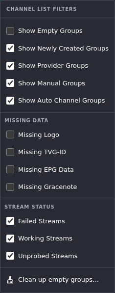
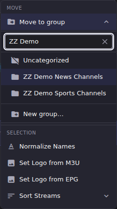
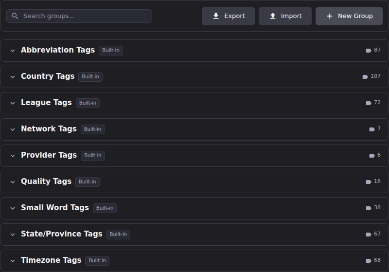

# Channel Groups and Tags

These two names sound related and are not, so start here:

- A **channel group** is a folder for channels. It lives in Dispatcharr, and it is what the Channels panel groups its rows under.
- A **tag** is a word in a vocabulary that [normalization](../normalization/index.md) rules and [Channel Pipeline](../channel-pipeline/index.md) conditions match against, for example `HD`, `4K`, `NFL`, `Ontario`. Tags are a matching vocabulary, not labels. They are never attached to a channel, and they never leave ECM.

Most of this article is about channel groups. The last section says what tags are and where to find them.

## Channel groups

### Read the group structure in the Channels panel

Each group header carries, left to right: the group name, an **Auto-Sync** badge if it applies, the channel count, a green count of channels with working streams, a red count of channels with failed streams, and the group's channel number range (for example `#9900–9901`).

**Result:** The Channels panel orders groups by the *lowest channel number* in each group, not alphabetically. A group whose channels start at 1 sits above one whose channels start at 9900, regardless of names. The group filter dropdown at the top of the panel is the exception: it lists every group in alphabetical order, including empty ones.

### Choose which groups you see

Two independent controls decide what the Channels panel shows.

1. The **N groups selected** dropdown picks specific groups by name. It has **Select All**, **Clear All**, and a **Search groups...** box for finding one in a long list.
2. The **Channel List Filters** button (the sliders icon beside it) filters by group *kind* and by channel condition.

The three group-kind toggles are the ones worth understanding, because ECM classifies every group automatically and you cannot change the classification by hand:

| Filter | What it matches |
|-|-|
| **Show Provider Groups** | Groups that appear in an M3U account's group settings, in other words groups your provider's playlist supplies. |
| **Show Auto Channel Groups** | Groups with auto channel sync switched on in M3U Manager, plus any group they are configured to redirect channels into. These are the groups that carry the **Auto-Sync** badge. |
| **Show Manual Groups** | Everything else: groups you created yourself. |

The classifications are exclusive, so a group counted as Auto Channel is not also counted as Provider. The remaining toggles (**Show Empty Groups**, **Show Newly Created Groups**) and the **Missing Data** and **Stream Status** sections filter on channel condition rather than group kind, which is how you answer questions like "which of my channels still have no logo."

**Result:** Turning a filter off hides matching groups from the panel. It changes nothing about the groups themselves, and nothing is sent to Dispatcharr.

> A group you have explicitly ticked in the group dropdown stays visible even with **Show Empty Groups** off. That is deliberate: an explicit pick is a request to see the group so you can drop channels into it.

### Create, rename or delete a group

**Create**, **Rename** and **Delete** are all staged.

1. With Edit Mode on, either click **Create new channel group** (the folder icon in the toolbar above the Channels panel) and enter a name, or open an existing group's **Group actions** menu (the ⋮ at the right of the group header) and choose **Rename Group** or **Delete Group**.
2. **Delete Group** offers **Also delete the N channels**. Leave that unticked and the channels survive: the dialog says they move to *"Default Group"*, and that is where they land.

**Result:** All three show up in the pending-change count and the Exit Edit Mode ledger, and are only sent to Dispatcharr on **Apply All**. Each is undoable and discardable like any other staged change, **Create** included: **Cancel** and **Discard** now take a newly created group back with them. A batch containing nothing but staged group creations still commits and exits Edit Mode correctly, rather than reading as a no-op and leaving the session open. **Delete Group** only appears on manual groups, so you cannot accidentally delete a group your provider is still populating.

The **Group actions** menu also holds **Probe Group**, **Sort Streams** and **Sort & Renumber** for the group's channels.

### Move channels into a different group

1. With Edit Mode on, tick the channels you want, then open **More → Move to group** in the selection toolbar at the bottom of the panel.
2. Pick a target from the filterable list, or **Uncategorized**, or **New group…**.

3. A **Move N Channels to Group** dialog opens. Choose what happens to the channel numbers: **Keep current numbers**, **Assign sequential numbers** (which suggests the next free number after the target group's highest), or **Custom starting number**.
4. If the numbers you are moving in would collide with numbers already in the target group, the dialog warns *"Channel numbers will shift"* before you commit and names the existing channels that move to make room. If the move leaves gaps behind, it offers **Close gaps in source group**.
5. Click **Move N Channels**.

**Result:** The move, any shifting of existing channels, and any source-group renumbering are all staged as separate batches, so you can undo them and they only reach Dispatcharr on **Apply All**. Moving into a group flagged **Auto-Sync** raises a warning first, because the next provider sync may undo hand-placed channels there.

**Move a single channel by drag.** With Edit Mode on, dragging one channel row onto a different group's header opens the same dialog, titled **Move Channel to Group**, seeded with just that one channel; steps 3-5 above apply unchanged. The dialog picks its default numbering choice from what the destination group already holds: if the destination has no numbered channels yet, only **Keep current numbers** and **Custom starting number** are offered, since there is nothing to suggest a sequential number from.

### Reorder groups

With Edit Mode on, each group header grows a drag handle. Dragging a group to a new position opens a **Reorder Group** dialog offering **Keep current numbers**, **Renumber sequentially** or **Custom starting number** for that group's channels.

**Result:** The renumbering is a staged change like any other. The new *position* is not: group order is held in the page's own state and is not saved anywhere, so a page reload puts the panel back to ordering groups by lowest channel number. If you want an ordering that lasts, the renumber is what makes it stick, not the drag.

## Tags

Tags are at **Settings → Tags**, described in the UI as *"Manage tag vocabularies used by normalization rules for pattern matching."* They ship as nine built-in groups: Abbreviation, Country, League, Network, Provider, Quality, Small Word, State/Province and Timezone Tags.

Expand a group to see its description, an *"N of M tags enabled"* count, and the tags themselves as chips. Click a chip to enable or disable that tag, and type into **Add new tag...** to extend the vocabulary. Built-in tags have no delete button, only the enable/disable click; tags you added yourself can be deleted. **Export** downloads the whole vocabulary as `tags.yaml` and **Import** takes that YAML back, which is how you move a tuned vocabulary between instances.

**Result:** Changing a tag changes what your normalization rules and Channel Pipeline conditions match. Nothing about your channels or groups changes until a rule that uses the vocabulary actually runs. Nothing here is ever visible to Dispatcharr or your media server.

## Going deeper

- [Normalization](../normalization/index.md): the rules that consume tag vocabularies, and how to author one.
- [Channel Pipeline](../channel-pipeline/index.md): rule conditions that match against a tag group.
- [M3U Manager](../m3u-manager/manage-stream-groups.md): where auto channel sync is turned on, which is what makes a group an Auto Channel Group.
- [Bulk Channel Operations](bulk-edit.md): the rest of the selection toolbar, and which of its actions are staged.
