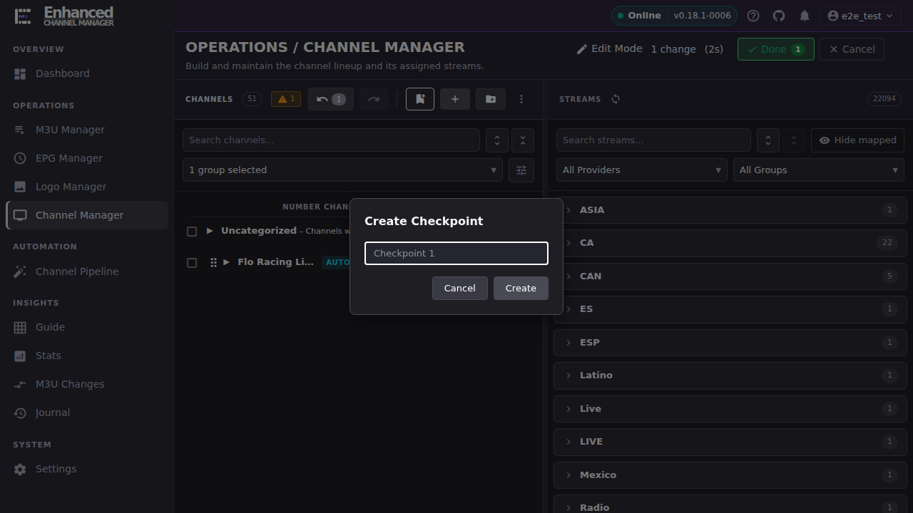

# Channel Manager

Channel Manager is where you build and maintain your channel lineup. Most of what you do here goes through **Edit Mode**, a staging area that batches your edits so nothing reaches Dispatcharr until you say so. But not everything is staged, and knowing which is which is the single most important thing on this page.

## Common tasks

### Turn on Edit Mode and see what changes

1. Open **Channel Manager**.
2. Click **Edit Mode** (top right).

**Result:** A new row of controls appears above the Channels panel: **undo**, **redo**, a bookmark-shaped **Create checkpoint** button, **Create new channel** (+), **Create new channel group** (folder), and **More actions** (⋮). The **Edit Mode** label grows a running timer, and a **Done** button and a **Cancel** button appear next to it.

Keep this in mind for everything below: **Create new channel**, **Create new channel group**, editing a channel inline, dragging a stream onto a channel, and **Delete** from the selection toolbar are all *staged*. They only take effect when you click **Done → Apply All**, they count toward the pending-change total, and **Cancel** or **Discard** throws them away like any other staged edit.

Almost everything in Edit Mode is now staged, including setting logos in bulk, changing profile visibility, clearing probe stats, and restoring a hidden group. Four things still write immediately: **Merge** (from the toolbar or from Find Duplicates), **Import CSV**, **Probe**, and creating, renaming or deleting a channel *profile*. Each of those now says so on screen at the moment you act, and the two destructive ones make you tick a checkbox first. The [Bulk Channel Operations](bulk-edit.md) article has the full table.

### Create a channel (a staged change)

1. With Edit Mode on, click **Create new channel** (the + icon).
2. Enter a **Channel Name** and, optionally, a **Starting Channel Number**, **Channel Group**, and channel profiles.
3. Expand **Normalization Rules** if you want your normalization rules applied to the name you typed. The panel previews what the rules will make of the name as you type it. Leave the toggle off to create the channel under the literal text you entered. Its starting position comes from **Settings → Channel Normalization → "Apply normalization by default when creating channels"**.
4. Click **Create Channel**.

**Result:** The channel appears in the Channels panel right away, but nothing has reached Dispatcharr yet. The **Edit Mode** label now reads **1 change**, a matching badge appears on **Done**, and the undo button shows a count of 1.

Editing an existing channel's name, number, or group inline, and dragging a stream from the Streams panel onto a channel, stage the same way. Each is one more entry in the undo stack and one more line in the change count.

### Give a channel a number that's already taken

If you type a channel number that another channel is already using, ECM stops and asks before staging it. This happens whether you edit the number inline in the channel list or through **Edit Channel**.

**Result:** a **Channel Number Already Used** dialog naming the number and every channel currently on it. Dispatcharr genuinely allows duplicate channel numbers, so this is not an error, and the dialog says so. It is asking whether you meant it.

- **Go Back** returns you to the field. From the inline editor it puts back exactly what you typed, so nothing has to be retyped.
- **Use It Anyway** stages the change and remembers that you approved *this specific collision*. You will not be asked about it again at Apply time.

That last point has an edge worth knowing: your approval is tied to the channels the dialog named. If the set of channels sitting on that number changes before you apply, ECM asks again, because the collision it would create is no longer the one you agreed to.

### Clear a channel's number

Clearing a number is treated as a deliberate act, not as an empty field. If the channel's *name* contains the number you are clearing, ECM warns you first:

> Clearing the number leaves it in the channel's name.

Automatic renaming only rewrites a name when there is a new number to write, so the name keeps the old number until you edit it yourself. Choose **Clear It Anyway** to proceed or **Go Back** to reconsider.

Clearing is only available from the inline channel-number editor. In the **Edit Channel** modal, leaving the number field empty means "leave it alone", not "clear it".

### Apply your staged changes

1. When you're done making changes, click **Done** next to Edit Mode.
2. ECM shows an **Exit Edit Mode** dialog summarizing every pending change (for example, "1 new channel created"). Click **Show details** to see the itemized list.
3. If changing a number will also rewrite a channel's *name*, the dialog lists every one of those before you commit:

    > N channel name(s) will also be rewritten because the number changed:

    followed by one before-and-after line per channel. These are names that carry their channel number, like `150 | Alpha`. They are already counted in the change total above, not added to it a second time; the list is there so no rename is a surprise.

4. Click **Apply All**.

**Result:** ECM commits every staged change to Dispatcharr in one batch, the dialog closes, and Edit Mode turns off. Open **Guide** or a media client pointed at ECM/Dispatcharr to confirm the change is live.

### Discard changes you don't want to keep

There are two ways to throw away staged work, and they land in the same place:

1. **From inside Edit Mode**, click **Cancel** (next to Done) at any point. ECM asks *"You have N pending change(s) that will be lost. Are you sure you want to cancel?"* Confirming discards everything staged so far and exits Edit Mode.
2. **From the exit summary**, click **Done**, then click **Discard** instead of **Apply All**.

**Result:** Every staged change is thrown away (the channel you created, the stream you dragged, the edit you typed) as if it never happened. Because nothing was ever sent to Dispatcharr, there is nothing on the Dispatcharr side to undo. Edit Mode turns off and the Channels panel reverts to exactly what it looked like before you opened it.

Discard only affects the *current* Edit Mode session. It cannot undo a batch you already applied with **Apply All**. That batch already reached Dispatcharr. For actions that write to Dispatcharr immediately even while Edit Mode is on (CSV import, merges), see [Bulk Channel Operations](bulk-edit.md). Discard does not touch those either, because they were never staged in the first place.

### When someone else changed a channel number while you were editing

Before Apply writes anything, ECM re-reads the channel list. If a number you are about to change has moved on the server since you started, you get a **Channel Numbers Changed While You Were Editing** dialog.

**Nothing has been applied at this point.** The dialog opens instead of committing, and everything else you staged is untouched and will still be applied.

For each affected channel it tells you what it was on when you started, what it is on now, and what your change would put it on. You choose per channel:

- **Use my number** keeps your change and overwrites theirs.
- **Keep the server's** withdraws your number for that channel.

There is no pre-selected option, and **Apply With These Choices** stays disabled until you have answered every row. That is deliberate: a pre-ticked "keep mine" would be a silent overwrite wearing a checkbox. **Keep Editing** abandons the apply entirely and leaves every staged change exactly as it was.

Two consequences of choosing **Keep the server's** that are easy to be surprised by:

- **A range renumber is dropped whole, not trimmed.** Renumbering a range assigns numbers in sequence, so keeping the server's number for one channel in the middle would shift every channel after it onto numbers you were never shown. Rather than do that, ECM drops the entire renumbering and tells you it did. The dialog warns you before you choose, on the affected rows.
- **An automatic rename goes with the number.** If the name you staged was one ECM generated from the number, giving up the number gives up that rename too, so you are not left with a channel called `150 | Alpha` sitting on 199. A name you typed yourself is never touched.

After you choose, ECM re-checks against the list your decisions were made about and applies. If something moved *again* in the meantime, it asks once more rather than guessing.

### Pick up staged work after your session expires

If your sign-in expires while you have staged changes (a token refresh fails, or the server stops recognising your session), ECM cannot apply them: the session is already gone and every commit would be rejected. It saves them instead.

Sign back in and you are **offered** the work back, with an account of anything that no longer applies. It is not restored automatically, because part of a saved session can fail its freshness checks and you should see what you are getting before **Apply All** is one click away. A **Restored** badge sits in the Edit Mode header for the rest of the session, because a restored change count looks identical to a fresh one and the difference decides whether applying is safe.

Four limits, all deliberate:

| | |
|-|-|
| **It belongs to you** | Staged work is tied to the account that staged it. If a *different* person signs in on that tab, the work is destroyed rather than offered to them. Otherwise they would apply your edits under their name, and the Journal would record every change as theirs. |
| **It dies with the tab** | Closing the tab discards it. It is not saved to disk and it will not follow you to another browser or machine. |
| **It expires after 12 hours** | Long enough to cover an interrupted working session; short enough that a lineup which has had days to move is never applied against stale assumptions. |
| **A duplicate you confirmed may be re-checked** | Your approval of a duplicate number named the channels that were on it. If a channel you were *not* shown has joined that number while you were away, the approval no longer describes the collision, so it is withdrawn and the number is checked again before anything is applied. The restore dialog tells you upfront which confirmations this affects. A collision that merely got *smaller*, because someone moved off the number, keeps your approval: you already agreed to the larger one. **Apply All** applies the same rule, so restore never asks you about something Apply would have accepted. |

### Undo, redo, and checkpoints within a session

While Edit Mode is on:

- **Undo** (Cmd+Z, or Ctrl+Z on Windows/Linux) steps back through your staged changes one at a time, most recent first.
- **Redo** (Cmd+Shift+Z / Ctrl+Shift+Z) steps forward again through anything you've undone.
- **Create checkpoint** (the bookmark icon) opens a dialog where you name and save the current staged state. It's pre-filled with a running name like "Checkpoint 1". Use this before a large or risky batch of edits so you have a labeled point in your session, rather than clicking Undo one step at a time to get back to it.

**Result:** Undo, redo, and checkpoints all operate on the current staged batch only. Once you click **Apply All**, that batch is committed and there's nothing left in the undo stack to step through. A fresh Edit Mode session starts with a clean history.

## Going deeper

- [Bulk Channel Operations](bulk-edit.md): CSV import, bulk EPG assignment, Gracenote IDs, Find Duplicates, and Merge Channels for working across many channels at once, and which of those are staged vs. immediate.
- [Stream Deduplication](stream-dedup.md): what happens when a stream you're adding looks like it belongs to a channel you already have.
- [`docs/api.md`](https://github.com/MotWakorb/enhancedchannelmanager/blob/main/docs/api.md): the channel and stream API endpoints behind Edit Mode's Apply All commit.
- [`docs/architecture.md`](https://github.com/MotWakorb/enhancedchannelmanager/blob/main/docs/architecture.md): how staged edits are batched and sent to Dispatcharr.
