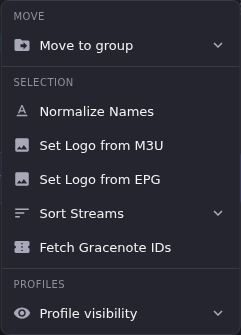

# Put Logos on Channels

Logos are managed in **Logo Manager**, but they are *assigned* in **Channel Manager**. This article covers the Channel Manager side: setting a logo on one channel, and setting logos on many at once. For the library itself (uploading, adding by URL, finding and deleting unused artwork) see [Logo Manager](../logo-manager/index.md).

Both paths now stage the assignment like any other Edit Mode change. There is one shared wrinkle about the artwork library itself, covered below.

## Common tasks

### Set the logo on a single channel

Covered step by step in [Logo Manager → Match a logo to a channel](../logo-manager/index.md#match-a-logo-to-a-channel). In short: with Edit Mode on, open the channel's **Channel actions** menu, choose **Edit Channel**, and in the **Channel Logo** section either click **Use EPG Logo** / **Use Stream Logo** or pick a thumbnail from the picker, then **Save Changes**.

**Result:** The assignment is staged like any other channel edit and reaches Dispatcharr on **Apply All**.

One thing that walkthrough does not say: **Use EPG Logo** and **Use Stream Logo** create the logo record in the library straight away, before you save anything. If you click one and then close the modal or discard the Edit Mode session, the channel keeps its old logo but the new image stays in Logo Manager as an unused entry. Clean those up with Logo Manager's **Unused only** filter.

### Set logos on many channels at once

**This path is now staged.** It counts toward the Edit Mode change total, it is covered by Undo, and **Cancel** or **Discard** throws it away. Nothing reaches Dispatcharr until **Apply All**. Earlier builds wrote these straight through; if you built a habit around that, this is the change to unlearn.

1. With Edit Mode on, tick the channels you want in the Channels panel.
2. In the selection toolbar, open **More**.
3. Choose **Set Logo from M3U** or **Set Logo from EPG**.

The two sources differ in where they look:

| Action | Where the image comes from | Skipped when |
|-|-|-|
| **Set Logo from M3U** | The first of the channel's assigned streams that carries a logo URL from the provider playlist. | The channel has no streams, or none of them carry a logo URL. |
| **Set Logo from EPG** | The icon on the EPG entry the channel is linked to. | The channel has no EPG match, or the matched entry has no icon. |

**Result:** ECM works through the selection one channel at a time and reports the outcome as a notification: *"Set logos: 12 assigned, 3 skipped (no M3U logo)"*, or *"(no EPG logo)"* for the EPG variant. Those assignments are **staged**. Review them in the Channels panel and commit with **Done → Apply All**, or throw them away with **Cancel** or **Discard**. If you pointed it at the wrong selection, discarding is now a real option.

**One part of this is still immediate, on both the single and the bulk path.** Pulling a logo from an M3U or EPG source adds that image to your Logo Manager library straight away, before anything is staged. Discarding the session leaves every channel's logo untouched and leaves the newly added artwork behind as an unused library entry. Nothing on screen says so. Clean them up with Logo Manager's **Unused only** filter.

It is still worth running on a small selection first to see what your provider's or EPG source's artwork actually looks like, before applying it to a few hundred channels.

## Going deeper

- [Logo Manager](../logo-manager/index.md): the artwork library, uploading, adding by URL, and finding logos nothing is using.
- [Channel Manager](channels-overview.md): the Edit Mode staging model both of these paths now use.
- [Bulk Channel Operations](bulk-edit.md): the other actions on the same selection toolbar, and the four that still write immediately.
- [EPG](../epg/index.md): matching a channel to EPG data, which is what makes **Set Logo from EPG** find anything.
