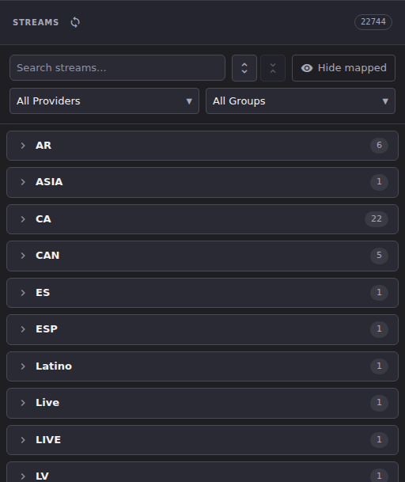
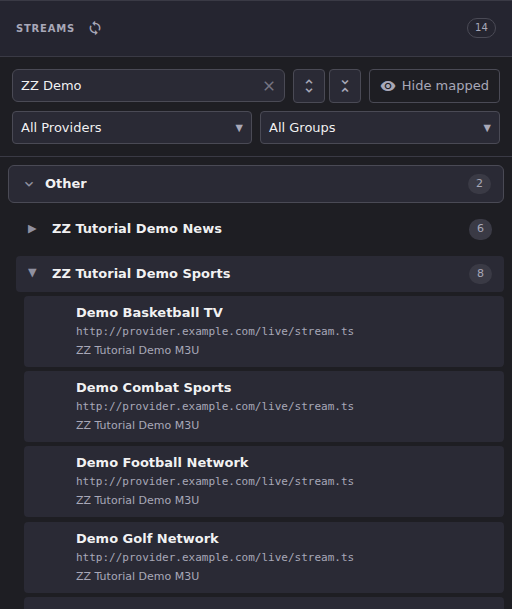

# Streams

A **stream** is one playable URL that a provider's playlist handed to Dispatcharr. A **channel** is what your viewers see in the guide. A channel plays one of the streams assigned to it, so the Streams panel is your raw material and the Channels panel is the finished lineup. This article covers reading and filtering that raw material. Putting streams onto channels is covered in [Assign Streams to Channels](assign-streams-to-channels.md).

Everything on this page is read-only until you turn on **Edit Mode**. Outside Edit Mode you can search, filter, preview and copy, but the selection checkboxes and drag handles that let you act on a stream are not rendered at all.

## Common tasks

### Read the Streams panel

1. Open **Channel Manager**. The Streams panel is the right-hand half of the split view.
2. The panel is three levels deep: **category** → **group** → **stream**. Click a category to expand it, then click a group inside it to load and expand that group's streams.

**Result:** You see your provider's group names bucketed under short category headings such as `AR`, `CA`, `US` or `Other`, each with the number of groups it holds.

Those categories are not something you configure. ECM derives each one from the group name itself: it takes the text before the first `|` or `:` in the name, so a group called `UK: SPORTS [1080p]` lands under `UK` and one called `CA| Documentary` lands under `CA`. Any group whose name has neither delimiter falls into **Other**, which always sorts last. ECM does not normalise the prefixes, so `US` and `USA` stay separate categories if your provider uses both.

### Narrow the list to the streams you care about

The toolbar above the list gives you four independent filters, and they combine:

1. Type into **Search streams...** to match on stream name.
2. Use **All Providers** to limit the list to one M3U account.
3. Use **All Groups** to limit it to specific provider groups. This dropdown has its own **Search groups...** box.
4. Click **Hide mapped** to drop every stream that is already assigned to a channel. The button's label changes to **Mapped hidden** while it is on, and the setting survives a page reload.

**Result:** The number badge next to the **Streams** heading tracks what you are looking at. With no filters it is the total stream count; with a group filter applied it is the filtered count; with a search term it is the number of matching streams.

Use **Expand all groups** and **Collapse all groups** (the two arrow buttons beside the search box) when you want to sweep the whole list rather than drill into one group.

### Inspect a single stream

1. Expand a group to load its streams.

2. Each row shows the stream name, its URL, and the name of the M3U account it came from. That third line is how you tell two identically-named streams from different providers apart.
3. The buttons on the right of the row are **Preview stream in browser**, **Open in VLC** and **Copy stream URL**.

**Result:** **Preview stream in browser** opens ECM's built-in player so you can confirm the stream is alive before you build a channel on it. **Copy stream URL** puts the provider URL on your clipboard, which is what you want when you are testing a stream outside ECM.

> Stream URLs usually carry your provider credentials as query parameters. Treat anything you copy from here as a secret, and be careful about pasting it into a bug report or a screenshot.

### Refresh the inventory

1. Click the **Refresh streams from Dispatcharr** button (the circular-arrows icon next to the **Streams** heading).

**Result:** ECM re-reads the stream inventory from Dispatcharr. Use this after you have refreshed an M3U account in [M3U Manager](../m3u-manager/index.md) and want the new streams to show up here without reloading the page. It does not fetch anything from your provider; it only re-reads what Dispatcharr already holds.

### Spot a stream your provider has dropped

Providers rename and retire streams constantly. When Dispatcharr's own playlist refresh stops matching a stream that a channel is still using, ECM marks it with a **STALE** badge on the assigned-stream row inside that channel. The stream is still there and may still play, but it is no longer listed in the source playlist, so it is a candidate for replacement.

**Result:** Expand a channel in the Channels panel and look at its stream list. A **STALE** badge means "this came from a playlist entry that has since disappeared." Nothing removes it automatically.

## Going deeper

- [Assign Streams to Channels](assign-streams-to-channels.md): turning the streams you found here into channels, and what is staged versus what is immediate.
- [Stream Deduplication](stream-dedup.md): what happens when the stream you are adding looks like a channel you already have.
- [M3U Manager](../m3u-manager/index.md): where streams come from in the first place, and how to refresh a provider playlist.
- [`docs/api.md`](https://github.com/MotWakorb/enhancedchannelmanager/blob/main/docs/api.md): the stream endpoints behind this panel, when you want to script something.
