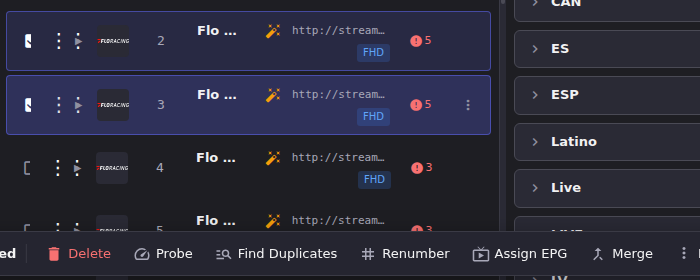
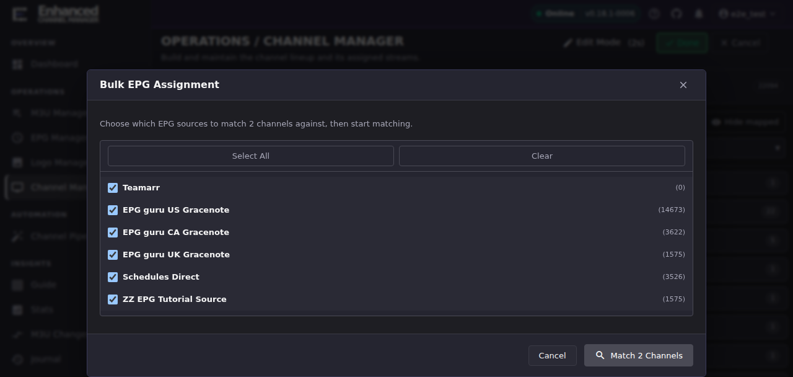
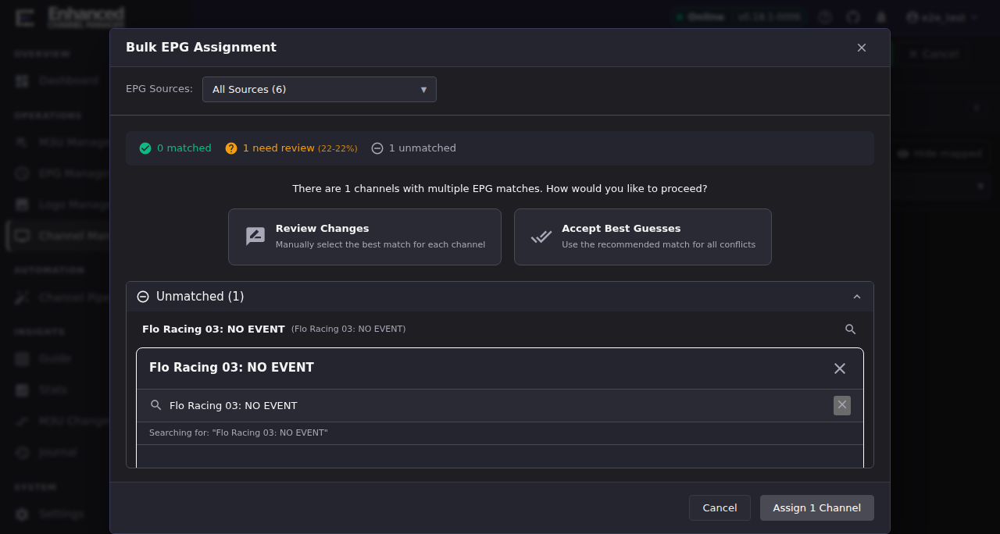

# Match channels to EPG data

Matching is a separate step from adding a source: an EPG source being
**Ready** (see [Add and refresh EPG sources](epg-sources.md)) only means ECM
*has* guide data to offer. It doesn't attach any of it to your channels
yet. Matching is also not the same as
[normalization](../normalization/index.md): normalization changes how a
channel's *name* looks, matching changes which *guide row* it points at.

## Bulk-match a set of channels

1. Open **Channel Manager** and turn on **Edit Mode**.
2. Select the channels you want to match: check their row checkboxes (or a
   whole group's checkbox).
3. In the floating selection bar at the bottom, click **Assign EPG**.

4. In the **Bulk EPG Assignment** dialog, choose which EPG sources to match
   against (all active, non-dummy sources are selected by default;
   **Dummy EPG Profiles never appear here**, since they generate guide data
   rather than offering it as a match target). Click **Match N Channels**.

**Result:** ECM analyzes every selected channel and sorts it into one of
three buckets, shown as a summary bar: **matched** (confidence at or above
the auto-match threshold, 80% by default), **need review** (a candidate
exists but confidence is below the threshold), and **unmatched** (nothing
found). If there are channels needing review, you're prompted to **Review
Changes** (pick per channel) or **Accept Best Guesses** (use the top
candidate for every conflict) before you can finish.

### Make the match show up in Guide

Matching a channel to an EPG entry links the two records, but it does not by
itself pull that entry's programme listings into the [Guide](../guide/index.md)
grid. This is expected behavior, not a bug: Guide displays whatever
programme data ECM already has cached, and a channel-to-EPG match takes
effect there only after the EPG data itself is refreshed again. Guide's own
**Refresh** button reloads the grid from that cache; it does not re-fetch
EPG data, so clicking it repeatedly after a match will not make programming
appear.

To get real programming showing for newly-matched channels, run the **EPG
Refresh** task: **Settings → Scheduled Tasks → EPG Refresh → Run Now** (or
wait for its next scheduled run). Once that completes, Guide's Refresh
button will show the new programme data. For large feeds, allow a few
minutes after the task reports success before expecting Guide's Refresh to
show it: Dispatcharr's own ingest keeps running behind the task's
"complete" status, and this took roughly 3-5 minutes on a 14,000-channel
feed during verification.

## Why review matters: read the confidence score

Do not treat every suggested match as correct. A low score means the
matcher found *something* shaped like your channel name, not that it found
the right guide row. A real example from this instance: a channel named
*"Flo Racing 02: FLORACING 002 | 2026 USAC INDIANA SPRINT WEEK AT TERRE
HAUTE ACTION TRACK..."* came back with a recommended match of **"WEEK"**
(a broadcast station callsign) at **22% confidence**. The word "WEEK"
literally appears inside the channel's long generated title, which is
enough for the matcher to suggest it, but it is obviously the wrong guide
entry for a motorsports channel.

When you see a card like this:

- A **high score in the 90s** on a channel whose name closely resembles the
  suggested entry is usually safe to accept.
- A **low score** (under ~50%), or a suggestion that doesn't semantically
  match the channel at all, needs a manual look. Use **Search All EPG** on
  the card to search every loaded guide entry by name or `tvg_id` instead of
  trusting the ranked suggestions.
- **Accept Best Guesses** applies the top-ranked candidate to *every*
  remaining conflict in one click: safe for a batch of channels you've
  spot-checked, risky for a batch you haven't looked at at all.

## Fixing a channel with no match

Channels the matcher couldn't find anything for land in the **Unmatched**
section of the review screen. Click the search icon next to a channel to
open the same manual search used for conflicts. It starts pre-filled with
the channel's own name, and if your guide sources genuinely don't carry that
channel, the search comes back empty:

From here you can either broaden the search (drop distinctive words the
guide provider wouldn't include, like scores or dates baked into a stream's
title) or accept that this channel has no matching guide row yet. Leaving
it unmatched is not an error state; it just means that channel keeps
whatever guide data (or lack of it) it already had.

For a single channel outside a bulk run, the same lookup is available from
the channel's own EPG picker in its edit dialog (**Get from EPG** /
**Copy from EPG**), which is also how you manually correct one channel. See
[Finding and fixing mis-linked channels](finding-mislinked-channels.md) for
that workflow end to end.

## Timezone and region awareness

When auto-matching, ECM's matcher understands regional feeds so a "…West"
channel doesn't silently win against its own region's Pacific entry. Many
guide providers carry one "default" entry (implicitly East-coast) for a
network plus a separately tagged Pacific row, e.g.
`USANetwork(Pacific)(USAP).us`. Without region awareness a "…West" channel
would score the East-coast entry higher than its own Pacific counterpart.
The channel got *a* guide, just the wrong one, three hours off. This was the
root cause behind the [shared-EPG-link
bug](finding-mislinked-channels.md) (field report, 2026-07-14).

**Regional equivalences.** These region words are treated as timezone tags
on the *same* network, not separate networks:

| Region word | Region code | Notes |
|-|-|-|
| East | `E` | |
| West | `W` | |
| Pacific | `W` | West and Pacific are the same region. US West-coast feeds run on Pacific time, and guide providers label the West feed "(Pacific)". |
| Central | `C` | Its own region, not aliased to West. |
| Mountain | `M` | Its own region, not aliased to West. |

**How a region is detected**, for both the channel and each EPG candidate:

1. A parenthetical in the `tvg_id` wins first, e.g.
   `USANetwork(Pacific)(USAP).us` → West. Authoritative when present.
2. Otherwise, the *last meaningful word* of the display name, skipping
   trailing quality/format tags (`HD`, `FHD`, `4K`, ...) and bare trailing
   numbers, so `"AMC West HD"` and `"AMC West 2"` both still detect `West`.
3. Only an exact whole-word region token counts. Adjective forms like
   "Eastern" or "Western" (`PBS Eastern`, `Starz Encore Westerns`) are
   deliberately **not** treated as a region tag.

**How region affects ranking.** Region only breaks ties. It never promotes
a worse match over a better one. It's the last tie-break applied, after
confidence, source priority, and exact/token-overlap scoring: among
candidates that are otherwise tied, the entry whose region matches the
channel's wins. A channel with no detected region (ESPN, CNN, most
non-regional networks) is unaffected.

**Example: before and after.** Channel `AMC West`; the EPG source has both
`AMC` (implicitly East) and `AMC (Pacific)`:

- **Before:** `AMC West` matched `AMC`, the East-coast entry. The West/East
  tag was stripped when building the match key and "Pacific" wasn't
  recognized as related, so `AMC (Pacific)` wasn't even a match candidate
  for a short network name like AMC.
- **After:** `AMC (Pacific)` collapses into the same match key as `AMC`,
  making it a genuine candidate; the region-consistency tie-break then ranks
  it above the plain `AMC` entry because West↔Pacific agree. `AMC West` now
  links to `AMC (Pacific)`.

**Checking your fleet.** There is currently no UI surface for this audit, and
no way to run the [duplicate-EPG-link audit](finding-mislinked-channels.md)
from the ECM web UI. It finds channels still mis-linked: either left over
from before this fix, or a region combination the matcher doesn't have
enough signal to disambiguate automatically.

## Going deeper

- [Add and refresh EPG sources](epg-sources.md): sources must be Ready
  before they're useful match targets.
- [Finding and fixing mis-linked channels](finding-mislinked-channels.md):
  the read-only audit for channels that already share one EPG row, plus the
  single-channel manual re-link flow.
- [Migrate channel guides between IPTV and Gracenote](migrate-guides.md):
  bulk-move existing (already-matched) assignments to a different source,
  rather than rematching from scratch.
- [`docs/api.md`](https://github.com/MotWakorb/enhancedchannelmanager/blob/main/docs/api.md) (in the repository, not part of this published guide): the `/epg` router, including the match
  endpoint this dialog calls.
