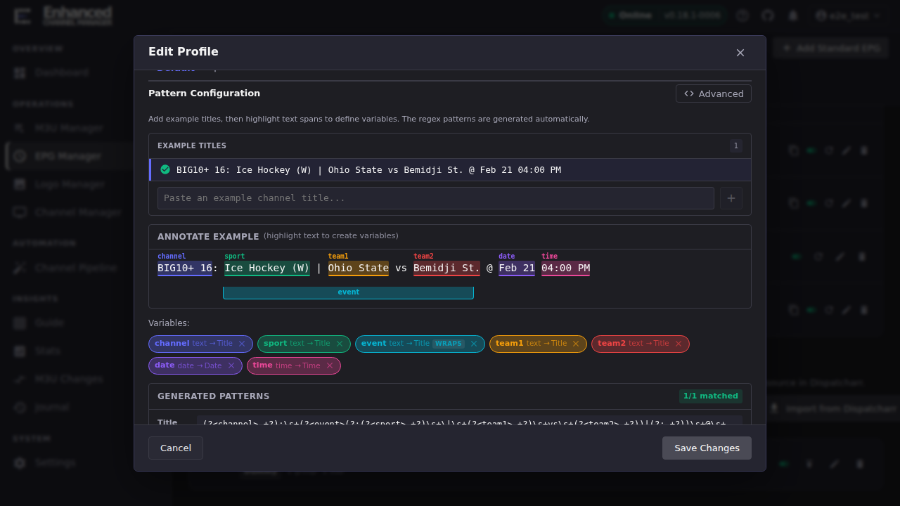
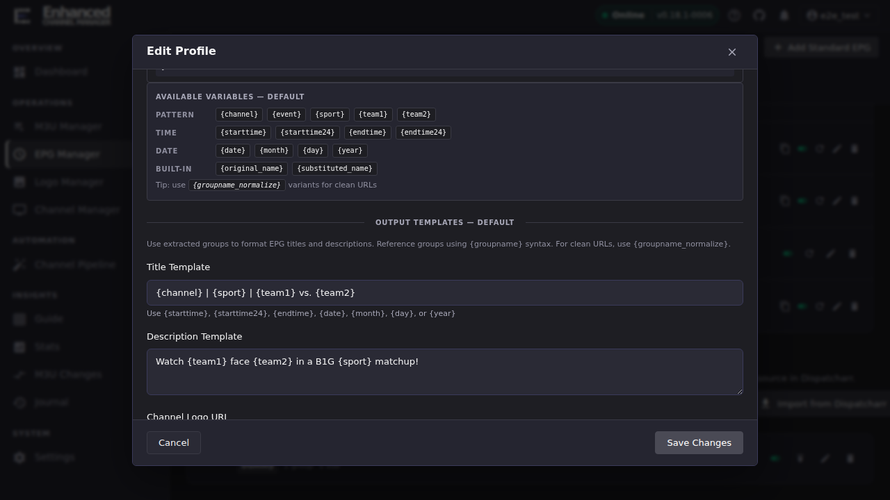

# Author dummy EPG templates

This is the operator-level walkthrough for the profile editor. It teaches
the workflow and the placeholders you'll actually reach for first; the
complete pipe/conditional syntax reference is
[`docs/template_engine.md`](https://github.com/MotWakorb/enhancedchannelmanager/blob/main/docs/template_engine.md). This article
doesn't duplicate that list; it gets you to your first working template.

## Build extraction variables from an example title

1. Open **EPG Manager**, find your profile under **Dummy EPG Profiles**, and
   click **Edit profile** (or **Add Profile** to start a new one).
2. Under **Pattern Configuration**, paste a real channel or stream name into
   **Example Titles**, one that's representative of the group you're
   generating guide data for.
3. **Highlight a span of text** in the annotated example to turn it into a
   named variable (channel, sport, team1, team2, date, time, and so on are
   common, but you name them yourself).

**Result:** ECM generates the regex pattern for you from the highlighted
spans. You never have to hand-write one. The panel shows **N/N matched**
once every example title you've pasted in matches the generated pattern; if
a title stops matching after you add another example, that's your signal
the two titles aren't shaped the same way and need either a second pattern
variant or a [substitution pair](#clean-up-names-before-matching) to
normalize them first.

## Write the output templates

Scroll down to **Output Templates** to turn the variables you just extracted
into what actually shows up in the guide:

1. In **Title Template**, reference your variables with `{variable}` syntax
   (e.g. `{channel} | {sport} | {team1} vs. {team2}`).
2. In **Description Template**, write a plain-language description using
   the same variables (e.g. `Watch {team1} face {team2} in a {sport}
   matchup!`).
3. Use the **Available Variables** reference directly above the templates
   to see every placeholder you can use, including the built-in time/date
   variants (`{starttime}`, `{starttime24}`, `{date}`, `{month}`, …) beyond
   the ones you defined yourself.

**Result:** The template fields accept the same `{name}`, `{name|pipe}`,
and `{if:...}...{/if}` syntax documented in full in
[`docs/template_engine.md`](https://github.com/MotWakorb/enhancedchannelmanager/blob/main/docs/template_engine.md#syntax). Use that
reference once you need pipes (`uppercase`, `titlecase`, `replace:from:to`,
…) or conditionals beyond straight variable substitution.

> **If a template references the old `lookup:` pipe:** it was removed. See
> [Lookup Tables retired](lookup-tables-retired.md) for what to use
> instead: usually `replace:<from>:<to>` or a substitution pair.

## Clean up names before matching

If your source names are inconsistent (extra whitespace, provider-specific
prefixes, inconsistent casing) before you ever get to pattern matching, use
**Substitution Pairs**: ordered find/replace rules applied top-to-bottom to
the name *before* the pattern tries to match it. This is the right place
for provider-name cleanup; don't try to work around messy input inside the
regex pattern itself.

## Verify before you rely on it

Every change to patterns or templates is reflected live. Use the preview
built into the profile editor to confirm real channel names in your
selected groups render the way you expect before saving. A syntax error in
a template does not fail loudly in production: `render_template()` falls
back to emitting the raw, unrendered template text into the guide rather
than breaking the XMLTV feed, so a typo shows up as literal `{team}` text
in your programme guide instead of a crash. Catch it in preview, not by an
end user noticing broken-looking guide entries.

## Going deeper

- [`docs/template_engine.md`](https://github.com/MotWakorb/enhancedchannelmanager/blob/main/docs/template_engine.md): full syntax
  reference: every pipe, conditional form, and the length/limit table.
- [Dummy EPG overview](dummy-epg-overview.md): when to reach for dummy EPG
  at all, and Dummy EPG Profiles vs. the legacy Dummy EPG Sources path.
- [Lookup Tables retired](lookup-tables-retired.md): upgrading a template
  that still references the removed `{key|lookup:<table>}` pipe.
- [Automatic guide data for master channels](https://github.com/MotWakorb/enhancedchannelmanager/blob/main/docs/event_sync.md#automatic-guide-data-for-master-channels-dummy-epg):
  reusing an Event Sync rule's own parse patterns instead of authoring a
  second copy for the profile.
