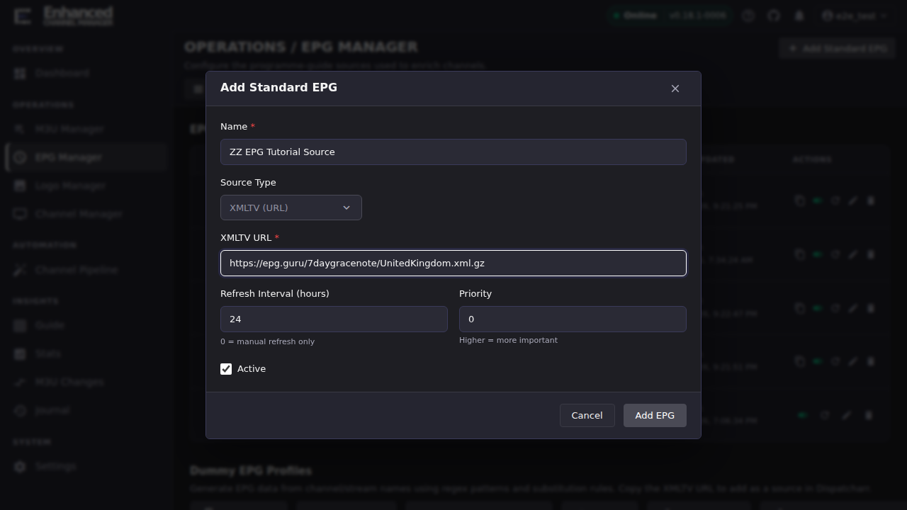
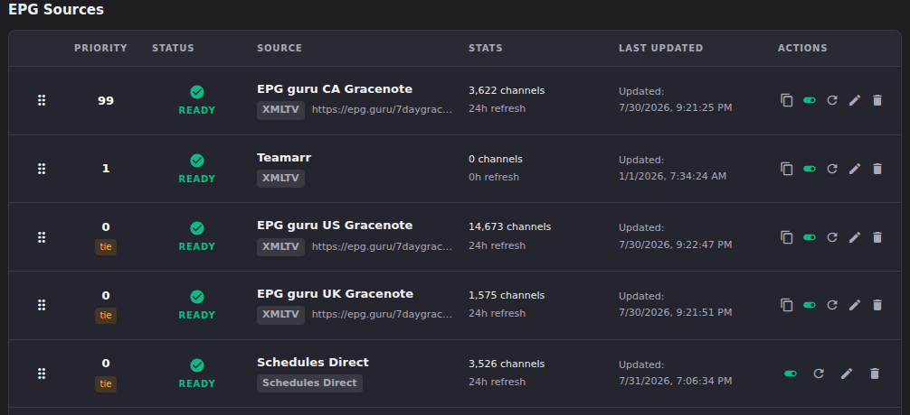

# Add and refresh EPG sources

An EPG source feeds programme listings into ECM so channels can show what's
actually on. This article covers adding a standard XMLTV source, refreshing
it, and reading its status. For a paid Schedules Direct account see
[Schedules Direct](schedules-direct.md); for channels with no upstream guide
at all see [Dummy EPG](dummy-epg-overview.md).

## Add an XMLTV EPG source

1. Open **EPG Manager**.
2. Click **Add Standard EPG**.
3. Enter a **Name**, leave **Source Type** as **XMLTV (URL)**, and enter the
   **XMLTV URL** for your feed.
4. Optionally adjust **Refresh Interval (hours)** (default 24; set to 0 for
   manual refresh only) and **Priority** (higher wins ties when two sources
   offer an equally good match for the same channel).
5. Click **Add EPG**.

**Result:** The source appears in the **EPG Sources** table with status
**Downloading… (see Dispatcharr for progress)** while ECM pulls the feed for
the first time, then flips to **Ready** with a channel count once the pull
completes. That count is guide entries parsed from the feed. It grows the
pool you can match against; it is not a count of your own channels.

## Refresh a source on demand

1. Find the source's row in **EPG Sources**.
2. Click the **Refresh EPG source** (circular arrow) icon on that row, or
   **Refresh All** in the toolbar to refresh every active source at once.

**Result:** The row's status cycles through its refresh state and **Last
Updated** advances to the refresh time. A source that fails to refresh shows
an error status instead of **Ready**.

## Read a source's health

The **EPG Sources** table is the at-a-glance view of every configured
source:

- **Priority**: higher priority number wins ties during matching. A **tie**
  badge means two sources share a priority and haven't been explicitly
  ordered; drag rows in **Reorder** mode to assign each a distinct priority.
- **Status**: **Ready** is the normal healthy state. Anything else
  (downloading, error) means the source needs attention before it
  contributes guide data.
- **Stats**: the channel count is guide entries available from that source,
  not a count of your own channels linked to it.
- **Last Updated**: when the source last refreshed successfully. Never
  refreshed shows no meaningful count yet.

## Going deeper

- [Schedules Direct](schedules-direct.md): connecting a paid Schedules
  Direct account instead of an XMLTV URL.
- [Matching channels to EPG data](channel-to-epg-matching.md): once a
  source is Ready, this is how you link your channels to it.
- [Migrate channel guides between IPTV and Gracenote](migrate-guides.md):
  moving existing guide assignments to a different source without
  rematching from scratch.
- [Dummy EPG overview](dummy-epg-overview.md): for channels with no
  upstream guide data at all.
