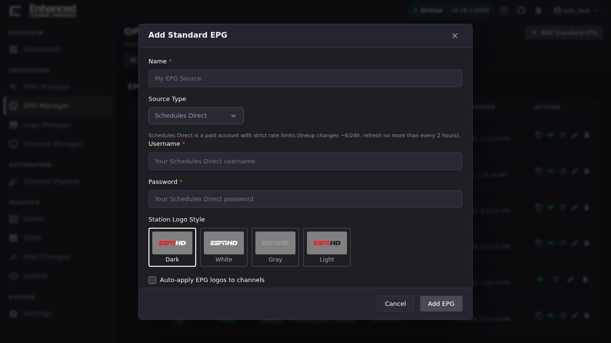
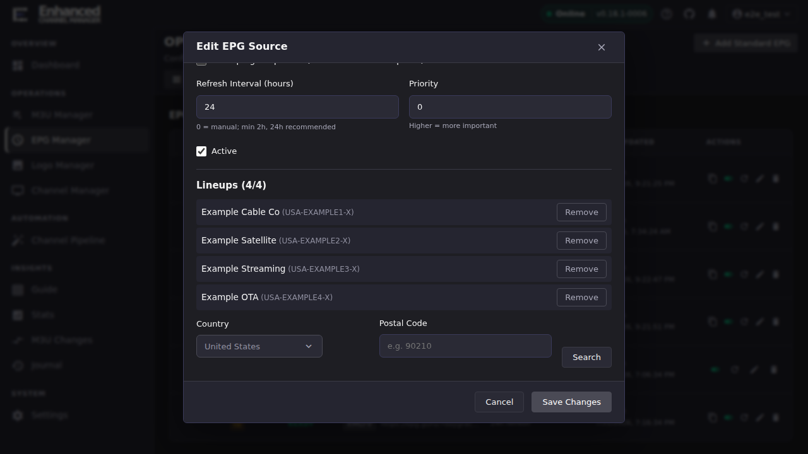

# Connect a Schedules Direct account

Schedules Direct is a distinct **Source Type** from a plain XMLTV URL. It
authenticates with your SD account and pulls specific **lineups** you choose,
rather than one static feed. See [Add and refresh EPG
sources](epg-sources.md) for the general XMLTV flow this complements.

## Add a Schedules Direct source

1. Open **EPG Manager** → **Add Standard EPG**.
2. Set **Source Type** to **Schedules Direct**.
3. Enter your SD **Username** and **Password**.
4. Optionally pick a **Station Logo Style** (Dark / White / Gray / Light:
   which logo variant SD serves for matched channels), enable **Auto-apply
   EPG logos to channels** to stamp those logos on matched channels every
   refresh, and enable **Fetch program posters** if you want per-programme
   artwork (uses extra SD API requests, off by default).
5. Click **Add EPG**.

**Result:** The source is created but pulls **no data yet**. An SD source
with no lineups added is empty. Continue to the next step.

> On later edits, leave the password field blank to keep the stored one. It
> is never displayed back to the browser.

## Add lineups

A lineup is the specific channel package SD indexes for your account (a
cable package, an OTA market, a streaming service like Pluto or Plex). After
saving the source, reopen it for editing. A **Lineups** panel appears below
the standard fields:

1. Pick your **Country** and enter a **Postal Code**, then **Search**.
2. Click **Add** next to the lineup that matches your provider.
3. Repeat for each lineup you need.

**Result:** Each added lineup appears in the list with a **Remove** button.
SD caps how many lineups can be active at once (shown as the panel's title,
e.g. **Lineups (4/4)** once you're at the cap) and limits how many lineup
*changes* you can make per day. The panel can show a **N changes left
today** count once ECM has that information, but don't rely on it being
visible: it did not appear at all in a session that made no lineup changes.
Track your daily change quota yourself if the counter isn't showing.

If the panel already opens at the cap (for example **Lineups (4/4)**), the
**Add** step above cannot succeed until you free a slot: each search
result's **Add** button is disabled with a "Maximum lineups reached"
tooltip, and lineups you've already added show **Added** in the search
results instead of an Add button. Click **Remove** on a lineup you no
longer need, then Add the new one. Removals count against the same daily
change quota as additions, so a remove-then-add swap uses two of your
changes for the day, not one.

## Refresh and match

Schedules Direct enforces stricter rate limits than a plain XMLTV feed: the
refresh interval has a **2-hour minimum** (24 hours recommended, same
default as XMLTV sources). After adding lineups, refresh the source (see
[Add and refresh EPG sources](epg-sources.md#refresh-a-source-on-demand)),
then use [channel-to-EPG matching](channel-to-epg-matching.md) to link your
channels to the SD stations you just added.

## Going deeper

- [Add and refresh EPG sources](epg-sources.md): the general XMLTV flow and
  how to read a source's health.
- [Matching channels to EPG data](channel-to-epg-matching.md): linking
  channels once lineups are loaded.
- [Migrate channel guides between IPTV and Gracenote](migrate-guides.md):
  moving existing assignments onto a newly-added SD source.
