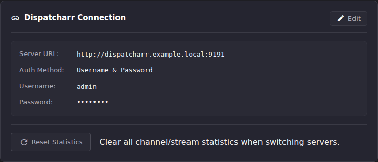
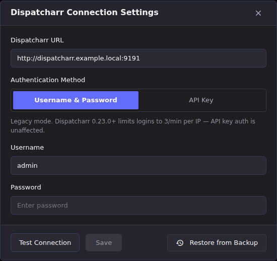
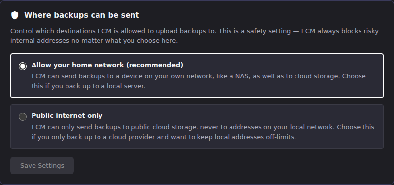

# Connect ECM to Dispatcharr

ECM is a management layer in front of [Dispatcharr](https://github.com/Dispatcharr/Dispatcharr).
It doesn't do anything until it knows where Dispatcharr is and how to
authenticate to it. This article covers the connection form, the specific
case of running Dispatcharr behind a shared Docker network, and what a
healthy connection looks like once it's saved.

## Common tasks

### Enter your Dispatcharr connection details

Right after you create the admin account, ECM opens the **Dispatcharr
Connection Settings** dialog automatically. `settings.configured` is
`false` until this step succeeds, and the app checks it on every load. You
can also reach the same dialog later: select **Settings** in the sidebar,
then **General** (under the **Connections** group), then **Edit** on the
Dispatcharr Connection card. See
[Find your way around the operator workspace](../operator-workspace.md#settings-and-contextual-links)
if the Settings section list looks unfamiliar.



1. Enter the **Dispatcharr URL**: the full base URL Dispatcharr is
   reachable at, e.g. `http://localhost:9191` or `http://dispatcharr.local:9191`.
2. Choose an **Authentication Method**:
   - **API Key**: recommended for Dispatcharr 0.23.0+. In Dispatcharr, click
     your username at the bottom of the sidebar to open the **User** dialog,
     select the **API & XC** tab, and click **Generate API Key**. Paste the
     resulting key in here.
   - **Username & Password**: the legacy method. Dispatcharr 0.23.0+ rate-limits
     logins to 3/minute per IP, which API key auth is not subject to.
3. Click **Test Connection**. The button reports **Connected** or **Failed**
   in place.
4. Once the test succeeds, click **Save**. It's disabled until a test has
   passed.



**Result:** the dialog closes, `settings.configured` becomes `true`, and
ECM loads your channels, streams, and stats from Dispatcharr on the main
screens.

> If you're migrating an existing ECM install rather than starting fresh,
> this same dialog has a **Restore from Backup** option that skips manual
> reconnection entirely. Upload a `.zip` backup and it restores settings,
> database, and configuration in one step.

### Fix "Rejected Dispatcharr URL" when Dispatcharr shares a network with ECM

If ECM and Dispatcharr run in Docker on a shared network (for example, both
behind a VPN sidecar like gluetun), you may need to address Dispatcharr as
`http://localhost:9191` rather than its container name. This is a real,
supported case (confirmed by [GitHub issue #754](https://github.com/MotWakorb/enhancedchannelmanager/issues/754),
filed by an operator in exactly this situation).

Two things to know:

1. **By default, this now works.** ECM's outbound-connection safety check has
   a mode setting: `lan_friendly` (the default) allows loopback and
   private-network and RFC 6598 shared (`100.64.0.0/10`) peer destinations;
   `public_only` blocks them. Prior to the fix
   for #754, **Test Connection** and **Save** disagreed even in the default
   mode: test connection allowed loopback, but save always rejected it
   regardless of mode. So an operator could see "Connected" and still be
   unable to save. That inconsistency is fixed; both now apply the same
   policy.
2. **If you deliberately switched to "Public internet only," a loopback URL
   will still be rejected on save**, with an error like:

   ```
   Invalid Dispatcharr URL: Invalid host — Destination IP 127.0.0.1 is denied
   by SSRF policy (public_only)
   ```

   Link-local addresses such as `169.254.169.254` are denied in *both* modes
   and produce the same message with `lan_friendly` in the parentheses.

   The **Save** button in the UI only shows a generic "Failed to save
   settings" toast. It does not surface this specific reason. To see the
   actual cause, check the container log
   (`docker compose logs -f ecm` / `docker logs <container>`) right after
   the failed save; the rejection is logged there in full.

   The setting that controls this is labeled **"Where backups can be
   sent"**, under **Settings → Backup & Restore** (the **Upkeep** group).
   Its copy talks about
   backup destinations because that's what it was originally built for, but
   it now also governs the Dispatcharr, Emby, Plex, and Jellyfin connection
   URLs. If your Dispatcharr URL is a loopback or private-network address
   and it's being rejected on save, this is the setting to check.

   

**Result:** with `lan_friendly` selected (the default), a loopback,
private-network, or `100.64.0.0/10` Dispatcharr peer URL saves successfully and the connection
behaves identically to any other URL.

### Confirm the connection is healthy

1. Hit the readiness endpoint from the host (or any machine that can reach
   ECM):

   ```bash
   curl http://<host>:6100/api/health/ready
   ```
2. Look for `"dispatcharr":{"status":"ok", ...}` in the response.

**Result:** a healthy, connected instance returns something like this
(captured live from a running instance):

```json
{
  "status": "ready",
  "checks": {
    "database": {"status": "ok", "detail": "SELECT 1 succeeded"},
    "dispatcharr": {"status": "ok", "detail": "reachable (HTTP 200)", "cached_until": "2026-08-01T00:12:01.068790+00:00"},
    "ffprobe": {"status": "ok", "detail": "/usr/bin/ffprobe"}
  }
}
```

If `dispatcharr.status` isn't `ok`, the connection saved but Dispatcharr
isn't currently reachable. Re-check the URL and that Dispatcharr itself is
running, or see [Troubleshooting](../troubleshooting/index.md). In the UI,
the same signal shows up as channels/streams failing to load or populate
across the workspace. ECM has settings but nothing to manage.

## Going deeper

- [First run](first-run.md): what leads into this step, including the preflight config-persistence check.
- [Set up your first channels](your-first-channels.md): once the connection is healthy, this is the end-to-end workflow: M3U account, EPG source, channels, groups, streams.
- [Find your way around the operator workspace](../operator-workspace.md): the full sidebar and Settings-section map, if you want more than the one path used above.
- [`docs/dispatcharr_api.md`](https://github.com/MotWakorb/enhancedchannelmanager/blob/main/docs/dispatcharr_api.md) (in the repository, not part of this published guide): what ECM expects from Dispatcharr's API surface, for a deeper dive on the integration contract.
- [`docs/architecture.md`](https://github.com/MotWakorb/enhancedchannelmanager/blob/main/docs/architecture.md) (in the repository, not part of this published guide): system overview, including where the outbound-connection safety check (SSRF policy) fits.
