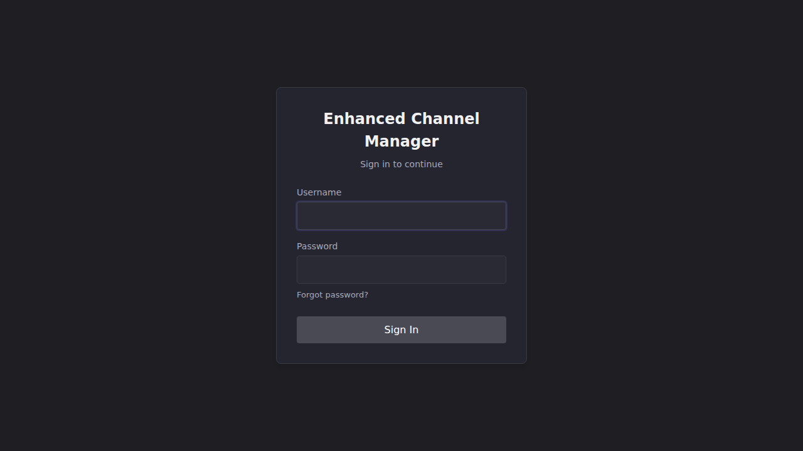

# First Run

The first time ECM starts, it runs a set of startup checks before the app
comes up, then walks you through creating an admin account. This article
covers both, plus the one warning worth stopping for.

## Common tasks

### What the preflight checks tell you

Before the application starts, the container runs a preflight script and
prints its results to the container log
(`docker compose logs -f ecm`, or `docker logs <container>`). This is
generic startup output. You'll see the same shape on every boot, not only
the first one. But it's the first thing worth reading on a first run,
because it tells you whether your data will survive a container recreate.

```
════════════════════════════════════════════════════════════
  Enhanced Channel Manager - Startup Preflight Checks
════════════════════════════════════════════════════════════

→ Setting up user/group identity...
→ PUID=1000 PGID=1000
✓ Running as uid=1000 gid=1000
→ Checking Python environment...
✓ Python 3.12.13 found at /opt/venv/bin/python
✓ FastAPI and Uvicorn available
✓ Uvicorn launcher at /opt/venv/bin/uvicorn
→ Checking filesystem...
✓ Config directory exists
✓ Config directory is writable
✓ Frontend build found
✓ Config directory /config is on a mounted volume (data persists across recreates)
→ Checking network configuration...
✓ Port 6100 (HTTP) is available
✓ Port 6143 (HTTPS) is available
→ Checking application modules...
✓ Application entry point found
✓ Application module loads successfully

════════════════════════════════════════════════════════════
  All preflight checks passed!
════════════════════════════════════════════════════════════

→ Starting Enhanced Channel Manager...
→ HTTP Server: http://0.0.0.0:6100
→ HTTPS Server: Managed by application (if TLS enabled)
→ Health Check: http://0.0.0.0:6100/api/health
```

The line that matters most on a first run is the config-persistence check:

- **`✓ Config directory /config is on a mounted volume (data persists across recreates)`**:
  you're set up correctly. Everything ECM writes (settings, the channel
  database, logos, TLS certs, backups) survives a container rebuild.
- **`! DATA IS NOT PERSISTENT: /config is not a mounted volume.`**: stop and
  fix this before you configure anything. Without a mount, ECM is writing
  everything into the container's own writable layer, and it is **destroyed**
  the next time the container is removed or recreated. This includes an
  "update" in Portainer, Unraid, or Watchtower, and
  `docker compose up --force-recreate`. This check is advisory (it won't
  block startup), specifically so a first-run or throwaway container isn't
  treated as an error. But it means every recreate silently starts you over.
  See [Give ECM a place to keep its data](installation.md#give-ecm-a-place-to-keep-its-data)
  to fix it, then recreate the container.

**Result:** the container logs "All preflight checks passed!" and starts
listening. If a check fails instead (not just the config-persistence
warning, but an actual `✗` line), the container exits and does not start; see
[Troubleshooting](../troubleshooting/index.md) once the dedicated
container-won't-start article is published.

### Create the admin account

Once the container is up, open `http://<host>:6100` in a browser. With no
users in the system yet, ECM shows a setup form instead of a login screen.
The fields are: **Username** (3+ characters), **Email** (used for password
recovery), **Password**, and **Confirm Password**. The password rule the
backend enforces is: at least 8 characters, not a known common/breached
password, and it can't contain the username. The form's on-screen hint states
that same rule. There are no composition requirements: ECM follows NIST
800-63B, which recommends against mandatory uppercase/lowercase/number rules.

1. Fill in all four fields.
2. Click **Create Admin Account**.

**Result:** the account is created with full administrator privileges, and
you're signed in automatically. There's no separate login step. ECM then takes you
straight into the Dispatcharr connection setup; see
[Connect ECM to Dispatcharr](connect-dispatcharr.md).

> **Note:** the admin account setup screen only appears once, before any
> admin account exists. This section's verification instance already has an
> admin account, so the setup screen could not be screenshotted without
> tearing down its auth state. Do not mistake the sign-in screenshot below
> for it — they are different screens.

### Recognize the sign-in screen on a later visit

The setup screen above only ever appears once, before any admin account
exists. If you close the browser and come back (or your session expires),
you'll see ECM's regular sign-in screen instead, asking for the username and
password of an account that already exists.



This screenshot **is** a live capture (an unauthenticated browser session
against the running verification instance). Unlike the setup screen above,
this screen is reachable at any time and doesn't depend on wiping an
existing account.

## Going deeper

- [Connect ECM to Dispatcharr](connect-dispatcharr.md): what happens right after you create the admin account.
- [Install ECM](installation.md): the config-persistence warning in more detail, including how to fix it.
- [`docs/auth_middleware.md`](https://github.com/MotWakorb/enhancedchannelmanager/blob/main/docs/auth_middleware.md) (in the repository, not part of this published guide): how ECM's auth model works, if you need more than the setup flow (SSO, multiple users, password reset).
