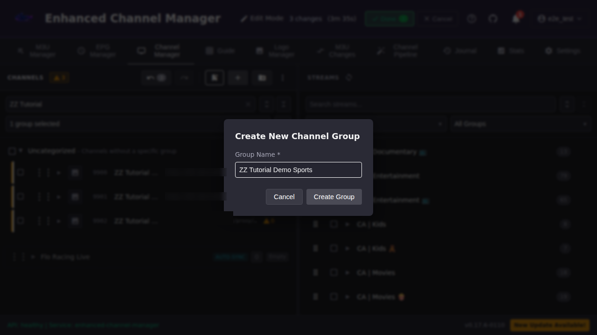
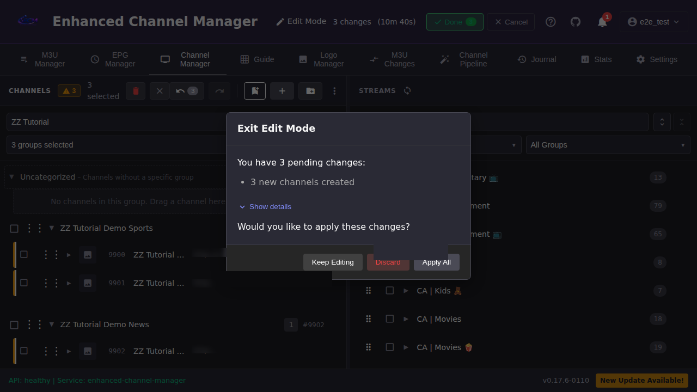

# Set Up Your First Channels

This walkthrough follows one path through the whole tool: add an M3U account,
add an EPG source, choose which stream groups to sync, refresh, then build
channels, channel groups, and stream assignments in Channel Manager. By the
end you'll have a small set of real, working channels and understand where
each later feature (Channel Pipeline, Normalization, EPG matching) picks up.

## Common tasks

### 1. Add an M3U account

1. Open **M3U Manager**.
2. Click **Add M3U Account**.
3. Enter an **Account Name** and choose an **Account Type**:
   - **Standard M3U**: fill in the **M3U URL** (or upload a file / point at a
     server file path).
   - **XtreamCodes**: the M3U URL field is replaced with **Server URL**,
     **Username**, and **Password**: your provider's XC credentials, not a
     playlist URL.
   - **HD Homerun**: fill in the local tuner lineup URL.
4. Click **Create Account**.

**Result:** The account appears in the M3U Accounts table with a status
badge. ECM performs an initial pull in the background. For a small account
this can take a few seconds; a large provider catalog (hundreds of groups)
can take on the order of a minute, showing a "Provider refresh in progress"
banner the whole time. When it finishes, the row shows a **Ready** status
and a group count (not a stream count; the row does not display one).

### 2. Add an EPG source

1. Open **EPG Manager**.
2. Click **Add Standard EPG**.
3. Enter a **Name** and the **XMLTV URL** for your EPG feed. A gzipped feed
   (a URL ending in `.xml.gz`) works too: ECM decompresses it automatically,
   no separate setting needed. Leave **Source Type** as **XMLTV (URL)**
   unless you're connecting a Schedules Direct account, which uses a
   separate flow (see [EPG](../epg/index.md)).
4. Click **Add EPG**.

**Result:** The source appears in the EPG Sources table with a channel
count pulled from the feed. This is the count of program-guide channels
available to match against, not ECM channels you've created yet.

### 3. Choose which stream groups to sync

Most providers organize streams into groups (Sports, News, Movies, and so
on). You rarely want every group synced.

1. Back on **M3U Manager**, find your account's row and click the **Manage
   Groups** (folder) icon.
2. In the **Manage Groups** modal, toggle **Enabled** per group. Turn off any
   placeholder or unwanted groups (a provider's `Default Group` is a common
   one to leave off).
3. Click **Save & Refresh**.

**Result:** The modal closes and ECM starts re-pulling streams for only the
groups you enabled. You don't need a separate manual refresh right after
this step, but convergence is not instant: on a large account it can take
on the order of tens of minutes, with no progress indication beyond the
account row staying **Ready**. Until it settles, the Streams panel can keep
showing streams from groups you just disabled, and the Create Channel
dialog's group dropdown can transiently list provider stream groups it will
later exclude. Both resolve on their own once the cleanup finishes. This is
expected, not a sign that group selection failed. Give it time before
concluding something is stuck.

### 4. Refresh the M3U account

**Save & Refresh** in the previous step already triggered a pull. Use this
step whenever you want to re-sync later without touching group selection:
click the **Refresh account** (circular arrow) icon on the account's row at
any time to pull the latest stream list from your provider.

**Result:** **Last Updated** advances to the refresh time. The row itself
doesn't print how many streams were created, updated, or removed; hover the
row's status badge to see that breakdown in a tooltip (for example,
"Processing completed in 2.4 seconds. Streams: 0 created, 0 updated, 0
marked stale, 0 removed. Total processed: 430.").

### 5. Create a few channels

Channels are what Dispatcharr actually serves: a channel is a number and a
name that one or more streams attach to.

The Channels panel has its own group filter dropdown, separate from the
provider stream groups you toggled in step 3. On a fresh instance it
defaults to "No groups selected," which hides every named channel group
from view until you pick one. Once you select groups here, the selection
persists: it survives a full page reload and a session expiry followed by
re-login, so you shouldn't need to reselect it each time you come back.

1. Open **Channel Manager**.
2. Click **Edit Mode** (top right). Channel Manager batches channel changes
   into a staged set so nothing reaches Dispatcharr until you commit.
   Notice the toolbar grows a **Create new channel**, **Create new channel
   group**, and undo/redo cluster once Edit Mode is on.
3. Click **Create new channel** (the **+** icon).
4. Enter a **Channel Name** and a **Starting Channel Number**. Pick a
   number range you know is unused (check the existing channel list first).
   You can also set the **Channel Group** right here if the group already
   exists.
5. Click **Create Channel**. Repeat for each channel you want.

**Result:** Each new channel appears in the Channels panel (under
Uncategorized if you didn't set a group) with a **0 streams** warning badge.
This is expected, since you haven't attached any streams yet. The Edit Mode
button shows a pending-changes count.

### 6. Create channel groups

Channel groups organize your Channel Manager list. They're independent
from the provider stream groups you toggled in step 3.

1. Still in Edit Mode, click **Create new channel group** (the folder+
   icon).
2. Enter a **Group Name** and click **Create Group**. Like channel
   creation, this is staged: it shows up in the pending-changes count and
   nothing reaches Dispatcharr until **Done → Apply All**.
3. Repeat for each group you need. Set a channel's group from the **Create
   Channel** dialog (step 5) when creating it, or drag an existing channel
   row onto a group's header in the Channels panel to move it afterward.
   Dropping a single channel on a group header opens a **Move Channel to
   Group** dialog with a required numbering decision: **Keep current
   numbers**, or a custom starting number against the target group's number
   range. Pick **Keep current numbers** if you just want the move without
   renumbering, then click **Move Channel**.

**Result:** Your new groups appear in the Channels panel with a live channel
count and number range, and the channels you assigned now sit inside them
instead of Uncategorized.

### 7. Add streams to your channels

A channel with no streams won't play anything. This is the step that
actually wires a channel up to content.

1. In the **Streams** panel (right side), find the stream group your
   provider streams live in and expand it.
2. On the left, expand the channel row you want to attach a stream to. An
   empty channel shows **"No streams assigned. Drag streams here to add."**
3. Drag a stream row from the Streams panel onto that drop zone. Repeat for
   each channel.
4. When you're done creating channels, groups, and stream assignments,
   click **Done** next to Edit Mode. ECM shows a summary of everything
   that's staged (for example, "3 new channels created"). Click **Apply
   All** to push it all to Dispatcharr in one commit, **Keep Editing** to
   go back, or **Discard** to throw the staged changes away.

**Result:** Once you click **Apply All**, the channels, groups, and stream
assignments are committed to Dispatcharr. Your channels are now playable.
Open **Guide** or a media client pointed at ECM/Dispatcharr to confirm.

Any channel you left under Uncategorized during staging does not stay
there: after the commit, Uncategorized shows 0/Empty and the channel is
committed into a system group named **Default Group** that you never
created yourself. This is expected. If a channel you staged without a group
seems to be missing, look for it in Default Group rather than Uncategorized.

## Going deeper

- [`docs/user_guide/channels-streams/index.md`](../channels-streams/index.md): day-to-day channel and stream management once your first batch exists.
- [`docs/user_guide/epg/index.md`](../epg/index.md): matching channels to EPG data and the dummy EPG template engine.
- [`docs/user_guide/channel-pipeline/index.md`](../channel-pipeline/index.md): automate channel creation from incoming streams instead of creating them one at a time.
- [`docs/architecture.md`](https://github.com/MotWakorb/enhancedchannelmanager/blob/main/docs/architecture.md) (in the repository, not part of this published guide): how the M3U → Channel Pipeline → Dispatcharr data flow fits together under the hood.
- [`docs/api.md`](https://github.com/MotWakorb/enhancedchannelmanager/blob/main/docs/api.md) (in the repository, not part of this published guide): the HTTP endpoints behind every action in this walkthrough, for scripting or automation.
