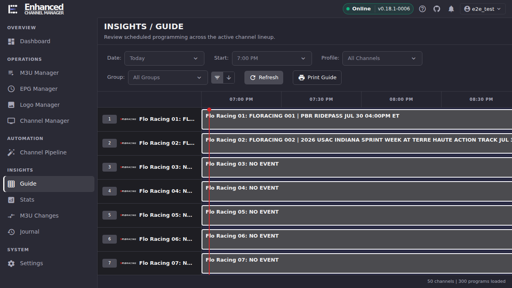
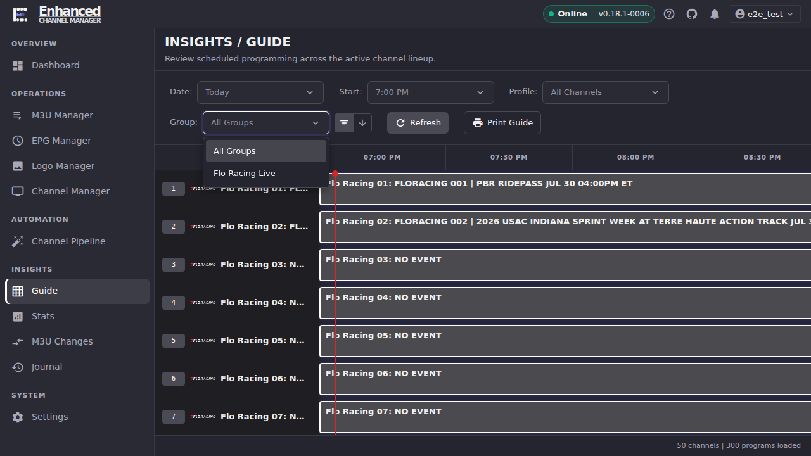
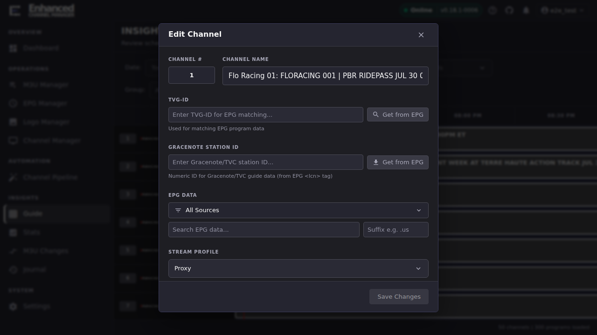
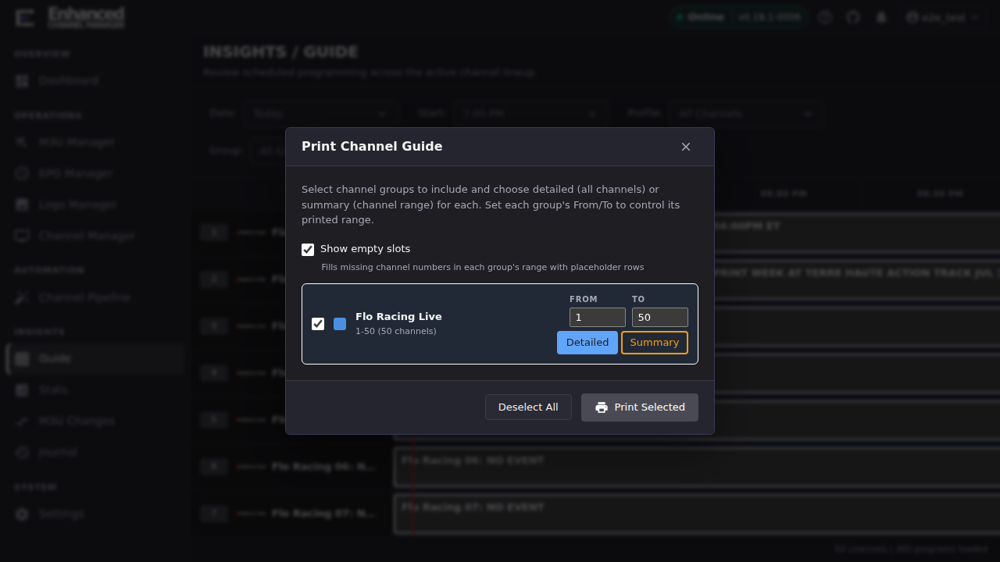

# Guide

Guide is a read-only, TV-guide-style grid: channels down the left, a rolling
time window across the top, and each cell showing whatever programme data ECM
has matched for that channel. It doesn't create or manage channels. That's
Channel Manager. Guide is where you go to check that the EPG work you did
elsewhere actually landed.

## Common tasks

### Check whether EPG data is reaching a channel or group

1. Open **Guide** (under **Insights** in the sidebar).
2. Use the controls above the grid to scope what you're looking at:
   - **Date** jumps to a specific day: Yesterday, Today, Tomorrow, and a few
     days ahead.
   - **Start** jumps the visible window to a starting hour.
   - **Profile** filters to one of your configured Channel Profiles (the same
     profiles used to scope outputs like Plex or HDHomeRun), or **All
     Channels**.
   - **Group** filters to a single channel group. The two small icons next to
     it switch between **filter mode** (hides other groups) and **jump mode**
     (scrolls the grid to that group without hiding the rest).
3. Read the cells. A channel with a real EPG match shows the programme's
   title and its time block, growing wider the longer the programme runs. A
   red vertical line marks the current time.
4. Hover over a programme cell for its full title (and subtitle, if any) plus
   its exact start and end time. This helps when the grid truncates a long
   title.

**Result:** you can see, per channel, whether real programming is airing.
Channel rows with no live programme data may still show a cell. Some
providers (particularly single-event/PPV feeds handled through [Event
Sync](https://github.com/MotWakorb/enhancedchannelmanager/blob/main/docs/event_sync.md)) publish their own placeholder title, such as
"NO EVENT," between events. That's the provider telling you nothing is on
right now, not a matching failure. A channel where the *EPG match itself*
is missing is a different problem, covered in
[EPG → Channel-to-EPG matching](../epg/index.md#channel-to-epg-matching).

### Fix a channel's EPG match without leaving the grid

1. Click a channel's name or number in the left column. The cursor becomes
   a pointer, and hovering shows "Click to edit `<channel name>`."
2. In the **Edit Channel** dialog, update whichever field is wrong: **TVG-ID**
   (with **Get from EPG** to look one up), **Gracenote Station ID**, the
   **EPG Data** search (scoped to a specific source or **All Sources**, with
   an optional suffix filter), or **Stream Profile**. This is the same
   channel-metadata editor Channel Manager uses. Editing here just saves a
   trip.
3. Select **Save Changes**.
4. Select **Refresh** at the top of Guide to reload the grid.

**Result:** the channel is re-linked to the right EPG entry. Guide's
**Refresh** button reloads the grid from ECM's existing programme cache; it
does not re-fetch EPG data by itself, so the grid will not show real
programming yet. Run the **EPG Refresh** task (**Settings → Scheduled Tasks
→ EPG Refresh → Run Now**, or wait for its next scheduled run) to pull the
new match's programme listings in, then use Guide's Refresh button to load
them into the grid. See [Matching channels to EPG
data](../epg/channel-to-epg-matching.md#make-the-match-show-up-in-guide) for
the same step in the bulk-matching flow.

This is a single-channel spot-fix. For bulk EPG matching, mis-linked-channel
audits, or adding a new EPG source, see [EPG](../epg/index.md).

### Print a copy of the guide

1. Select **Print Guide**.
2. For each channel group, choose **Detailed** (every channel) or **Summary**
   (just the channel-number range), and set that group's **From**/**To**
   channel-number range.
3. Turn on **Show empty slots** if you want placeholder rows for channel
   numbers in the range that don't exist, or leave it off to print only real
   channels. Use **Deselect All** to start over if you change your mind about
   which groups to include.
4. Select **Print Selected**, then use your browser's print dialog to print
   or save it as a PDF.

**Result:** a printable (or PDF) channel guide scoped to exactly the groups
and channel-number ranges you chose.

## Going deeper

- [EPG](../epg/index.md): adding and configuring EPG sources, dummy EPG for
  channels with no upstream guide, bulk channel-to-EPG matching, and the
  duplicate-EPG-link audit for channels sharing one guide row.
- [`docs/event_sync.md`](https://github.com/MotWakorb/enhancedchannelmanager/blob/main/docs/event_sync.md): the single-event/PPV channel
  workflow behind the "no event scheduled" placeholder titles you'll see on
  some channels between events.
- [Channels & Streams](../channels-streams/index.md): the full channel
  editor (streams, channel groups, tags) for changes beyond EPG metadata.
