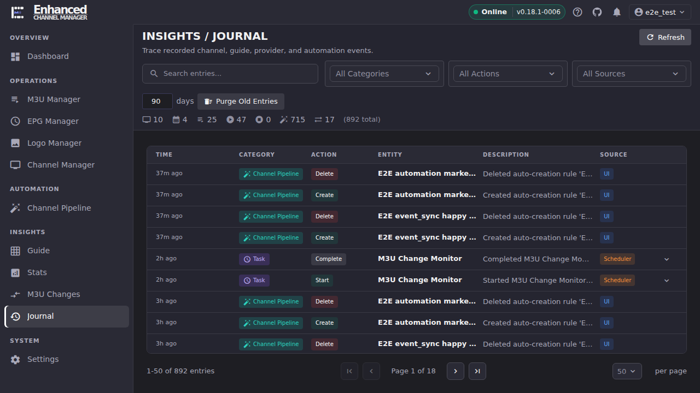
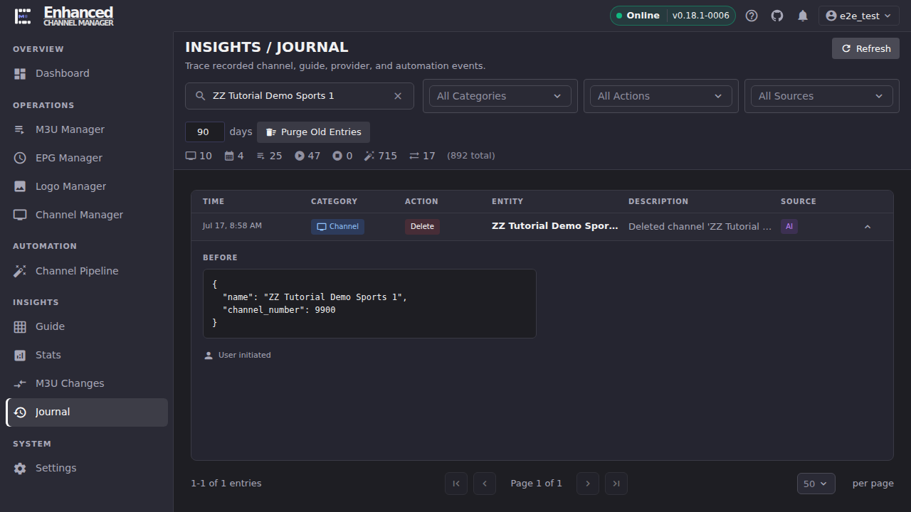

# Journal

Journal is ECM's forensic record of every channel, EPG, M3U, watch, task, Channel Pipeline, and Event Sync change it has made or observed. You reach for it after the fact. "What changed my lineup last night" is the real question, not "how do I read a table."

## Common tasks

### Narrow down to the change you're chasing

1. Open **Journal**.
2. Type into **Search entries...** for a name or description match, and/or pick from the **All Categories** (Channel, EPG, M3U, Task, Watch, Channel Pipeline, Event Sync), **All Actions** (Create, Update, Delete, Start, Stop, Refresh, Stream Add/Remove/Reorder, Reorder, Merge Not Applied, Bulk Merge Incomplete), and **All Sources** (UI, AI, Scheduler, Channel Pipeline) dropdowns.
3. Combine filters to ask a specific question. For example, Category **Channel** + Action **Delete** answers "what channels got deleted, and when."

**Result:** The entry list narrows to only rows matching every active filter, and the entry count and pagination at the bottom update to match. There is no separate time-range filter. The day-count field in the toolbar controls purging (see below), not what you're viewing, so lean on Search and the Category/Action/Source filters, and page back through the (already newest-first) list if you're hunting further into the past.

### Read exactly what changed

1. Click anywhere on an entry row. Rows that recorded a before/after diff show an expand arrow on the right.
2. The row expands into **Before** and **After** JSON blocks showing the exact field values, plus who or what triggered it: **User initiated** (a person, including an AI assistant acting on a person's request) vs. **Automatic**, and a **Batch** ID if the change was one of several applied together.

**Result:** You get the exact prior state, not just a description. The example above shows a deleted channel's name and channel number as they were the moment before removal, which is what you need to recreate it or confirm it was an intentional delete.

### Keep the Journal from growing without bound

1. Set the day count next to **Purge Old Entries** in the toolbar (defaults to 90).
2. Click **Purge Old Entries** and confirm the browser prompt.

**Result:** Entries older than the day count you set are deleted, and a notification reports how many entries were purged. This is a one-way action. Purged entries are not recoverable, so if you're mid-investigation, finish it (or export what you need) before purging.

## Going deeper

- [Channel Pipeline](../channel-pipeline/index.md): the biggest single source of Journal volume; rule runs, auto-creation, and rollback all write entries here.
- [Event Sync](https://github.com/MotWakorb/enhancedchannelmanager/blob/main/docs/event_sync.md): Event Sync activity is journaled under its own category; the dev guide explains what triggers it.
- [`docs/api.md#journal`](https://github.com/MotWakorb/enhancedchannelmanager/blob/main/docs/api.md#journal): the API reference for the Journal, useful if you want to query it programmatically instead of filtering in the UI.
