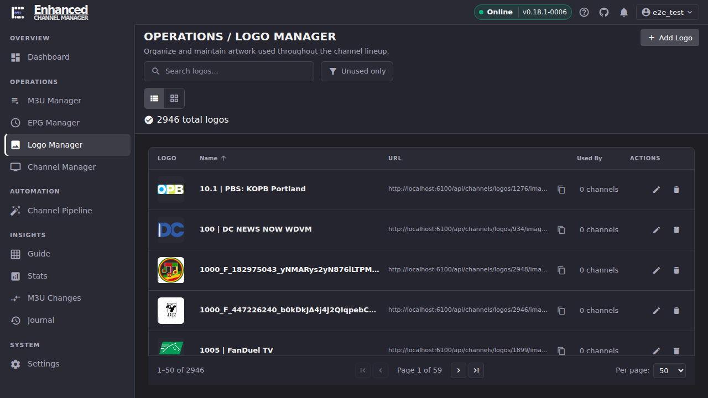
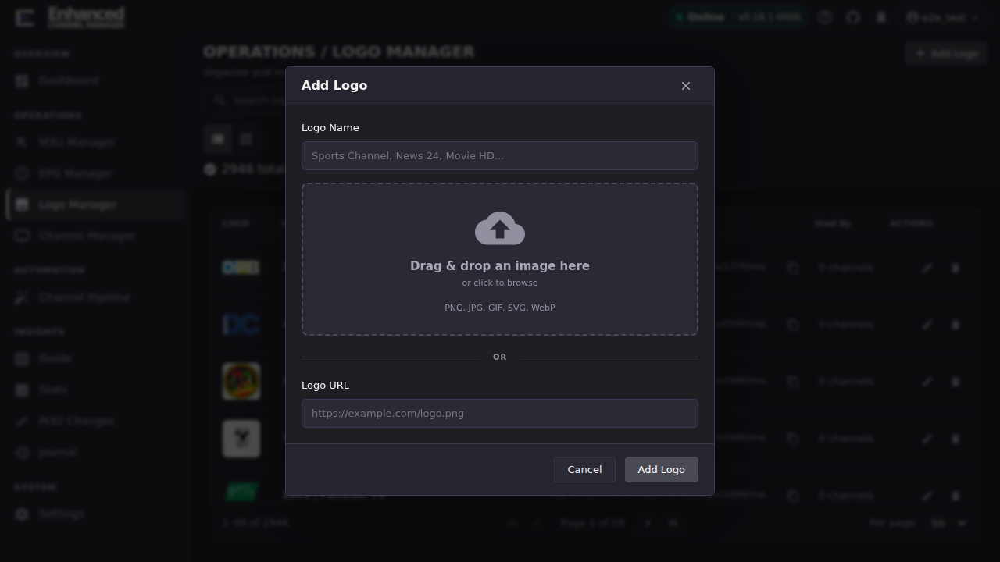
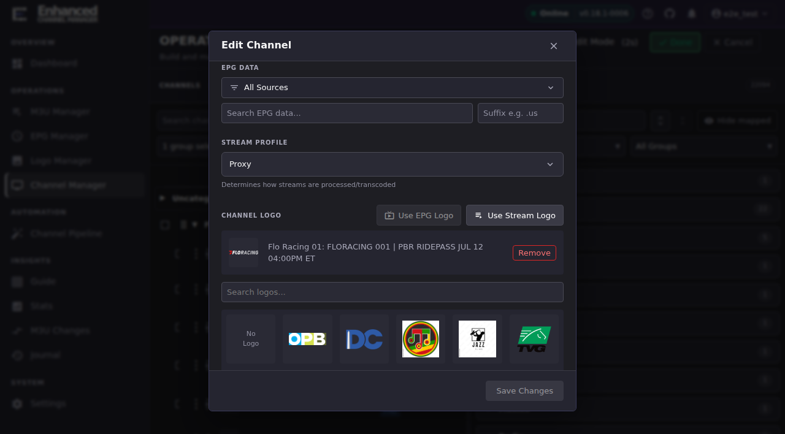
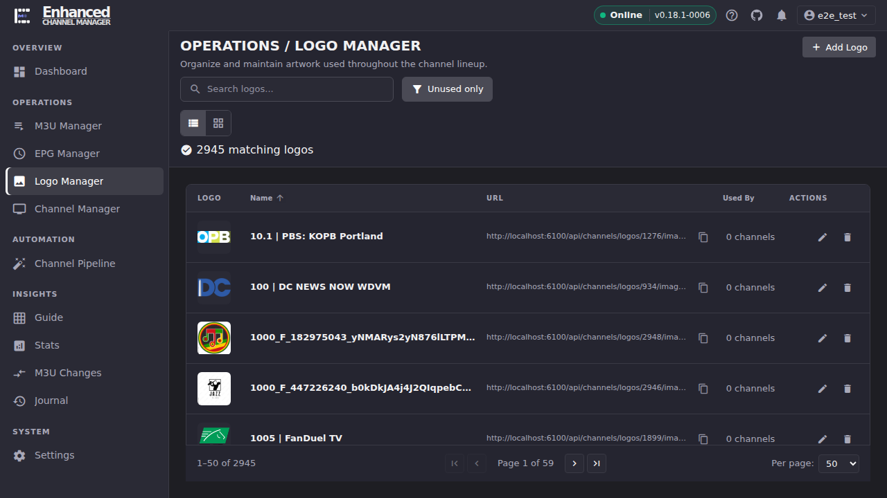

# Logo Manager

Logo Manager is ECM's central library of channel artwork: every image an operator has uploaded, added by URL, or pulled from EPG/stream data lives here. Use it to add new artwork and to find (and remove) images nothing is using; assigning a logo to a specific channel happens in Channel Manager, covered in the third walkthrough below.

## Common tasks

### Find a logo in the library

1. Open **Logo Manager**.
2. Type into **Search logos...** to filter by name, or leave it blank to browse everything.
3. Use the **List view** / **Grid view** toggle (left of the search box) to switch between the sortable table and a visual grid. Grid view is faster once you've narrowed the list and just need to eyeball an image.

**Result:** The list (or grid) updates to the matching set, and the total above it (either "N total logos" or "N matching logos") reflects your search.

### Add a new logo

1. Click **Add Logo** (top right).
2. Enter a **Logo Name**.
3. Either drag an image onto the drop zone (or click it to browse: PNG, JPG, GIF, SVG, WebP), **or** paste an address into **Logo URL**. You only need one of the two.
4. Click **Add Logo** to save.

**Result:** The modal closes and the new logo is in the library. Search for its name if the list doesn't visibly change (the library is sorted alphabetically by default, so a new logo can land anywhere in the page order).

### Match a logo to a channel

Logo Manager only manages the catalog of images. Assigning one to a specific channel happens in **Channel Manager**.

1. Open **Channel Manager** and click **Edit Mode** (top right).
2. Open the channel's **Channel actions** menu (the ⋮ icon on its row) and select **Edit Channel**.
3. In the **Channel Logo** section: click **Use EPG Logo** to pull the icon from the channel's assigned EPG data, or **Use Stream Logo** to pull it from one of the channel's attached streams. Whichever button is enabled depends on whether that data exists for this channel. Otherwise, type into **Search logos...** and click a thumbnail from the grid below it to assign a logo already in the library.
4. Click **Save Changes**.

**Result:** Your pick becomes the channel's **Current Logo**, shown with a **Remove** option. Because this happened in Edit Mode, it's a *staged* change like any other Channel Manager edit. Exit Edit Mode and click **Apply All** (see [Set Up Your First Channels](../getting-started/your-first-channels.md#7-add-streams-to-your-channels)) to push it to Dispatcharr.

### Find and remove logos nothing is using

1. Open **Logo Manager** and click **Unused only** in the toolbar.
2. Scan the filtered list: every row shown has **0 channels** in the **Used By** column.
3. Click the **Delete** (trash) icon on a logo you no longer need, then confirm in the dialog.

**Result:** The logo is removed from the library and the total drops by one. Deleting a logo that's still assigned to channels is *not* blocked. The confirmation dialog just warns you how many channels reference it, so filtering to **Unused only** first is what makes this genuinely safe: everything you see there has nothing depending on it.

## Going deeper

- [Set Up Your First Channels](../getting-started/your-first-channels.md): the Edit Mode / staged-changes / Apply All model that governs any channel edit, including a logo assignment.
- [EPG](../epg/index.md): assigning EPG data to a channel is what makes **Use EPG Logo** available.
- [`docs/api.md#logos`](https://github.com/MotWakorb/enhancedchannelmanager/blob/main/docs/api.md#logos): the HTTP endpoints behind logo upload, search, and delete.
