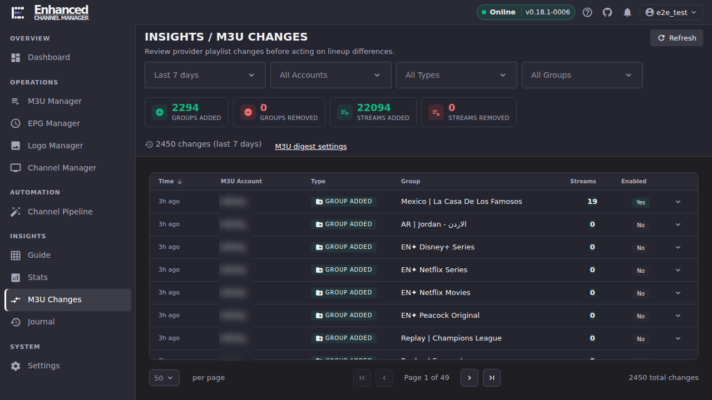
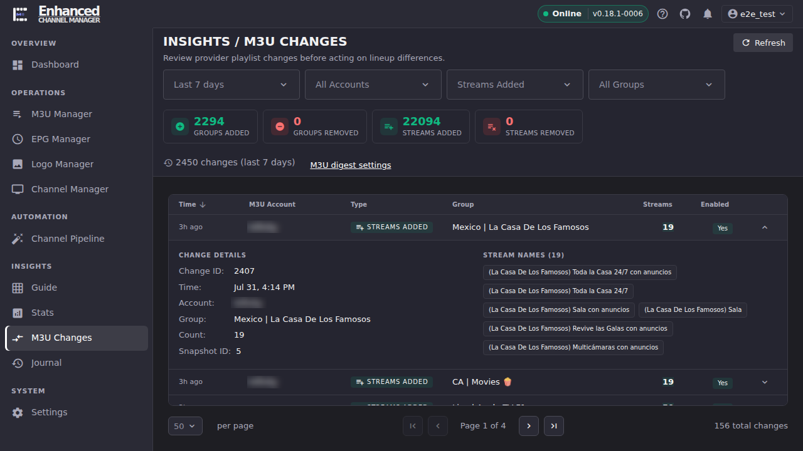

# M3U Changes

M3U Changes is ECM's read-only log of what each provider added or removed on their end since ECM last refreshed that account: groups and streams appearing or disappearing. It answers "is this change safe," not "let me fix it here." Acting on a change always happens back in M3U Manager.

## Common tasks

### See what a provider changed recently

1. Open **M3U Changes**.
2. Pick a **Time Range** (Last 24 hours through Last 90 days) and, optionally, narrow to one **Account**, one change **Type** (Groups Added, Groups Removed, Streams Added, Streams Removed), or **Status** (Enabled Only / Disabled Only).
3. Read the four summary tiles for a scoped count before scrolling the table: **Groups Added**, **Groups Removed**, **Streams Added**, **Streams Removed**.

**Result:** The table and the summary tiles both scope to your Time Range and any other filters you set. The page footer's total, by contrast, is unbounded by time and only respects the Account/Type/Status filters. As a result, it's normal for the footer's "N total changes" to be larger than the summary tiles above it.

### Decide whether a change needs your attention

1. Look at the **Enabled** column on each row. **Yes** means that group (or the streams in it) is already syncing into ECM's stream list. **No** means the provider added something ECM has recorded, but that isn't flowing through to your streams yet. Most commonly, that's a brand-new group.
2. To bring in a **No** you want, go to **M3U Manager** → the account's **Manage Groups** icon, toggle that group **Enabled**, then **Save & Refresh**. This is the same flow covered in [Set Up Your First Channels](../getting-started/your-first-channels.md#3-choose-which-stream-groups-to-sync).
3. M3U Changes itself has no accept/reject control. It is a log, not a review queue. Confirming a change is "safe" means recognizing what it is (a seasonal group coming back, an expected provider reshuffle) and, if you want it live, making that selection in M3U Manager.

**Result:** For every row, you know whether a provider's change is already affecting your lineup or is sitting inert until you opt the group in from M3U Manager.

### Inspect exactly what changed in one group

1. Click a row to expand it.
2. Read **Change Details** (account, group, time, stream count) and the **Stream Names** list below it, which names every stream involved in that change (the first 20 inline; **+N more** expands the rest).

**Result:** You can confirm, by name, exactly which streams were added or removed. This is the fastest way to tell "this is the seasonal channel coming back" from "this is provider noise I don't want."

## Going deeper

- [Set Up Your First Channels](../getting-started/your-first-channels.md#3-choose-which-stream-groups-to-sync): where you actually act on a change, enabling or disabling a stream group in M3U Manager.
- [Notifications & Alert Methods](../notifications/index.md): the M3U Digest is an email/Discord summary of the same change data, on a schedule, for operators who don't want to check this tab manually.
- [`docs/api.md#m3u-digest`](https://github.com/MotWakorb/enhancedchannelmanager/blob/main/docs/api.md#m3u-digest): the API reference for M3U Changes and the digest settings, useful if you want to query this data programmatically instead of through the UI.
