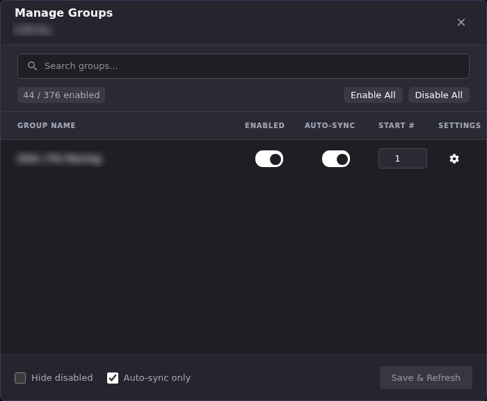
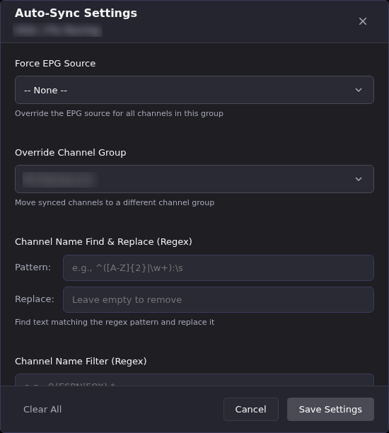

# Choose Which Stream Groups Sync to Channel Manager

Every provider organizes its playlist into groups (Sports, News, Movies,
and so on), and a group's **Enabled** toggle here is the only gate between
"this provider has the stream" and "ECM has ever seen it." A disabled
group's streams don't exist anywhere else in ECM: not Channel Manager's
stream browser, not a Channel Pipeline rule, not Auto-Sync. This page
covers the full Manage Groups and Auto-Sync Settings screens; for the
fastest path from a new account to a working channel, see [Set Up Your
First
Channels](../getting-started/your-first-channels.md#3-choose-which-stream-groups-to-sync).

## Common tasks

### Enable or disable which groups sync

1. In **M3U Manager**, click the **Manage Groups** (folder) icon on the
   account's row.
2. Use **search**, or **Hide disabled** / **Auto-sync only**, to narrow a
   long list. Providers regularly ship hundreds of groups.
3. Toggle **Enabled** per group. Use **Enable All** / **Disable All** to
   start from a clean slate.
4. Click **Save & Refresh**.

**Result:** ECM re-pulls streams for the account, keeping only the streams
belonging to groups you left enabled. A disabled group's existing streams
are removed from ECM's stream list, not just hidden. Nothing downstream
(Channel Manager, Channel Pipeline, Auto-Sync) can reference them until you
re-enable the group.

### Prune a newly added account before you rely on it

A new account defaults to **Auto-enable new groups (Live)** on (set when
you added the account, and editable afterward from **Edit account**), so
most or all of its Live groups start (or arrive) enabled, including on the
account's very first refresh. **Auto-enable new groups (VOD)** and
**(Series)** default off, and VOD import itself defaults off (**Enable
VOD**).

1. Right after adding an account, open **Manage Groups** before you build
   anything on top of it.
2. Click **Disable All**, then re-enable only the groups you actually
   want, or leave the defaults and prune down from "everything on."
3. Click **Save & Refresh**.

**Result:** Channel Manager's stream browser and any Channel Pipeline rule
now only ever see the groups you kept. This is the most common reason a
rule "matches nothing" on a freshly added account with hundreds of
unpruned groups: the rule's condition is fine, but the group gate never let
the stream through.

### Configure Auto-Sync for a group

Auto-Sync turns a group's toggle into a standing rule: streams in that
group are kept as channels automatically, using the settings below, every
time the account refreshes.

1. In **Manage Groups**, toggle **Auto-Sync** on for the group.
2. Click the **settings** gear in that row (only available once Auto-Sync
   is on).
3. Set any of the fields below, then **Save Settings**.

| If you want to… | Use this setting |
|-|-|
| Force a specific EPG source onto every channel this group creates | **Force EPG Source** |
| Route the synced channels into a specific Channel Manager group instead of this stream group's name | **Override Channel Group** |
| Clean up a provider's messy channel names | **Channel Name Find & Replace (Regex)** |
| Sync only some of this group's streams, evaluated against what's already imported | **Channel Name Filter (Regex)** (see the callout below) |
| Control which Dispatcharr **Channel Profile** (client-facing visibility) these channels belong to | **Channel Profile Assignment** |
| Control the Dispatcharr stream/transcode profile these channels use for playback | **Stream Profile Assignment** |
| Set the order channels appear within the group | **Channel Sort Order** |
| Give every channel in the group a shared placeholder logo | **Custom Logo** |

**Result:** From the next **Save & Refresh** onward, ECM keeps this group's
channels in sync with these settings automatically. You don't re-create
them by hand after every refresh.

Two settings are worth a second look before you save them:

- **Channel Profile Assignment is global for the stream group.** Saving it
  applies to *every* M3U account that has a group with this same name, not
  just the account you're editing. Clearing it back to empty does **not**
  remove existing channels from any profile. It only makes ECM stop
  actively managing this group's profile membership going forward. Channels
  a Channel Pipeline rule already assigned to a profile are excluded from
  Auto-Sync's profile management entirely.
- **An override can make several source groups share one profile decision.**
  When groups from different M3U accounts use **Override Channel Group** to
  feed the same effective Channel Manager group, ECM evaluates all of those
  source rows together. Their API order and provider refresh order do not
  decide the winner. If two sources select different non-empty **Channel
  Profile Assignment** sets, ECM freezes profile-membership updates for that
  effective group and opens **Profile choice required** at the app root. The
  dialog names the effective group, each competing profile set, the source
  groups, and their M3U accounts. Select one option explicitly; ECM records
  that decision first, then writes the selected profile set back to every
  source account row. It never changes group or channel membership as part of
  accepting the choice.

  This review always requires a signed-in administrator, including when ECM's
  general authentication requirement is turned off. Browse to `/login` first;
  a headless instance with no operator account must create one before it can
  resolve profile conflicts.

  **Decide later**, the close button, and Escape dismiss only that exact
  question for the current browser session. Use **Review choice** on its
  notification to reopen it. A changed source/profile shape is a new question
  and prompts again. If an account write fails after the decision is saved,
  the dialog says so and ECM retries; do not make a second, different choice
  merely to trigger a retry.

  If the dialog is unavailable, apply the same profile set manually under
  **Auto-Sync Settings → Channel Profile Assignment** for every source group
  and account named by the notification, then run **Save & Refresh**. Profile
  membership remains frozen until the source settings agree; ECM will not
  choose whichever provider happens to return first.
- **Stream Profile Assignment is where assignment actually happens.** The
  top-level **Stream Profiles** screen (reached from **M3U setup actions**
  → **Stream Profiles**) is a catalog you can add to, but it doesn't attach
  a profile to any channel by itself. That only happens here, per group.

### Understand two regex fields that look alike

**Channel Name Filter (Regex)**, in Auto-Sync Settings above, filters which
of this group's *already-imported* streams get synced into channels,
evaluated at sync time. It only sees streams that already passed the
account's own [stream filters](index.md#filter-out-streams-before-theyre-imported).
This field can narrow further, but it can't recover a stream the
account-level filter excluded first.

## Going deeper

- [Set Up Your First
  Channels](../getting-started/your-first-channels.md#3-choose-which-stream-groups-to-sync):
  the fastest path from a new account to a working channel.
- [M3U Changes](../m3u-changes/index.md): see exactly what a provider
  added or removed before deciding whether to enable a group.
- [Channel Pipeline](../channel-pipeline/index.md): rules only ever
  evaluate streams from groups enabled here.
- [Settings → Channel Defaults](../settings/channel-defaults.md): Channel
  Profile defaults that Auto-Sync's Channel Profile Assignment interacts
  with.
- [`docs/api.md`](https://github.com/MotWakorb/enhancedchannelmanager/blob/main/docs/api.md): HTTP endpoints behind Manage Groups and
  Auto-Sync Settings.
