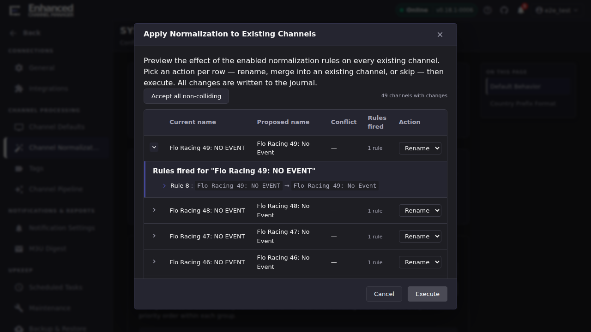
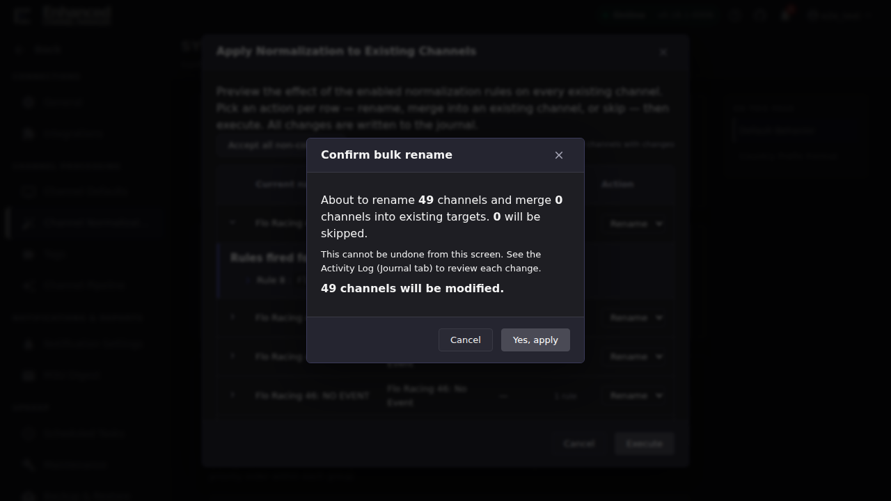

# Apply Rules to Existing Channels

Changing your normalization rules does not rename channels you already
have. **Apply to existing channels** is the one-time bulk rewrite that
brings stored names up to date with the current rule set. It previews
first, it acts only on rows you explicitly choose, and it is not reversible
from the screen it runs on.

## When to use it

Reach for it when:

- You added or changed a rule and want channels created before the change
  to pick it up.
- You selected **Normalization Groups** on a Channel Pipeline rule that
  previously had none, and the channels it already created still carry raw
  provider names.
- You imported a rule set from YAML and want its effect applied
  retroactively.

Do not reach for it to rename one channel. Edit that channel directly. This
is a bulk operation and it writes a journal entry for every row it touches.

## Common tasks

### Preview what would change

1. Go to **Settings → Channel Normalization**.
2. In the **Normalization Rules Engine** header, press **Apply to existing
   channels**. The **Apply Normalization to Existing Channels** dialog
   opens and immediately runs a preview. Nothing has been written.
3. Wait for **Loading preview...** to clear. ECM walks every channel in
   your library, so on a large library this takes a while.

**Result:** a table of only the channels whose names would change, with a
count above it reading *N channels with changes*. If nothing would change
you get a message saying so, which means either your rules are disabled or
every name is already normalized.

The table has five columns:

| Column | What it tells you |
|-|-|
| **Current name** | The name stored today |
| **Proposed name** | What the current rule set would produce |
| **Conflict** | Whether another channel already holds the proposed name, or another row in this preview is heading for the same name |
| **Rules fired** | How many rules contributed to the change |
| **Action** | What you want done with this row: **Skip**, **Rename** or **Merge** |

Press the chevron at the left of any row to open its rule trace. The
drawer lists each rule that fired, in order, with the text before and
after. When a row changed but no rule fired, the drawer says so: the
difference came from Unicode preprocessing alone.

A detail worth knowing when you compare this against **Test Rules**: if the
stored name starts with a channel-number prefix like `107 | `, that prefix
is split off, only the rest is normalized, and the prefix is put back on
the proposed name.

### Choose an action per row

Read this before you press anything. **The preview does not open with
everything switched off.** Every conflict-free row is pre-set to
**Rename**, and only rows with a conflict start at **Skip**. So pressing
**Execute** straight after the preview loads renames every conflict-free
channel in the list. Go through the table before you execute, and set
anything you do not want rewritten back to **Skip**.

The three actions:

- **Rename** writes the proposed name onto the channel. It is unavailable
  when another channel already holds the proposed name.
- **Merge** folds this channel's streams into the channel that already
  holds the proposed name, then deletes this channel.
- **Skip** leaves the channel alone.

**Accept all non-colliding** re-sets every conflict-free row to
**Rename**. It is a way back to the opening state after you have changed
rows, not a step you need on a fresh preview.

**Result:** the footer's **Execute** button becomes available once no
conflict group is still waiting on a decision.

### Resolve a conflict

There are two shapes of conflict, and the **Conflict** column
distinguishes them.

**An existing channel already owns the proposed name.** The cell shows a
warning icon and that channel's name. **Rename** is disabled for the row,
because two channels cannot both take the name. Choose **Merge into
existing** or **Skip**.

**Two or more rows in this preview normalize to the same name.** Those rows
are tagged **Conflict Group N** and each gets a **Winner** radio button.
Pick one winner per group. Choosing a winner sets the winner's action
automatically and flips every other row in the group to **Skip**, so you
cannot accidentally rename two channels onto the same name.

Until every conflict group has a winner, a warning appears next to the row
count and **Execute** stays disabled.

**Result:** with all conflict groups resolved, **Execute** is available.

### Execute the rewrite

1. Press **Execute**.
2. Read the **Confirm bulk rename** dialog. It states how many channels
   will be renamed, how many merged and how many skipped, and warns that
   this cannot be undone from this screen.

   

   If the renamed count is higher than you expected, press **Cancel**.
   The counts here are the last chance to catch rows you meant to set to
   **Skip**.

3. Press **Yes, apply**.

**Result:** an **Apply complete** summary replaces the table, with counts
of renamed, merged, skipped and failed rows, and a rule-set hash
identifying exactly which rule set produced the run. Every rename and every
merge is recorded in the [Journal](../journal/index.md), and the summary
links there.

## Safety and limits

- **Rename, not Skip, is the opening state for conflict-free rows.** The
  confirmation dialog tells you the counts before anything is written.
  Read them.
- **The rename step refuses conflicts.** Even if a request somehow asks to
  rename into a taken name, the server declines that row and reports it as
  an error rather than clobbering anything.
- **One run at a time.** Starting a second bulk apply while one is running
  fails immediately rather than interleaving with it.
- **Rate limited.** The bulk endpoint accepts five calls a minute. If you
  repeatedly reopen and re-run the dialog, you can hit that limit.
- **Admin only, when authentication is enabled.** Non-admin users are
  refused.

## What survives a rename, and what a merge costs

**Rename** changes the name and nothing else. The channel keeps its ID, its
number, its group, its streams and its watch history.

**Merge** is destructive on the source channel. Its streams are appended to
the target channel (duplicates are not added twice), then the source
channel is deleted. The target keeps its own name, number and group. The
source channel's number becomes free, and history tied to the source row
goes with it. The target's history is not backfilled.

## Undoing a run

There is no undo button. Plan for that before you press **Yes, apply**.

- **To reverse a rename**, find the entry in the Journal, which records the
  name before and after, and edit the channel's name back.
- **To reverse a merge**, you would have to recreate the source channel and
  reattach its streams by hand. This is the reason the preview and the
  per-row confirmation exist.
- **To reverse a whole run**, restoring from a backup is the realistic
  path. See [Backup & Restore](../backup-restore/index.md).

The rule-set hash in the summary is worth keeping if you are working
through several rounds of rule edits: it identifies which version of the
rule set produced a given run.

## Going deeper

- [How normalization works](concepts.md): why existing channels do not
  update themselves.
- [When things look wrong](when-things-look-wrong.md): what to check when
  the proposed names are not what you expected.
- [Journal](../journal/index.md): the record of every rename and merge this
  operation performs.
- [`docs/normalization.md`](https://github.com/MotWakorb/enhancedchannelmanager/blob/main/docs/normalization.md#re-normalize-existing-channels):
  the reference treatment, including the API-level shape of the operation.
