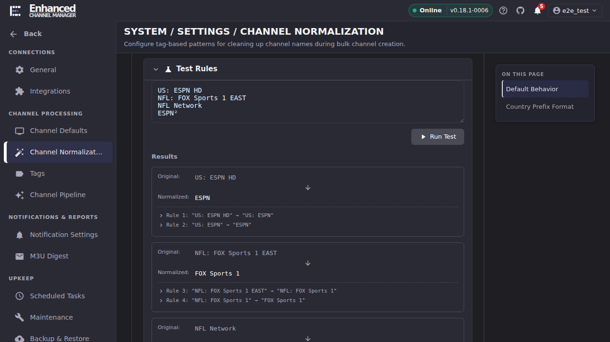
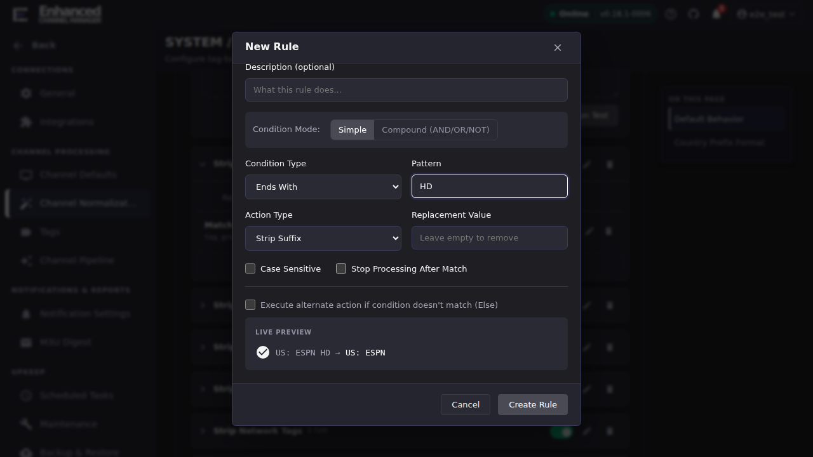

# Author Your First Normalization Rule

This walkthrough takes you from an unwanted channel name to a saved rule
that fixes it, previewing every step before anything is written. Everything
up to the final **Create Rule** press is read-only, so you can iterate as
many times as you like.

Rule authoring lives at **Settings → Channel Normalization**, in the
**Normalization Rules Engine** panel.

## Common tasks

### See what your current rules already do

Start here even if you are sure you need a new rule. ECM ships with a set
of rule groups that strip quality suffixes, country prefixes, timezone
suffixes, league prefixes and more, and your name may already be handled.

1. Go to **Settings → Channel Normalization** and scroll to
   **Normalization Rules Engine**.
2. Expand **Test Rules**.
3. Paste the raw stream names you care about into the box, one per line.
   Leaving the box empty runs a built-in sample set instead.
4. Press **Run Test**.

**Result:** a **Results** list appears. Each entry shows **Original:** and
**Normalized:**, and underneath, one line per rule that changed the name,
in the order they fired, reading `Rule <id>: "<before>" → "<after>"`. If
**Normalized:** is already the name you want, you do not need a new rule.

Read the trace lines carefully. In the example above, `US: ESPN HD` took
two rules to become `ESPN`, and the second rule's input is the first
rule's output. That chaining is the subject of
[Rule groups and ordering](rule-groups-and-ordering.md).

### Add a rule

Rules live inside groups, so pick the group your rule belongs in first.
Every group has its own **Add Rule** button. If none of the existing groups
fit, press **New Group**, give it a name, and press **Create Group**. A
group you create is yours to edit, reorder and delete; groups marked
**Built-in** can only be enabled or disabled.

1. Expand the group you want the rule in.
2. Press **Add Rule** at the bottom of the group's rule list. The **New
   Rule** dialog opens.
3. Fill in **Name**. This is the only required field, and it is what you
   will see in the rule list and in trace output, so make it describe the
   effect: *Strip HD suffix*, not *Rule 3*.
4. Choose a **Condition Type** and enter a **Pattern**. See
   [Condition and action types](condition-and-action-types.md) for what
   each type matches.
5. Choose an **Action Type**, and a **Replacement Value** if the action
   takes one. Replacement Value is only editable for Replace, Regex
   Replace and Normalize Prefix; the other actions ignore it.
6. Watch **Live Preview** at the bottom of the dialog.

**Result:** **Live Preview** shows either a green `before → after` pair, an
**Else** badge if your else branch fired instead, or **No match**. It
re-runs about a third of a second after you stop typing, so you get
feedback on every edit without pressing anything.

### Point Live Preview at your own sample

**Live Preview** does not test against the whole sample set. It uses the
**first line** of the **Test Rules** box, or ECM's first built-in sample if
that box is empty.

1. Before opening the rule dialog, put the name you are trying to fix on
   the **first line** of the **Test Rules** box.
2. Open or reopen the rule dialog.

**Result:** **Live Preview** now evaluates your rule against your own
sample rather than a stock one.

### Iterate before you save

Nothing you do in the rule dialog is stored until you press **Create Rule**
(or **Save Changes** when editing). Preview costs nothing and touches no
channel data, so treat the dialog as a scratchpad:

- **No match** and you expected a match: check the condition type first.
  **Starts With** and **Ends With** both require a separator next to the
  pattern, so `HD` will not match `ADHD` and `ES` will not match `ESPN`.
- **A match, but the wrong text was removed:** check whether an earlier
  rule already rewrote the name. **Live Preview** evaluates your rule
  alone against the raw sample; the **Test Rules** results list shows the
  full chain.

When the preview shows what you want, press **Create Rule**.

**Result:** the rule appears in its group's list, enabled, showing its name
and a summary of its condition. The group's rule count goes up by one.

### Confirm the rule in the full chain

A rule that previews correctly on its own can still be shadowed by a rule
that runs before it.

1. Go back to **Test Rules**.
2. Paste your sample names again and press **Run Test**.

**Result:** the **Normalized:** value is the name you want, and the trace
lines underneath include your new rule. If your rule is missing from the
trace, an earlier rule changed the name out from under it. See
[Rule groups and ordering](rule-groups-and-ordering.md).

## Going deeper

- [Condition and action types](condition-and-action-types.md): the full
  catalogue of what a rule can match and what it can do.
- [Rule groups and ordering](rule-groups-and-ordering.md): why a rule that
  previews correctly might not fire in the full chain.
- [Apply to existing channels](apply-to-existing-channels.md): your new
  rule affects names produced from now on. This is how you bring already
  stored names up to date.
- [Tags](../settings/tags.md): the tag vocabularies that **Tag Group**
  conditions match against.
