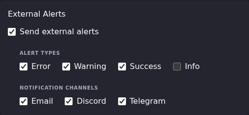

# Route Alerts to the Right Channel

After this article you will be able to send different severities to
different channels, silence the noisy ones, and predict which alerts can
reach which channel at all.

The three gates an alert passes are described in
[Notifications & Alert Methods](index.md). This article assumes you have
read that, and covers the routing decisions that sit on top of them.

## Where routing is configured

Almost all routing is per task, in **Settings → Scheduled Tasks → Edit** on
the task you care about. There is no global "send everything to Discord"
switch, and no global severity filter. Every task carries its own copy of
the toggles.

Defaults for a task are: external alerts on, Error, Warning and Success
on, Info off, and all three channels on. The **Notification Center** block
above it is separate and does not gate external delivery.

## The two dispatch paths

This is the part that explains most surprising routing behavior, and it is
not visible anywhere in the UI.

ECM has two distinct ways of getting an alert out, and they support
different channels:

| Alert source | Path | Channels it can reach |
|-|-|-|
| Scheduled task results, and anything else that raises an in-app notification | Shared Notification Settings | Discord and Telegram directly; email by handing off to the alert-method path |
| Per-source EPG refresh watcher, per-account M3U refresh watcher, stream probe results | Alert Methods | Whatever alert-method rows exist |

Because the Notification Settings page only ever creates one alert method
(the SMTP one named `Email`), the practical consequence on a default
instance is:

- **Scheduled task alerts** reach email, Discord and Telegram.
- **EPG refresh, M3U refresh and stream probe alerts** reach email only.
  They have no Discord or Telegram row to dispatch to.

If you need those source-level alerts in Discord or Telegram, you have to
create an alert method of that type through the API. See
[API reference → Alert Methods](https://github.com/MotWakorb/enhancedchannelmanager/blob/main/docs/api.md#alert-methods) in the
repository, and the
per-channel notes in
[What ECM posts to Discord](discord-webhook-customization.md#the-embed-path-and-when-it-applies)
and [Set up the Telegram bot](telegram-bot-setup.md#the-alert-method-path).

## The full gate order

For a scheduled-task alert, in order. The first gate that blocks decides.

1. **Send external alerts** on the task. Off means nothing leaves ECM.
2. The **Alert Types** checkbox matching the fired severity.
3. The **Notification Channels** checkbox for that channel.
4. That channel being **Configured** in Notification Settings.
5. For email only: the `notify_<severity>` opt-in on the `Email` alert
   method. The UI creates it with info **off**, so info alerts never reach
   email.
6. For email only: a non-empty recipients list.

Gates 1 and 2 stop the alert everywhere. Gates 3 to 6 stop it on one
channel while the others still fire.

## Timing: Discord and Telegram are immediate, email is not

Discord and Telegram posts happen as the alert is raised. Email alerts are
buffered for 30 seconds and flushed as a group, so two alerts a few seconds
apart arrive as one digest email with a subject like
`ECM Digest: 1 success, 2 error`. The window is fixed in code.

Do not read a delayed or merged email as a failure. Read the arrival time
of the Discord or Telegram copy if you need the moment the alert fired.

## Worked examples

### Send only errors to Discord, everything to email

The severity filter and the channel filter are independent lists, so a
per-severity split needs one task setting plus a per-channel decision. ECM
cannot express "errors to Discord, successes to email" **within a single
task**, because the Alert Types checkboxes apply to all enabled channels at
once.

What you can do:

1. Open the task and leave **Send external alerts** on.
2. Under **Alert Types**, tick only the severities you want anyone to
   receive at all. Anything unticked here is gone from every channel.
3. Under **Notification Channels**, tick **Email** and **Discord**.
4. Save.

**Result:** the ticked severities go to both channels. If you genuinely
need Discord to be errors-only while email stays verbose, split the work
across two tasks, or accept the same severity set on both.

### Silence success noise

Successful runs are the most common source of alert fatigue, and they are
on by default.

1. Open each task you want quieter.
2. Under **Alert Types**, untick **Success**.
3. Save.

**Result:** that task alerts only on warnings and errors. Its successful
runs still appear in the Notification Center if **Show notifications in
bell icon** is on, so you keep the record without the notification.

There is no global control for this. It is per task, every task.

### Turn on info alerts for one task only

1. Open the task and tick **Info** under **Alert Types**.
2. Save.

**Result:** info alerts now reach Discord and Telegram for that task.

**They will not reach email.** The `Email` alert method the UI creates has
its info opt-in off, and the UI offers no way to change it today; see
[Manage the Email Alert Recipients list](email-recipients-deep-dive.md#what-the-field-is-and-what-it-creates)
for the current gap.

### Route one EPG source's failures to a different recipient set

This is the one case the per-task toggles cannot express at all, because
EPG and M3U refresh watchers do not run under a task's channel settings.

Alert methods carry an optional source filter that scopes them to specific
EPG sources, specific M3U accounts, or a minimum probe-failure count. With
it you can have two SMTP methods with different recipient lists, each
listening to a different set of sources. The filter supports three modes
per category: all sources, only the listed ones, or all except the listed
ones.

Both the second method and the filter are API-only today. The request
shapes and the filter schema are in
[API reference → Alert Methods](https://github.com/MotWakorb/enhancedchannelmanager/blob/main/docs/api.md#alert-methods) in the repository.

### Stop a noisy probe from alerting until it is really bad

The probe-failure category in that same filter takes a minimum failure
count. Below the threshold, warning and error alerts are suppressed;
completion alerts with no failures always go through. Again, API-only.

## Choosing a channel deliberately

| If you want | Use |
|-|-|
| A durable record you can search later | Email. Every alert is a message, and the digest keeps them grouped |
| A shared team feed | Discord. One webhook, one channel, immediate |
| Something on your phone | Telegram. Immediate, and one chat |
| No external delivery, just a record in ECM | Turn **Send external alerts** off and leave **Show notifications in bell icon** on |

## When routing does not behave

| Symptom | Cause to check first |
|-|-|
| One channel silent, others fine | That channel's per-task toggle, then its **Configured** badge |
| All channels silent for one task | **Send external alerts** on that task |
| All channels silent for one severity | The **Alert Types** checkbox for that severity |
| Info alerts reach Discord but not email | Expected. Gate 5 above |
| EPG or M3U refresh alerts never reach Discord | Expected. No Discord alert method exists |
| Email arrives late or merged | Expected. The 30-second digest window |

Dispatch decisions are logged. A task logs its full alert configuration
before dispatching, and the dispatcher logs which channels it attempted
and which succeeded, under `[NOTIFY-SVC]` and `[ALERTS]` prefixes. Skips
are logged with the reason. See
[Read the logs](../troubleshooting/read-the-logs.md).

## Going deeper

- [Notifications & Alert Methods](index.md): the three gates and the
  Notification Settings page.
- [Manage the Email Alert Recipients list](email-recipients-deep-dive.md):
  the recipients field, the digest window, and the alert method behind it.
- [What ECM posts to Discord](discord-webhook-customization.md): message
  format and the limits of Discord customization.
- [Set up the Telegram bot](telegram-bot-setup.md): the two fields and
  their failure modes.
- [API reference → Alert Methods](https://github.com/MotWakorb/enhancedchannelmanager/blob/main/docs/api.md#alert-methods) (GitHub):
  everything the UI cannot configure, including additional methods and source
  filters.
- [API reference → Scheduled Tasks](https://github.com/MotWakorb/enhancedchannelmanager/blob/main/docs/api.md#scheduled-tasks) (GitHub):
  updating per-task alert configuration without the UI.
