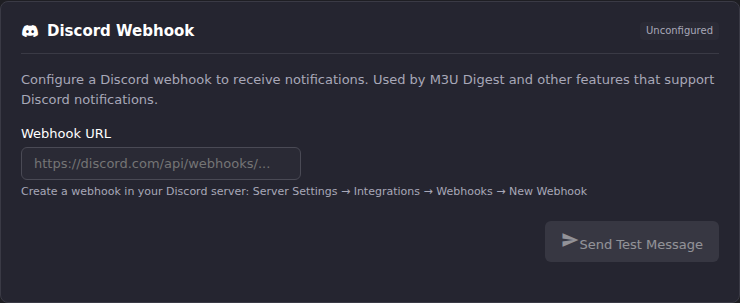

# What ECM Posts to Discord, and What You Can Change

After this article you will know the exact shape of the messages ECM sends
to a Discord webhook, which parts of them you can influence, and which
parts are fixed in code so you stop looking for a setting that does not
exist.

Setting the webhook up in the first place is covered in
[Notifications & Alert Methods](index.md). This article picks up once it is
saved.

## The field, and what ECM checks before storing it

**Settings → Notification Settings → Discord Webhook** has exactly one
field, **Webhook URL**.



ECM POSTs this URL verbatim, so it is validated against a host allowlist
before it is stored. Accepted hosts are `discord.com`, `discordapp.com`,
`canary.discord.com` and `ptb.discord.com`, and the path must begin
`/api/webhooks/`. Anything else is refused on save with:

```text
Invalid Discord webhook URL — must be an https webhook on discord.com / discordapp.com (e.g. https://discord.com/api/webhooks/...).
```

An empty field is allowed and simply disables the integration.

Remember that a Discord webhook URL **is** a credential. Anyone holding it
can post to that channel. Treat it like a password: do not paste it into a
support thread, a screenshot, or an issue.

## Testing before you save

**Send Test Message** posts using the value currently in the field, not
the last saved value, so you can validate a URL before committing it. The
button stays disabled until the field has content.

The test payload is **not** representative of a real alert. It is a fixed
plain message posted under the webhook username `ECM Test`:

```text
**✓ ECM Discord Test**

Your Discord webhook is configured correctly.
You will receive notifications from Enhanced Channel Manager here.
```

A success toasts `Test message sent successfully`. Failures are mapped to
short, specific messages rather than raw Discord output:

| What went wrong | Message |
|-|-|
| Field left empty | `Webhook URL is required` |
| Host or path is not a Discord webhook | `Invalid Discord webhook URL format` |
| Discord rejected the token | `Invalid webhook - unauthorized` |
| Webhook deleted, or the id is wrong | `Webhook not found - may have been deleted` |
| Too many posts too quickly | `Rate limited - try again later` |
| Anything else | `Discord returned error: 500` (the HTTP status) |
| ECM could not reach Discord at all | `Connection error during Discord test` |

## What a real scheduled-task alert looks like

This is the part most often assumed wrong. For alerts raised by scheduled
tasks, ECM posts a **plain webhook message**, not an embed. The payload is
a `content` string plus a `username` of `ECM Alerts`. There is no color
bar, no title field, no footer, and no structured fields.

The body is assembled as:

```text
**<emoji> <alert title>**

<alert message>

**Task:** <task name>
**Duration:** 12.4s
```

The emoji is chosen from the severity and is fixed: ℹ️ for info, ✅ for
success, ⚠️ for warning, ❌ for error. The `Task` line appears whenever the
alert carries a task name; the `Duration` line appears whenever it carries
a run duration.

Because the message is Discord markdown, the title renders bold. Nothing
in it is escaped, so a task name containing markdown characters renders as
markdown.

## What you can and cannot change

| Thing | Changeable? |
|-|-|
| Which severities post | Yes, per task, under **Alert Types** in the task editor |
| Whether a task posts to Discord at all | Yes, per task, under **Notification Channels** |
| Which Discord channel receives alerts | Yes, by pointing the webhook at a different channel in Discord |
| The webhook's display name and avatar | In Discord's own webhook settings. ECM sends `username: ECM Alerts`, which overrides the name you set in Discord |
| Message wording, emoji, bold formatting | No. Fixed in code |
| Embed color, title, footer, fields | Not on this path. See below |
| Mentioning a role or user (`@here`, `<@&id>`) | No. ECM never inserts a mention and provides no field to add one |

There is no way to make an alert ping anyone. If you need paging behavior,
put the webhook in a channel your team has set to notify on every message,
and use Discord's own notification settings rather than looking for an ECM
setting.

## One webhook, shared by everything

The URL you save here is used by every ECM feature that posts to Discord:
scheduled-task alerts, the M3U Digest, and anything added later. There is
no per-feature webhook field in the UI, and the **M3U Digest** page links
back to this same setting rather than offering its own.

Practically, that means channel routing is a Discord-side decision. If you
want refresh failures and digests in different channels, the UI cannot do
it.

## The embed path, and when it applies

ECM does contain a richer Discord renderer that posts a proper embed:
title with severity emoji, description, severity color, ISO timestamp, a
`Source:` footer, and up to 25 metadata fields. It has three optional
settings, `username` (default `ECM Alerts`), `avatar_url`, and
`include_timestamp` (default on).

That renderer runs only for a Discord **Alert Method** row, and the
Notification Settings page never creates one. The **Alert Methods** list at
the bottom of the page is read-only; it lists what exists and offers a test
and a delete, not a create. The only way to get a Discord alert method
today is to create it through the API.

If you do create one, the two paths coexist and behave differently:

| Alert source | Path taken | Format |
|-|-|-|
| Scheduled task results | Shared **Webhook URL** above | Plain `content` message |
| Per-source EPG refresh, per-account M3U refresh, stream probe results | Discord alert method, if one exists | Embed |

A Discord alert method also brings its own per-severity opt-ins and the
granular `alert_sources` filter, which is the only mechanism in ECM for
routing (say) one EPG source's failures to a different webhook than
another's. See [Alert routing patterns](alert-routing-patterns.md) for what
that buys you and
[API reference → Alert Methods](https://github.com/MotWakorb/enhancedchannelmanager/blob/main/docs/api.md#alert-methods) in the repository
for the request shapes.

## When alerts stop arriving

| Symptom | Check |
|-|-|
| Test succeeds, task alerts never appear | The task's **Send external alerts** toggle and its **Discord** channel toggle |
| Everything stopped at once | The webhook was probably deleted in Discord. Re-test; a deleted webhook reports `Webhook not found - may have been deleted` |
| Alerts arrive late or in bursts | Not Discord. Discord posts are immediate; the batching you may be thinking of applies to the email path only |
| Alerts appear under an unexpected name | Expected. ECM overrides the webhook name with `ECM Alerts` on every post |

Failures on the live alert path are logged with a `[NOTIFY-SVC]` prefix and
include the HTTP status Discord returned. See
[Read the logs](../troubleshooting/read-the-logs.md).

## Going deeper

- [Notifications & Alert Methods](index.md): getting the webhook URL out of
  Discord and the three gates every alert passes.
- [Alert routing patterns](alert-routing-patterns.md): which alert sources
  can reach Discord at all, and the worked routing examples.
- [M3U Digest](../settings/m3u-digest.md): the other feature that posts to
  this webhook, on its own schedule.
- [API reference → Alert Methods](https://github.com/MotWakorb/enhancedchannelmanager/blob/main/docs/api.md#alert-methods) (GitHub):
  creating the Discord alert method that unlocks the embed renderer.
