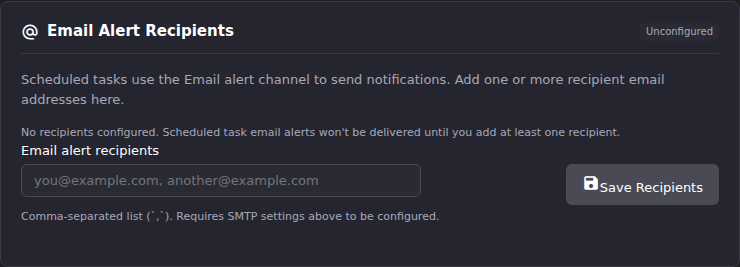
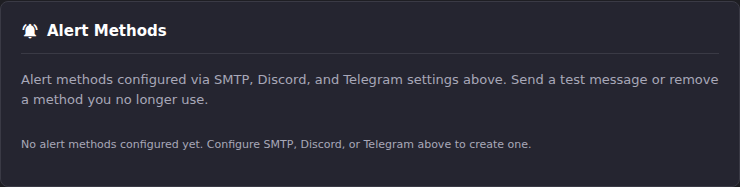

# Manage the Email Alert Recipients List

After this article you will know exactly what the **Email alert
recipients** field accepts, what ECM builds behind it, and why an address
that looks fine can still fail to receive an alert.

This is the deep reference for one field. The end-to-end setup walkthrough
is in [Notifications & Alert Methods](index.md); read that first if you
have not configured SMTP yet.

## What the field is, and what it creates

**Settings → Notification Settings → Email Alert Recipients** is the only
place the UI writes a recipient list for scheduled-task alerts. It is
separate from **SMTP Configuration** (the server) and from the **M3U
Digest** recipients (a different report with a different audience).



When you save a non-empty list, ECM creates a single **Alert Method** row
on your behalf: name `Email`, type `smtp`, enabled. It appears in the
**Alert Methods** list further down the same page. Saving again updates
that same row rather than creating a second one.



The row is created with four severity opt-ins baked in, and the UI gives
you no way to change them:

| Opt-in | Value the UI sets |
|-|-|
| `notify_error` | on |
| `notify_warning` | on |
| `notify_success` | on |
| `notify_info` | **off** |

`notify_info` being off matters. It is an extra gate on top of the three
described in the [index](index.md#how-alerts-get-delivered-the-short-version):
even if a task has **Info** ticked under **Alert Types**, the info alert is
dropped at the Email method and no email is sent. Errors, warnings and
successes are unaffected. See
[Alert routing patterns](alert-routing-patterns.md) for the way around it.

## The separator is a comma

One comma-separated list, in one field:

```text
alerts@example.com, oncall@example.com, archive@example.com
```

Nothing else is a separator. A space-separated or semicolon-separated
string that you *type* is read as a single malformed address and rejected
at save time.

**Pasting is the exception.** On paste, ECM rewrites `;`, newline and
carriage return to `, ` before the text lands in the field, so a column
copied out of a spreadsheet or an address list copied from another mail
client works without cleanup. The rewrite happens only on paste, never on
typing.

Whitespace around each address is trimmed, and empty entries between
commas are discarded.

## What gets rejected, and the exact wording

Each address is checked against the HTML standard's valid-email-address
production, a pragmatic subset of RFC 5322. Validation runs when you leave the
field and again when you click **Save Recipients**.

Validation short-circuits on the **first** bad entry, so a list with three
problems reports one at a time:

| Situation | What you see |
|-|-|
| An entry fails the check | `bad@@example is not a valid email address. Use a comma-separated list.` (inline under the field, and as an error toast on save) |
| The field is empty or only separators | `Add at least one recipient email address` |

The message quotes the offending entry verbatim, so read the token in the
error rather than re-scanning the whole list.

The backend re-validates independently when it stores the list. That
second pass additionally rejects any entry containing a carriage return,
a line feed, `<`, `>` or `:`, with
`to_emails entry contains forbidden character (CR): '...'`. You will
normally never see it, because the frontend regex rejects those characters
first; it exists so the same guarantee holds for anything written through
the API.

## Duplicates are removed for you

Comparison is case-insensitive, the first occurrence wins, and input order
is preserved otherwise. `Alerts@example.com` and `alerts@example.com`
collapse to whichever you typed first.

When at least one entry is dropped, the save still succeeds and you get a
warning toast alongside the success toast:

- `Removed 1 duplicate recipient`
- `Removed 3 duplicate recipients`

## Confirming the save landed

On success you get three signals:

1. A success toast reading `Email alert recipients saved`.
2. The badge next to the **Email Alert Recipients** heading flips from
   **Unconfigured** to **Configured**, and the empty-state line
   ("No recipients configured. Scheduled task email alerts won't be
   delivered until you add at least one recipient.") disappears.
3. A `Saved at HH:MM` timestamp appears in the section header.

The field is also rewritten to the normalized, deduplicated form, so what
you see afterwards is exactly what ECM stored.

**Result:** the **Email** row exists under **Alert Methods**, and
scheduled tasks with **Email** ticked under **Notification Channels** now
have somewhere to deliver to.

## What the recipients actually receive

Every recipient is on the same message. ECM builds one email with all
addresses joined into the `To:` header, then hands the full list to the
SMTP server in a single `sendmail` call. There is no `Bcc:` option, so
**every recipient can see every other recipient**. Use a distribution
address if that is not acceptable.

Each message is `multipart/alternative` with a plain-text part and a
styled HTML part, color-coded by severity.

The subject depends on how many alerts were in flight:

| Case | Subject |
|-|-|
| A single alert | the severity label followed by the alert title, for example `[ERROR] Stream Probe` |
| Two or more alerts inside one window | `ECM Digest: 1 success, 2 error` |

That second case is the **digest window**. Email alerts are buffered for
30 seconds and flushed together; alerts arriving inside the same window
arrive as one email listing each of them. This is a property of the email
path only. Discord and Telegram alerts are posted as they happen. The
window is fixed in code and is not exposed as a setting.

The severity labels used in the subject are `[INFO]`, `[SUCCESS]`,
`[WARNING]` and `[ERROR]`.

## Testing without waiting for a task

Two buttons on this page look similar and do different things.

**Test Connection → Send Test Email** exercises the SMTP server only. It
sends to whatever single address you type in **Test Recipient Email**, and
it ignores the Email Alert Recipients list entirely. The message subject is
`ECM SMTP Test - Connection Successful`, and a successful send toasts
`Test email sent to you@example.com`. Use this to prove your host, port,
security mode and credentials.

**Alert Methods → the send icon on the `Email` row** is the real thing. It
sends a live alert-shaped email, subject `[INFO] Connection Test`, to
**every address in the recipients list**, through the same code path a
task alert uses. On success the toast reads
`Test email sent to alerts@example.com, oncall@example.com`. Treat it as a
real send, because it is one: everybody on the list gets mail.

If SMTP is not configured, that button fails without sending anything and
reports
`Shared SMTP not configured. Configure in Settings > Email Settings first.`
If the list is empty it reports `No recipient email addresses configured`.

## Inheriting a list from an older instance

Older ECM versions stored `to_emails` as one comma-joined string. Current
versions store a proper list of addresses, and canonicalize on write: any
save through the UI or the API converts a string to a list. Reads still
accept both shapes, so an instance upgraded from an older version keeps
delivering alerts before you touch the field, and converts the first time
you press **Save Recipients**.

There is no migration to run and nothing to check. If you want to force
the conversion, open the field and save it unchanged.

## When mail still does not arrive

Work down this list in order. It is ordered by how often each cause is the
answer.

| Symptom | Check |
|-|-|
| Nothing arrives for any task | The task's **Send external alerts** master toggle, then its **Email** channel toggle. See [Alert routing patterns](alert-routing-patterns.md). |
| Badge says **Configured**, still nothing | SMTP itself. Use **Send Test Email** with your own address to separate a server problem from a routing problem. |
| Errors arrive, info alerts never do | Expected. `notify_info` is off on the Email method the UI creates. |
| One alert arrives describing several runs | Expected. Two or more alerts landed inside the 30-second digest window. |
| Some recipients get mail, others do not | Your mail server or the recipient's provider is dropping it. ECM sent one message to all of them. Check `[ALERTS-SMTP]` lines in the backend log for the recipient count ECM handed over. |

`[ALERTS-SMTP]` log lines record authentication failures and SMTP errors
verbatim. See [Read the logs](../troubleshooting/read-the-logs.md).

## Going deeper

- [Notifications & Alert Methods](index.md): the three delivery gates and
  the rest of the Notification Settings page.
- [Alert routing patterns](alert-routing-patterns.md): sending different
  severities to different channels, and the two dispatch paths that decide
  which alerts can reach which channel.
- [API reference → Alert Methods](https://github.com/MotWakorb/enhancedchannelmanager/blob/main/docs/api.md#alert-methods) (GitHub):
  creating additional SMTP methods with their own recipient sets and severity
  opt-ins, which the UI cannot do.
- [M3U Digest](../settings/m3u-digest.md): the other email report, with its
  own recipients field and its own schedule.
