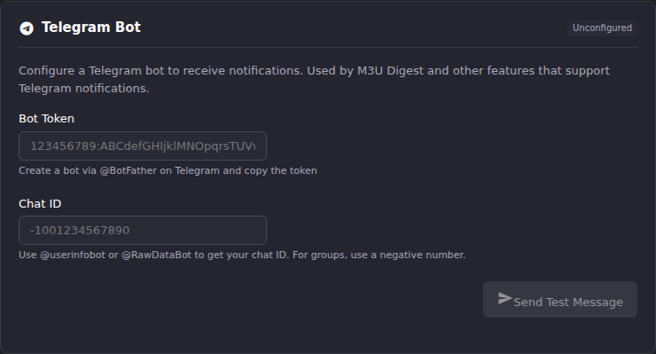

# Set Up the Telegram Bot

After this article you will have a Telegram bot delivering ECM alerts to a
chat you control, and you will know which Telegram concepts matter to ECM
and which ones do not.

The three delivery gates every alert passes are described in
[Notifications & Alert Methods](index.md). This article covers only the two
fields ECM needs and how to fill them correctly.

## The two fields ECM needs

**Settings → Notification Settings → Telegram Bot** asks for a **Bot
Token** and a **Chat ID**. That is the whole configuration. ECM does not
use a Telegram user account, a phone number, an API id, or an API hash.



The **Configured** badge requires **both** fields to be non-empty. One
without the other counts as unconfigured, and no Telegram alert is sent.

The Bot Token field is a password input, so it masks what you type. The
Chat ID field is not, because a chat id is not a secret. The token is: it
grants full control of the bot to anyone holding it.

## Get the bot token

1. In Telegram, open a chat with **@BotFather**.
2. Send `/newbot` and answer the two prompts: a display name, then a
   username ending in `bot`.
3. BotFather replies with the token. It has the shape
   `<digits>:<letters, digits, underscores and hyphens>`, matching the
   field's own placeholder `123456789:ABCdefGHIjklMNOpqrsTUVwxyz...`.
4. Paste it into **Bot Token**.

ECM validates the shape before it will contact Telegram. A token that does
not match `<digits>:<token>` is refused locally with
`Invalid bot token format`, without a network call. This is a deliberate
guard against a malformed token being used to build a request to somewhere
other than Telegram.

**Result:** the Bot Token field shows a masked value and the section badge
still reads **Unconfigured**, because the chat id is missing.

## Get the chat ID

ECM sends to exactly one chat. Which one depends on where you want alerts.

**For a direct message to yourself:** message **@userinfobot** or
**@RawDataBot**. Either replies with your numeric user id, which doubles as
your chat id. It is a positive number.

**For a group or supergroup:** add your bot to the group first, then use
**@RawDataBot** in that group to read the chat id. Group chat ids are
negative, as the field's hint says. The field's placeholder,
`-1001234567890`, shows the supergroup shape, which starts `-100`.

Paste the value into **Chat ID** and click **Save Settings**.

**Result:** the badge next to **Telegram Bot** turns to **Configured**.

**The bot must already be in the destination chat before it can post
there.** Telegram will not let a bot message a group it has not joined, and
for a direct message the user has to have started a conversation with the
bot first. If either is missing, the test below fails with
`Chat not found - check your chat ID` even though the id is correct.

## Send a test message

**Send Test Message** uses the values currently in the form, not the last
saved values, so you can validate a token and chat id before saving them.
The button stays disabled until both fields have content.

The test posts a fixed message in Telegram's MarkdownV2 mode:

```text
✓ *ECM Telegram Test*

Your Telegram bot is configured correctly.
You will receive notifications from Enhanced Channel Manager here.
```

It is a real message to a real chat. Do not press it if you have someone
else's chat id in the field.

A success toasts `Test message sent successfully`. Failures map to:

| What went wrong | Message |
|-|-|
| Token missing or malformed | `Invalid bot token format` |
| Chat ID left empty | `Chat ID is required` |
| Telegram rejected the token | `Invalid bot token - unauthorized` |
| Bot is not in the chat, or the id is wrong | `Chat not found - check your chat ID` |
| Another Telegram validation failure | `Bad request: <Telegram's description>` |
| Too many messages too quickly | `Rate limited - try again later` |
| ECM could not reach Telegram | `Connection error during Telegram test` |

The test performs a single `sendMessage` call. It does not separately
verify the bot, so a token that is well-formed but wrong fails at the
message, not before it.

## What a real alert looks like

Scheduled-task alerts are sent with `parse_mode: HTML` and are assembled
as:

```text
<emoji> <b><alert title></b>

<alert message>

<b>Task:</b> <task name>
<b>Duration:</b> 12.4s
```

The emoji is fixed by severity: ℹ️ for info, ✅ for success, ⚠️ for
warning, ❌ for error. The `Task` and `Duration` lines appear only when the
alert carries those values.

Nothing in the alert wording is configurable, and there is no field
anywhere in ECM for a message template, a silent-notification flag, or a
link-preview setting on this path.

**One caveat worth knowing.** On this path the alert title and message are
inserted into HTML without escaping. If a task name, a source name, or an
error string contains `<`, `>` or `&`, Telegram can reject the whole
message as malformed HTML. The alert is then simply missing, and the
backend log records the rejection with a `[NOTIFY-SVC] Telegram alert
failed` line carrying Telegram's own description. If Telegram alerts go
missing only for particular failures, check the log for that line before
suspecting the token.

## Telegram concepts that do not apply to ECM

Worth stating plainly, because they cost time to chase:

- **Privacy mode makes no difference.** BotFather's privacy setting
  controls which messages a bot can *read* in a group. ECM never reads
  anything: the only Telegram endpoints it calls are `sendMessage` and, on
  one code path, `getMe`. Leave privacy mode at its default.
- **Topics and threads are not addressable.** ECM sends a plain
  `sendMessage` carrying a chat id and no thread id, so it cannot target a
  specific topic in a forum-style group.
- **One chat only.** There is one Chat ID field. To fan out to several
  chats, use a group rather than trying to list ids.

## The alert-method path

As with Discord, ECM contains a second, richer Telegram renderer used by a
Telegram **Alert Method** row. It escapes the message properly, supports
`parse_mode` (`HTML`, `Markdown` or `MarkdownV2`), `disable_notification`
for a silent post, and `disable_web_page_preview`. Its connection test also
calls `getMe` first, so it can report the bot's username and distinguish a
bad token from a bad chat id.

The Notification Settings page never creates such a row, and the **Alert
Methods** list at the bottom of that page is read-only: it lists, tests and
deletes, but does not create. Creating a Telegram alert method is an API
operation today. See
[API reference → Alert Methods](https://github.com/MotWakorb/enhancedchannelmanager/blob/main/docs/api.md#alert-methods) in the repository.

Note the split if you do create one: scheduled-task alerts still go out
over the shared **Bot Token** and **Chat ID** above, while per-source EPG
refresh, per-account M3U refresh and stream probe alerts go through the
alert method. [Alert routing patterns](alert-routing-patterns.md) explains
why.

## When alerts stop arriving

| Symptom | Check |
|-|-|
| Test succeeds, task alerts never appear | The task's **Send external alerts** toggle and its **Telegram** channel toggle |
| Test fails with `Chat not found` | The bot is not in the chat, or the id lost its leading `-` |
| It worked, then stopped | The bot was removed from the group, or the token was revoked in BotFather |
| Only some alerts arrive | Likely the unescaped-HTML caveat above. Look for `[NOTIFY-SVC] Telegram alert failed` in the log |

See [Read the logs](../troubleshooting/read-the-logs.md) for getting at
those lines.

## Going deeper

- [Notifications & Alert Methods](index.md): the three gates, and the rest
  of the Notification Settings page.
- [Alert routing patterns](alert-routing-patterns.md): choosing which
  severities and which tasks reach Telegram.
- [API reference → Alert Methods](https://github.com/MotWakorb/enhancedchannelmanager/blob/main/docs/api.md#alert-methods) (GitHub): the
  Telegram alert method and its optional settings.
