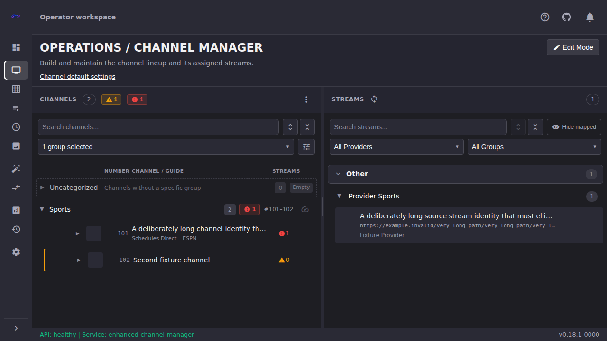
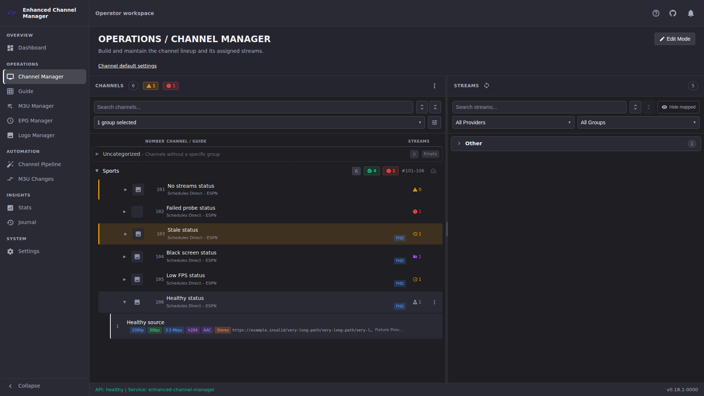
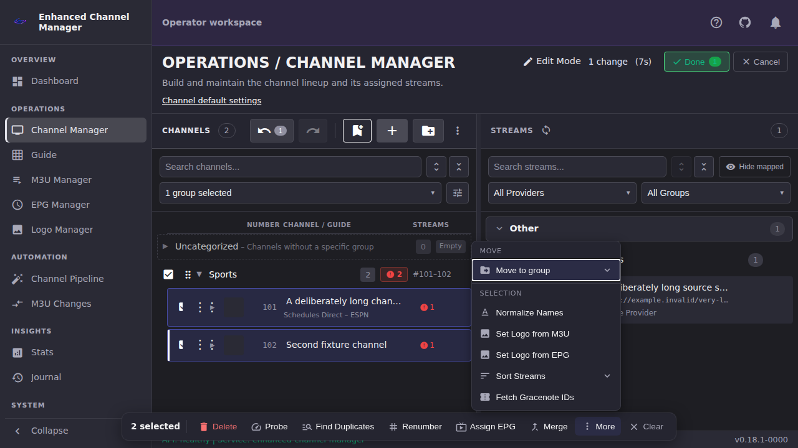
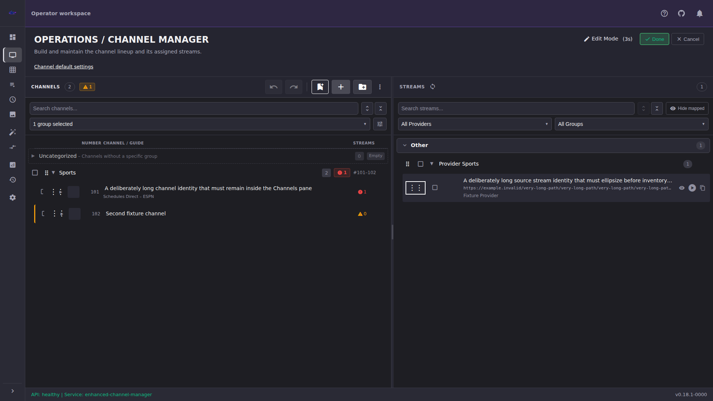

# Find Your Way Around the Operator Workspace

ECM uses a grouped sidebar so related pages stay together while the main work
area keeps as much width as possible. This page explains where things moved,
how deep links behave, and how to use the workspace with a keyboard. It is an
orientation reference, not a replacement for the task tutorials tracked in
the [user-guide destination index](index.md#by-workspace-destination).

## Primary navigation

The expanded sidebar is 244 pixels wide and shows five non-interactive group
headings:

| Group | Destinations |
|-|-|
| **Overview** | **Dashboard** |
| **Operations** | **M3U Manager**, **EPG Manager**, **Logo Manager**, **Channel Manager** |
| **Automation** | **Channel Pipeline** |
| **Insights** | **Guide**, **Stats**, **M3U Changes**, **Journal** |
| **System** | **Settings** |

**Operations** follows the order you normally set ECM up in: sources, then
programme data, then artwork, then the **Channel Manager** that uses all three.
**Insights** holds the pages you read rather than configure.

Select the ECM logo at the top of the sidebar to switch to the 68-pixel
icon-only rail. The group headings and visible labels disappear, but every
destination keeps its accessible name, tooltip, current-page treatment, and
place in the keyboard order. The preference is stored in this browser. Select
the logo again to restore the labels.

The logo is the only collapse control; it is announced as **Collapse
navigation** when the sidebar is expanded and **Expand navigation** when it is
collapsed.

At 1280×720, collapsing the sidebar gives dense pages more working width. At
1920×1080, the expanded sidebar normally leaves enough room for both Channel
Manager panes. ECM never changes the preference silently.

## Service status in the header

The top bar shows a status pill on the right, next to the User Guide and
notification controls:

| Pill | Meaning |
|-|-|
| **● Online** | ECM answered its health check normally. |
| **● Connecting** | ECM has not answered its first health check yet. |
| **● Offline** | The API returned an error. |
| **● <status>** | ECM answered with a status other than healthy; the reported status is shown as-is. |

The pill also shows the running ECM version, after the status word
(**● Online · <version>**).
The coloured dot repeats what the words already say, so the status is readable
without relying on colour.

When a newer ECM release is available, the notice arrives as an entry in the
notification centre (the bell icon further along the header), not as a pill
or link next to the status pill. ECM has no bottom status bar; the header
carries all of it.

### Keyboard-only navigation

1. Press `Tab` from the browser chrome. The first ECM control is **Skip to
   main content**.
2. Continue pressing `Tab` through the application header and the links in the
   **Primary** navigation landmark. Focus follows the same order as the table
   above.
3. Press `Enter` on a destination link.
4. Press `Enter` or `Space` on **Collapse navigation** or **Expand
   navigation**. This is the logo control at the top of the sidebar, reached
   before the destination links. Focus stays on the control.
5. Use `Shift+Tab` to move backward. A visible outline identifies the focused
   control in either sidebar mode.

Ordinary navigation links do not use an arrow-key menu pattern. Browser
Back/Forward returns to previous ECM routes.

## Dashboard is a drill-down, not a second control panel

**Dashboard** summarizes the operator workspace without changing data. Each
card links to the page where you can investigate or act:

| Dashboard summary | Drill-down destination |
|-|-|
| ECM service | **Settings** |
| Lineup inventory | **Channel Manager** |
| Source accounts | **M3U Manager** |
| Recent M3U changes | **M3U Changes** |
| Scheduled work | **Settings** → **Scheduled Tasks** |
| Recent journal | **Journal** |

A failed card keeps the other cards usable. Use that card's **Retry** control;
do not interpret a missing card as a zero value.

## Settings and contextual links

**Settings** is one primary destination. Selecting it replaces the sidebar's
groups with the **Settings sections** list, so the whole page width belongs to
the settings content. The sections are grouped, in this order:

| Group | Sections |
|---|---|
| **Connections** | General, Integrations |
| **Channel Processing** | Channel Defaults, Channel Normalization, Tags, Channel Pipeline |
| **Notifications & Reports** | Notification Settings, M3U Digest |
| **Upkeep** | Scheduled Tasks, Maintenance, Backup & Restore |
| **Workspace** | Appearance, Linked Accounts |
| **Administration** | Authentication, User Management, TLS Certificates, MCP Integration |

**Administration** appears for administrators only. Non-administrators see the
first five groups and no empty Administration heading.

Select **Back** at the top of the sidebar to restore the main navigation
groups. Back only changes what the sidebar shows. You stay on the Settings
page you were reading. Because the sidebar holds the Settings sections while
you are in Settings, reach another destination by selecting **Back** first.

Links beside a task take you directly to the relevant subsection;
for example, **Channel default settings** in Channel Manager opens
`#settings/channel-defaults`. Use those contextual links instead of hunting
through every Settings section.

Each section names itself in the page header rather than repeating a heading
inside the content area. Opening **General** shows **SYSTEM / SETTINGS /
GENERAL SETTINGS** with that section's description beneath it, so the content
pane starts at the first setting.

Any Settings page with more than one section shows an **On this page**
navigation region in a column on the right of the page, which stays in place as
the settings scroll. Pages with a single section, or none, do not show it:
there would be nothing to move between. Its buttons move within the current
page and update the `?section=` portion of the hash. They do not leave
Settings. On narrower windows the region moves back above the settings content.

### Save and cancellation protection

On the Settings pages that save as a page (**General**, **Channel Defaults**,
**Appearance**, **Notification Settings**, **Integrations**, **Channel
Pipeline**, and **Maintenance**), changing a field produces the sticky
**Unsaved settings** action region:

- **Save changes** writes the page's pending values.
- **Cancel changes** reloads the last saved values.
- Leaving the page while changes are pending asks **Discard unsaved settings
  and leave this page?**
- Closing or reloading the browser with pending changes triggers the browser's
  unsaved-change warning.
- If saving fails, your entered values remain available so you can correct or
  retry them.

The sticky **On this page** and **Unsaved settings** regions keep the focused
control visible. They do not turn explicit saves into autosave.

## Channel Manager mental model

Channel Manager remains a two-pane workspace at both audited viewports:

- **Channels** on the left is the lineup Dispatcharr serves. Assigned streams
  expand beneath their channel.
- **Streams** on the right is the all-provider inventory from which streams
  are assigned.
- The separator between them is named **Resize Channels and Streams panes**.
  Drag it with a pointer. With a keyboard, press `Tab` until the separator has
  a visible focus outline and its current percentage is announced. Press
  `ArrowLeft` or `ArrowRight` to move the split by 2 percentage points,
  `Home` for the minimum Channels width, or `End` for the maximum. The
  separator exposes its current, minimum, and maximum percentages to assistive
  technology.

### Channel identity, artwork, and status

Channel number and channel name are separate columns. The guide subtitle uses
`<EPG provider> – <tvg-name>`.

Channel rows use channel artwork. If a channel has no logo, ECM shows the image
placeholder. Streams inventory uses the stream's own artwork when present and
otherwise reserves an empty artwork slot; it does not invent a channel
fallback.

The compact indicator at the right of each channel announces the total stream
count and exactly one highest-priority state:

1. no streams assigned
2. failed probe
3. stale
4. black screen
5. low FPS
6. healthy

The accessible names follow the same pattern, such as **0 streams; no streams
assigned**, **1 stream; failed probe**, or **1 stream; healthy**. The icon and
text alternative carry the meaning; color alone does not. Probe details,
resolution badges, timeouts, and strike information belong with a channel's
assigned streams, not in the Streams inventory.

## Edit Mode and staged changes

Select **Edit Mode** to begin a staged editing session. Channel, channel-group,
stream-group, and stream grab handles appear only where reordering is
supported; they are absent from the layout and keyboard order outside Edit
Mode. Keyboard drag controls announce pickup, destination, drop, and
cancellation.

Use **Undo** and **Redo** in the Channels pane history controls while the
session is active. **Done** reviews and commits staged changes. **Cancel**
discards them. Navigating away with staged changes opens **Exit Edit Mode** so
the route change cannot silently lose work.

Selecting one or more channels opens the bottom **Selection actions** toolbar.
Its available actions are **Delete**, **Probe**, **Find Duplicates**,
**Renumber**, **Assign EPG**, **Merge** (two or more channels), **More**, and
**Clear selection**. **More selection actions** opens upward; press `Escape`
to close it and return focus to the trigger.

### Keyboard-only Edit Mode

1. Tab to **Edit Mode** and press `Enter` or `Space`.
2. Tab through pane searches, filters, row controls, and drag handles. Every
   control has a visible focus outline.
3. Press `Enter` on a keyboard drag handle, choose the announced destination
   with the menu keys, then press `Enter` to drop or `Escape` to cancel.
4. Use channel checkboxes to open **Selection actions**. Tab to an action and
   press `Enter` or `Space`.
5. Tab to **Done** to review/save, or **Cancel** to discard.

## Old-to-new orientation and URLs

The page names and hashes remain stable; only their visual grouping changed.

| Former top-level destination | Current location | Canonical hash |
|-|-|-|
| Channel Manager | **Operations** → **Channel Manager** | `#channel-manager` |
| Guide | **Insights** → **Guide** | `#guide` |
| M3U Manager | **Operations** → **M3U Manager** | `#m3u-manager` |
| EPG Manager | **Operations** → **EPG Manager** | `#epg-manager` |
| Logo Manager | **Operations** → **Logo Manager** | `#logo-manager` |
| Auto-Creation | **Automation** → **Channel Pipeline** | `#channel-pipeline` |
| M3U Changes | **Insights** → **M3U Changes** | `#m3u-changes` |
| Stats | **Insights** → **Stats** | `#stats` |
| Journal | **Insights** → **Journal** | `#journal` |
| Settings | **System** → **Settings** | `#settings` |
| No former equivalent | **Overview** → **Dashboard** | `#dashboard` |

Existing bookmarks continue to work. ECM canonicalizes these legacy hashes
without adding a misleading history entry:

| Legacy hash | Resolves to |
|-|-|
| `#auto-creation` | `#channel-pipeline` |
| `#settings/general` | `#settings` |
| `#settings/auto-creation` | `#settings/channel-pipeline` |
| `#settings/security` | `#settings/backup-restore` |

An empty or unknown primary hash falls back to `#channel-manager`. Unknown
Settings subsections fall back to **General**. Admin-only Settings deep links
show a permission state to non-admin operators rather than protected content.

## Task tutorials

For step-by-step work, continue through the existing guide index:

- [Set Up Your First Channels](getting-started/your-first-channels.md)
- [Channels & Streams](channels-streams/index.md)
- [Per-destination tutorial status](index.md#by-workspace-destination)

This orientation page deliberately does not duplicate those tutorials.
