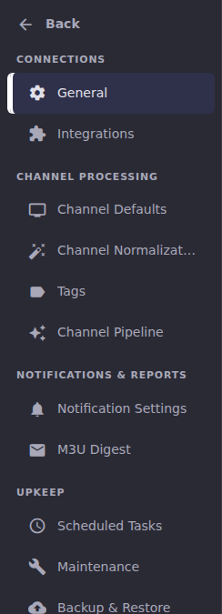
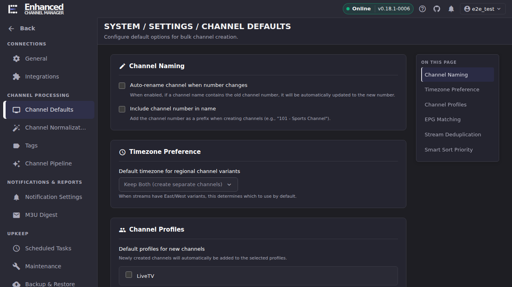

# Settings

> **Status:** Navigation rewritten 2026-07. Settings is now drill-in navigation with six grouped destinations, replacing a flat list of 18 (now 17; Lookup Tables was retired the same week; see [Where did Lookup Tables go?](#where-did-lookup-tables-go) below). This section documents the shipped navigation and the destinations in scoped batches; see the [Articles](#articles) table for what has shipped.

Settings is where an operator configures everything that isn't a day-to-day
channel-management task: the Dispatcharr connection, how channels get
created and cleaned up, where notifications go, recurring maintenance, and
(for admins) authentication and access control.

## How Settings navigation works

Settings is not a page. It's a destination with 17 sub-pages reached
through **drill-in navigation**. This changed recently; if you've read an
older description that says "scroll down the Settings page" or lists a flat
menu of destinations, it's out of date. Here's what's actually there:

1. **Click Settings** in the primary sidebar (bottom of the System group).
   The sidebar itself changes: the primary destinations (Dashboard, M3U
   Manager, Channel Pipeline, and so on) are replaced by a **Back** control
   and six grouped headings, each listing the Settings destinations under it.
2. **The groups, in order:** Connections, Channel Processing, Notifications
   & Reports, Upkeep, Workspace, and (for admins only) Administration. A
   group heading with nothing under it (Administration, for a non-admin
   viewer) simply doesn't render; there's no empty section to scroll past.
3. **Click any destination** in the sidebar to load that settings page. The
   page heading becomes a three-part breadcrumb
   (`SYSTEM / SETTINGS / <PAGE NAME>`), and the sidebar stays drilled in, so
   you can jump straight to the next destination without leaving Settings.
4. **Back returns the sidebar to the main destinations list. It does not
   navigate you away from the settings page you're viewing.** This trips
   people up once: clicking Back collapses the drill-in and shows Dashboard,
   M3U Manager, etc. again, but the page you were reading (say, Maintenance)
   is still on screen until you click a different primary destination.
5. **On longer pages, a second navigation rail appears on the right: "On
   this page."** Any settings page with two or more sections gets one; a
   single-section page (Tags, Linked Accounts, Backup & Restore) does not.
   Clicking an entry scrolls to that section and updates the URL with a
   `?section=` anchor, so you can bookmark or share a link straight to one
   section of a long page (useful for Maintenance, which has nine).

At the minimum supported viewport (1280×720), the grouped destination list
is taller than the visible sidebar and **scrolls internally**. Back stays
pinned at the top while you scroll to reach Workspace or Administration.

Here's a full page with the drill-in sidebar, the three-part breadcrumb, and
the "On this page" rail all visible together (Channel Defaults, chosen
because it has no sensitive data to redact):

## Start here

| I want to… | Go to | Group |
|-|-|-|
| Update ECM's connection to Dispatcharr, adjust stats polling, or pull a debug bundle | [General Settings](general-settings.md) | Connections |
| Connect Emby, Plex, or Jellyfin for Stats attribution | [Media Server Integrations](../integrations/index.md) | Connections |
| Set defaults for bulk channel creation (naming, timezone, EPG matching, dedup, Smart Sort) | [Channel Defaults](channel-defaults.md) | Channel Processing |
| Clean up channel names automatically when creating channels | [Channel Normalization](channel-normalization.md) | Channel Processing |
| Manage the tag vocabularies normalization rules match against | [Tags](tags.md) | Channel Processing |
| Configure Channel Pipeline exclusion filters and the runaway safety cap | [Channel Pipeline settings](../channel-pipeline/index.md) | Channel Processing |
| Set up SMTP, Discord, or Telegram so scheduled-task alerts reach you | [Notifications & Alert Methods](../notifications/index.md) | Notifications & Reports |
| Get an email digest when M3U playlists change | [M3U Change Digest](m3u-digest.md) | Notifications & Reports |
| Turn on, edit, or run any of ECM's 17 recurring tasks | [Scheduled Tasks](scheduled-tasks.md) | Upkeep |
| Reset a stuck probe, find orphaned groups, clean up stale or struck-out streams | [Maintenance](maintenance.md) | Upkeep |
| Back up or restore ECM's configuration and database | [Backup & Restore](../backup-restore/index.md) | Upkeep |
| Switch theme, date format, or stream-preview behavior | [Appearance](appearance.md) | Workspace |
| Link an external identity to your own account | [Linked Accounts](linked-accounts.md) | Workspace |
| Require login, or turn on Dispatcharr SSO | [Authentication](authentication.md) *(admin only)* | Administration |
| Create, edit, or deactivate a user account | [User Management](user-management.md) *(admin only)* | Administration |
| Turn on HTTPS with a Let's Encrypt or manual certificate | [TLS Certificates](tls-certificates.md) *(admin only)* | Administration |
| Connect Claude to ECM via MCP | [MCP Integration](mcp-integration.md) *(admin only)* | Administration |

## A note on "Security"

There is no longer a Settings → Security destination. Its one control (the
allowlist governing which network destinations ECM may send backups to)
was folded into **Backup & Restore → Where backups can be sent**. A
bookmarked `#settings/security` link still resolves there automatically. If
you're looking for that control, see [Backup & Restore](../backup-restore/index.md).

## Where did Lookup Tables go?

Lookup Tables was removed as a Settings destination. If you ever used it,
read [Lookup Tables retired: export before you upgrade](../epg/lookup-tables-retired.md)
before you upgrade past the release that removed it. There's a data export
step. A bookmarked `#settings/lookup-tables` link resolves to General.

## Articles

| Article | Group | Purpose |
|-|-|-|
| [General Settings](general-settings.md) | Connections | Dispatcharr connection, stats polling, timezone, logging, debug bundle. |
| [Channel Defaults](channel-defaults.md) | Channel Processing | Naming, timezone, channel profiles, EPG matching, dedup, Smart Sort. |
| [Channel Normalization](channel-normalization.md) | Channel Processing | The two Settings-level normalization toggles; defers to [`docs/normalization.md`](https://github.com/MotWakorb/enhancedchannelmanager/blob/main/docs/normalization.md) for rule authoring. |
| [Tags](tags.md) | Channel Processing | Managing the built-in tag vocabularies normalization rules match against. |
| [M3U Change Digest](m3u-digest.md) | Notifications & Reports | Turning on and scoping the M3U change digest email/Discord report. |
| [Scheduled Tasks](scheduled-tasks.md) | Upkeep | Running, editing, and reading the history of any of ECM's 17 scheduled tasks. |
| [Maintenance](maintenance.md) | Upkeep | Stream probing, probe history, orphaned groups, struck-out/stale streams, diagnostics. |
| [Appearance](appearance.md) | Workspace | Theme, date format, display options, VLC/stream-preview behavior. |
| [Linked Accounts](linked-accounts.md) | Workspace | Linking an external identity to your account. |
| [Authentication](authentication.md) | Administration | Requiring login, local auth, Dispatcharr SSO. |
| [User Management](user-management.md) | Administration | Creating, editing, and deactivating user accounts. |
| [TLS Certificates](tls-certificates.md) | Administration | Enabling HTTPS with Let's Encrypt (DNS-01) or a manual certificate. |
| [MCP Integration](mcp-integration.md) | Administration | Thin pointer to the full MCP connection reference. |

Three destinations in the live navigation aren't covered by a new article
here because they already have a home elsewhere in the user guide. See the
[Start here](#start-here) table: **Integrations** ([Media Server
Integrations](../integrations/index.md)), **Notification Settings**
([Notifications & Alert Methods](../notifications/index.md)), and **Channel
Pipeline** settings ([Channel Pipeline](../channel-pipeline/index.md)).
**Backup & Restore** likewise already has a full, exemplary section at
[`../backup-restore/`](../backup-restore/index.md). This page links to it
rather than duplicating it.

## Going deeper

- [`docs/design/settings-information-architecture.md`](https://github.com/MotWakorb/enhancedchannelmanager/blob/dev/docs/design/settings-information-architecture.md) (on the `dev` branch; not yet on `main`): the UX proposal and PO decisions (D1–D5) behind the current grouping. Preserved as historical analysis, not updated for shipped state.
- [`docs/architecture.md`](https://github.com/MotWakorb/enhancedchannelmanager/blob/main/docs/architecture.md): system overview, for how Settings values flow into the rest of ECM.
- [`docs/api.md`](https://github.com/MotWakorb/enhancedchannelmanager/blob/main/docs/api.md): HTTP API reference, if you want to read or write settings programmatically instead of through the UI.
