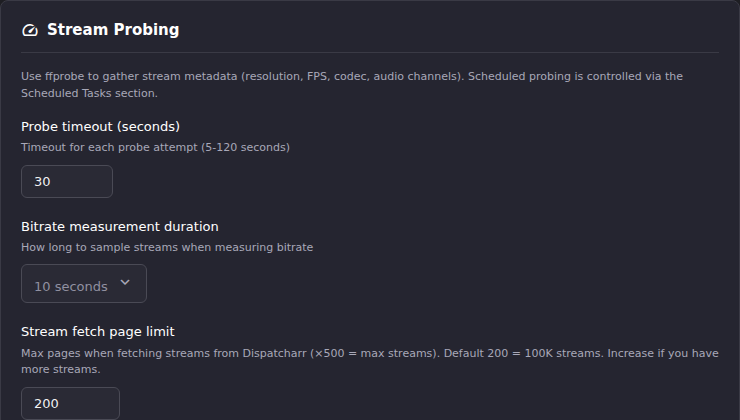

# Maintenance

Maintenance, under **Upkeep** in the Settings navigation, is the largest
single settings page: nine sections covering stream probing configuration
and a set of scan-and-clean diagnostic tools. Scheduled probing itself is
controlled from [Scheduled Tasks](scheduled-tasks.md); this page configures
*how* a probe behaves and hosts the cleanup tools that act on probe
results.

## Common tasks

### Tune stream probing before running one

1. Go to **Settings → Maintenance**.
2. Under **Stream Probing**, adjust the fields you need: **Probe timeout**,
   **Max concurrent probes** (match this to your lowest M3U provider
   connection limit to avoid rate limiting), **Profile distribution
   strategy**, and whether to **Refresh M3Us before probing** or run
   **Black screen detection**.
3. Save.
4. Trigger the actual probe from [Scheduled Tasks → Stream
   Probe](scheduled-tasks.md) (Run Now) or from wherever else your workflow
   starts one.

**Result:** The next probe run uses the updated settings. **Reflect stream
stats to Dispatcharr**, if enabled, also pushes resolution/codec/fps/bitrate
back to Dispatcharr after each successful probe.

### Recover from a stuck probe

1. Go to **Settings → Maintenance**.
2. Under **Reset Probe State**, click **Reset Stuck Probe** if a probe
   appears hung (for example, the browser was closed mid-probe).

**Result:** The stuck probe state clears and you can start a new probe.
**Clear All Probe Stats** on the same card wipes historical probe
statistics entirely. That's a separate, more destructive action.

### Find and remove channel groups with nothing in them

1. Go to **Settings → Maintenance**.
2. Under **Orphaned Channel Groups**, click **Scan for Orphaned Groups**.
3. Review the results (these are groups with no M3U account and no
   content, typically leftovers from a deleted M3U account) and remove
   the ones you don't need.

**Result:** The orphaned groups you remove no longer appear in the Channel
Manager's group list.

### Set the strike threshold for repeatedly failing streams {#strike-rule}

1. Go to **Settings → Maintenance**.
2. Under **Strike Rule**, set **Strike threshold**: the number of
   consecutive probe failures before a stream is flagged as struck out. Set
   to 0 to disable striking entirely.
3. Save.
4. Click **Scan for Struck Out Streams** to see which streams currently
   meet the threshold, then bulk-remove them from channels if appropriate.

**Result:** Streams crossing the threshold in future probe runs are
flagged. The threshold is not retroactive to past probe history until you
re-scan.

### Flag streams that haven't been checked recently

1. Go to **Settings → Maintenance**.
2. Under **Stale Streams**, set **Not probed in (days)**.
3. Click **Scan for Stale Streams**.

**Result:** Streams last probed longer ago than the threshold, or never
probed, are flagged, along with any the provider itself now reports as no
longer listed. Unlike struck-out streams, a stale stream may still play
fine; it just hasn't been confirmed lately.

### Make auto-created channels visible everywhere

1. Go to **Settings → Maintenance**.
2. Under **Auto-Created Channels**, click **Scan for Auto-Created
   Channels**.
3. Convert the ones you want to keep from auto-created to manual.

**Result:** Converted channels are no longer hidden from the Channel
Manager when their group doesn't have Auto Channel Sync enabled.

### Run a read-only diagnostic on your channel groups

1. Go to **Settings → Maintenance**.
2. Under **Channel Groups Diagnostic**, click **Run Diagnostic**.

**Result:** A report of duplicate group names, stale hidden-group records,
and channels whose group reference doesn't resolve. This is the same data
the debug bundle generator writes, without generating a full bundle.

## Going deeper

- [Scheduled Tasks](scheduled-tasks.md): where probing, struck-stream cleanup, and other maintenance tasks are actually scheduled and run.
- [General Settings](general-settings.md): the App Debug Bundle, which includes the Channel Groups Diagnostic output.
- [`docs/api.md`](https://github.com/MotWakorb/enhancedchannelmanager/blob/main/docs/api.md): API reference for the maintenance and probing endpoints.
