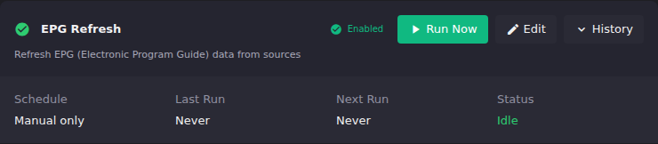

# Scheduled Tasks

Scheduled Tasks, under **Upkeep** in the Settings navigation, lists every
recurring job ECM can run and gives each one the same set of controls: a
status badge, Run Now, Edit, and an expandable History panel. On the
instance this was written against, there are 17 tasks: EPG Refresh, M3U
Refresh, M3U Change Monitor, Database Cleanup, Stream Probe, M3U Change
Digest, Popularity Calculation, Auto-Create Channels, Dummy EPG Refresh,
Re-probe Failed Streams, Struck Stream Cleanup, Black Screen Scan, YAML
Backup, Stats v2 Rollup & Prune, DBAS Backup, DBAS Restore, and Journal
Noise Purge. Because every task shares the same card layout, the tasks
below are generic. They apply to whichever task you're looking at.

## Common tasks

### Run a task immediately, without waiting for its schedule

1. Go to **Settings → Scheduled Tasks**.
2. On the task's card, click **Run Now**.

**Result:** The task's **Status** changes from Idle while it runs. **Last
Run** updates once it completes. Some tasks (Stream Probe) don't expose Run
Now here. Trigger those from their own page instead.

### Change how often a task runs, or turn it off

1. Go to **Settings → Scheduled Tasks**.
2. On the task's card, click **Edit**.
3. Adjust the schedule, or disable the task entirely.
4. Save.

**Result:** The card's status badge and **Schedule**/**Next Run** fields
update to reflect the change. A disabled task shows a paused-circle badge
and **Next Run: Disabled**.

### Check whether a task's last few runs succeeded

1. Go to **Settings → Scheduled Tasks**.
2. On the task's card, click **History**.

**Result:** The panel expands to show recent runs with their outcome. Use
this before assuming a task is broken. **Last Run: Never** on a
manual-only task just means nobody has run it yet, not that it's failing.

## Reference: what each task does

| Task | Purpose |
|-|-|
| EPG Refresh | Refresh EPG data from configured sources. |
| M3U Refresh | Refresh M3U playlists from providers. |
| M3U Change Monitor | Watch M3U playlists for external changes. |
| Database Cleanup | Clean up old probe history, task execution history, and journal entries. |
| Stream Probe | Probe streams to collect metadata (resolution, bitrate, codecs). See [Maintenance](maintenance.md) for the probing settings themselves. |
| M3U Change Digest | Send the email/Discord digest configured on [M3U Change Digest](m3u-digest.md). |
| Popularity Calculation | Calculate channel popularity rankings from watch history. |
| Auto-Create Channels | Automatically create channels from streams based on your Channel Pipeline rules. |
| Dummy EPG Refresh | Regenerate ECM's dummy EPG data and refresh it in Dispatcharr. |
| Re-probe Failed Streams | Re-probe only streams that previously failed or timed out. |
| Struck Stream Cleanup | Remove struck-out streams from channels. See [Maintenance](maintenance.md#strike-rule) for the strike threshold. |
| Black Screen Scan | Scan already-probed streams for black screens without re-probing them. |
| YAML Backup | Export ECM configuration as YAML to `/config/backups/`. See [Backup & Restore](../backup-restore/index.md). |
| Stats v2 Rollup & Prune | Aggregate the previous day's telemetry into daily rollups, then prune raw rows past the retention window. |
| DBAS Backup | Build a redacted, sealed backup artifact. See [Backup & Restore](../backup-restore/index.md). |
| DBAS Restore | Restore a DBAS backup artifact (dry-run by default). See [Backup & Restore](../backup-restore/index.md). |
| Journal Noise Purge | Purge automated-noise journal entries past the retention window; operator-initiated entries are untouched. |

## Going deeper

- [Maintenance](maintenance.md): the probing, strike, and stale-stream settings several of these tasks act on.
- [Backup & Restore](../backup-restore/index.md): the YAML/DBAS backup and restore tasks in full detail.
- [`docs/api.md`](https://github.com/MotWakorb/enhancedchannelmanager/blob/main/docs/api.md): API reference for reading or triggering scheduled tasks programmatically.
