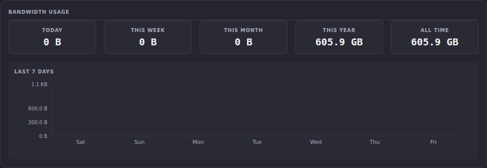
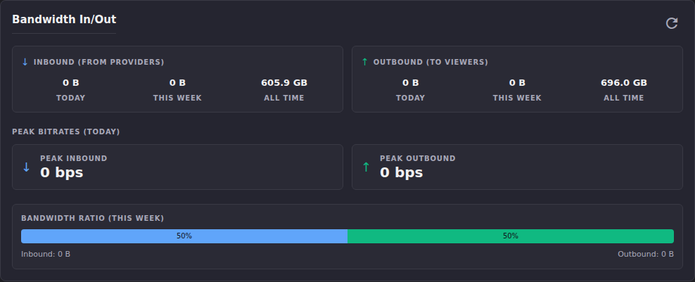

# Stats: Bandwidth

Stats has two bandwidth sections that answer the same underlying
question from different angles: **Bandwidth Usage** gives you the
headline totals and a 7-day trend chart, and **Bandwidth In/Out** breaks
the same window down into inbound (from providers) vs. outbound (to
viewers) with peak bitrates. Both read from ECM's original bandwidth
pipeline (`BandwidthDaily` / `ChannelBandwidth`). This predates the
Stats v2 `session_telemetry` pipeline and is **not** affected by the
`ECM_STATS_TELEMETRY_OPT_OUT` flag described in
[Stats v2 history cutover](stats-v2-history-cutover.md): these two
panels keep recording even with Stats v2 fully disabled.

## Common tasks

### Check today's and this week's usage at a glance

1. Scroll to **Bandwidth Usage** (`#stats-section-bandwidth-usage`).
2. Read the five totals: **Today**, **This Week**, **This Month**,
   **This Year**, **All Time**, and the **Last 7 Days** bar chart below
   them (today's bar is highlighted in a different color than the
   other six days).

   

**Result:** a fast read on whether bandwidth use is trending up or flat.
**On this instance:** Today, This Week, and This Month all read 0 B,
reflecting no recent transfer, while This Year and All Time show 605.9 GB,
meaning the total is historical (accumulated before the most recent
week) rather than current activity. The 7-day chart's Y-axis maxing out
at 1.1 KB confirms the same thing visually: this window has essentially
no recent bytes to show.

### Break usage into inbound vs. outbound, and check peak bitrates

1. Scroll to **Bandwidth In/Out** (`#stats-section-bandwidth-panel`).
2. Compare the **Inbound (from providers)** and **Outbound (to
   viewers)** cards. Each shows Today / This Week / All Time.
3. Check **Peak Bitrates (Today)** for the highest inbound and outbound
   bitrate ECM observed today.
4. Read the **Bandwidth Ratio (This Week)** bar for the inbound:outbound
   split over the last 7 days.

   

**Result:** a provider-vs-viewer breakdown of the same totals shown in
Bandwidth Usage. Outbound All Time (696.0 GB) is higher than Inbound All
Time (605.9 GB) here because outbound also includes ECM's own
transcoding/remux overhead on top of what it pulled in.
**On this instance:** Today and This Week are 0 B on both sides and Peak
Bitrates read 0 bps, reflecting no traffic in the current window, so the
ratio bar falls back to its 50/50 default (it can't compute a real split
from zero bytes). Refresh with the button in the panel's top-right corner to
re-pull the latest numbers without reloading the page.

## Going deeper

- [Stats v2 history cutover](stats-v2-history-cutover.md): why these
  two panels are unaffected by the Stats v2 telemetry opt-out, and what
  "legacy" vs. "Stats v2" means for this page.
- [Enhanced Statistics](enhanced-statistics.md): per-channel bandwidth
  breakdown, if the question is "which channel" rather than "how much
  total."
- [`docs/api.md`](https://github.com/MotWakorb/enhancedchannelmanager/blob/main/docs/api.md#enhanced-stats): the API reference both panels' data is available through, useful if you want to query it programmatically instead of through the UI.
