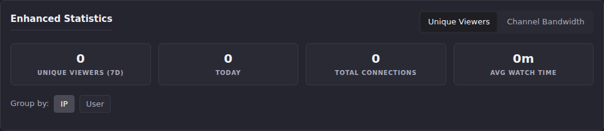

# Stats: Enhanced Statistics

**Enhanced Statistics** (`#stats-section-enhanced`) is a two-view panel:
**Unique Viewers** counts distinct viewers over a rolling 7-day window,
and **Channel Bandwidth** ranks channels by bandwidth, connection count,
or watch time over the same window. It's one of ECM's original stats
panels (introduced in v0.11.0, before the Stats v2 `session_telemetry`
pipeline existed).

## Common tasks

### Check how many distinct viewers watched in the last 7 days

1. Scroll to **Enhanced Statistics** and make sure **Unique Viewers** is
   selected (it's the default view).
2. Read the four stat cards: **Unique Viewers (7d)**, **Today**,
   **Total Connections**, **Avg Watch Time**.
3. Toggle **Group by: IP / User** to switch between counting distinct IP
   addresses and counting distinct usernames (usernames collapse a
   viewer across multiple IPs; IP grouping is the fallback for
   unauthenticated or unresolved viewers).

   

**Result:** when there's viewing activity, this also renders a **Daily
Unique Viewers** line chart and two ranked lists: **Top Viewers by
Connections** and **Channels by Unique Viewers**, both scoped to the
last 7 days and respecting the IP/User grouping toggle.
**On this instance:** all four stat cards read 0. There's been no
viewing activity in the last 7 days, so the chart and the two ranked
lists don't render at all (they only mount when there's at least one
row to show).

### Rank channels by bandwidth, connections, or watch time

1. Click **Channel Bandwidth** to switch views.
2. Use **Sort by: Bandwidth / Connections / Watch Time** to change what
   the bar chart and list below it rank on.

**Result:** a bar chart (top 10 channels) plus a full ranked list with
Bandwidth, Connections, and Watch Time columns per channel, all over the
last 7 days. **On this instance:** switching to Channel Bandwidth shows
"No channel bandwidth data available yet." instead. This is consistent
with the Unique Viewers view, since both draw on the same 7-day activity
window and this instance has no recent watch activity.

## Going deeper

- [Bandwidth](bandwidth.md): the account-wide (not per-channel)
  bandwidth totals, if the question is "how much total" rather than
  "which channel."
- [Metric glossary](metric-glossary.md): Stats v2's `total_watch_seconds`
  and `provider_id` definitions, for comparison with this panel's
  independent (pre-Stats-v2) watch-time and connection counting.
- [`docs/api.md`](https://github.com/MotWakorb/enhancedchannelmanager/blob/main/docs/api.md#enhanced-stats): the API reference for this panel's data, useful if you want to query it programmatically instead of through the UI.
