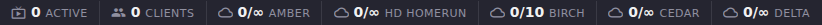

# Stats: Overview, Top Watched, and Channel Drill-Down

The top of the Stats page answers *what is ECM doing right now*: which
channels have active viewers, what just happened (connects, disconnects,
buffering, errors), and which channels earn the most watch time. This
page covers those three sections plus the per-channel detail view you
reach by drilling into any live channel.

## Common tasks

### Check what's streaming right now

1. Open **Stats** in the left navigation.
2. Look at the live-counts strip at the top of the page: **Active**
   (channels currently streaming), **Clients** (connected viewers), and
   one badge per M3U provider showing its current/max connection count.

   

   Above six providers, ECM switches this strip to a condensed table so
   providers don't scroll out of view (same data, denser layout).
3. If any channel has an active viewer, it appears as a card under
   **Active Channels** (`#stats-section-active-channels`), with client
   count, bitrate, FFmpeg speed, FPS, resolution, uptime, and total data
   transferred. Click the expand arrow on a card for FFmpeg speed / data
   transfer graphs and a full video/audio/stream/performance detail grid.

**Result:** the live-counts strip always renders, even at zero, as
shown above. If no channel currently has a viewer, the Active Channels
list is replaced by an empty-state message:

**On this instance:** no channel had an active viewer at verification
time, so the screenshot above is the empty state, not a populated
channel card. The card layout (logo, channel number, name, stream
badge, state, Quick Stats row, expand-to-graphs) is accurate from the
component source but was not itself rendered with live data.

### Drill into one live channel for detail

1. On any Active Channels card, click the **query_stats** icon (View
   details) in the card's action row.
2. A modal opens with two sections: **Popularity** (score, rank, 7-day
   watch count, 7-day unique viewers, trend) and **Live Stream Detail**,
   a raw key/value dump of Dispatcharr's live stream status for that
   channel. The Live Stream Detail section is intentionally unstructured
   passthrough data (Dispatcharr's shape isn't a fixed contract ECM can
   promise field names for); the Popularity section is a stable,
   designed summary.

**Result:** a channel with no popularity score yet shows "No popularity
score calculated yet for this channel." instead of the score grid. See
[Find out which channels get watched the most](#find-out-which-channels-get-watched-the-most)
below for how that score gets calculated.

> **Not independently screenshot-verified.** No channel had an active
> viewer on this instance, so there was no drill-down trigger to click and
> the description above has not been confirmed against a live render.

### Watch recent activity

1. Scroll to **Recent Events** (`#stats-section-recent-events`).
2. Use the event-type filter (All Events, Channel Start, Channel Stop,
   Client Connect, Client Disconnect, Buffering, Errors) to narrow the
   list.

**Result:** each row shows a relative timestamp, an icon + label for the
event type, and a message that includes the channel name and (when
known) the connecting/disconnecting username or IP. **On this
instance:** the Recent Events section did not render at all. It only
mounts once at least one streaming-related event exists, and none had
occurred at verification time.

### Find out which channels get watched the most

1. Scroll to **Top Watched Channels** (`#stats-section-top-watched`).
2. Toggle **By Views** (times watched) or **By Time** (total watch
   duration) to change the ranking.

**Result:** a ranked list, `#1` through `#10`, of the channels with the
most watch activity. **On this instance:** this section did not render.
Like Recent Events, it only mounts once ECM has at least one
top-watched channel to show, and this instance has none.

## Going deeper

- [Metric glossary](metric-glossary.md): precise definitions for the
  Stats v2 numbers that feed the Popularity drill-down (`session_count`,
  `total_watch_seconds`).
- [Popularity](popularity.md): the full Popularity Rankings panel this
  drill-down's score comes from.
- [Providers](providers.md): per-provider connection badges in the
  live-counts strip are the same attribution the Providers panel charts
  by provider.
- [`docs/api.md`](https://github.com/MotWakorb/enhancedchannelmanager/blob/main/docs/api.md#enhanced-stats): the API reference for this panel's data and the stop/stop-client actions behind the channel card buttons, useful if you want to query or trigger these programmatically instead of through the UI.
