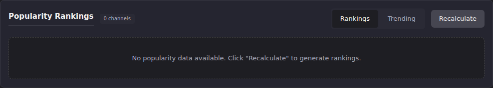

# Stats: Popularity Rankings

**Popularity Rankings** (`#stats-section-popularity`) scores every
channel using a blend of 7-day watch count, watch time, unique viewers,
and bandwidth, then ranks them and tracks whether each channel's score
is rising, falling, or holding steady compared to its previous
calculation. This is the same score shown in the
[channel drill-down modal](overview-top-watched.md#drill-into-one-live-channel-for-detail).

## Common tasks

### Generate or refresh the rankings

1. Scroll to **Popularity Rankings**.
2. Click **Recalculate**. This triggers a fresh scoring pass over the
   last 7 days of activity; a notification reports how many channels
   were scored, how many are new, and how many were updated.

   

**Result:** with viewing activity in the last 7 days, **Rankings**
populates with one row per channel: rank, name, trend arrow with
percent change, and a score bar. Click a row to expand watch count,
watch time, unique viewers, bandwidth, and (if this isn't the channel's
first scoring pass) its previous rank.
**On this instance:** clicking Recalculate against this instance's live
data still produced "No popularity data available." There has been no
watch activity in the last 7 days for any channel to score, so
recalculating has nothing to compute from. The screenshot above is that
verified empty state, not a stale or unrendered one.

### Check which channels are trending up or down

1. Click the **Trending** toggle (next to Rankings).
2. Read the two columns: **Trending Up** and **Trending Down**, each
   ranked by the size of the percent change since the previous
   calculation.

**Result:** the 10 fastest-rising and 10 fastest-falling channels,
side by side. **On this instance:** both columns read "No channels
trending up" / "No channels trending down." Trend requires at least
two scoring passes with a channel present in both, and this instance
has no scored channels yet.

## Going deeper

- [Overview, Top Watched, and Channel Drill-Down](overview-top-watched.md):
  the per-channel modal that surfaces one channel's popularity score
  without opening this panel.
- [Metric glossary](metric-glossary.md): how the underlying watch-count
  and watch-time numbers are computed.
- [`docs/api.md`](https://github.com/MotWakorb/enhancedchannelmanager/blob/main/docs/api.md#popularity): the API reference for popularity rankings, trending, and score calculation, useful if you want to query or trigger these programmatically instead of through the UI.
