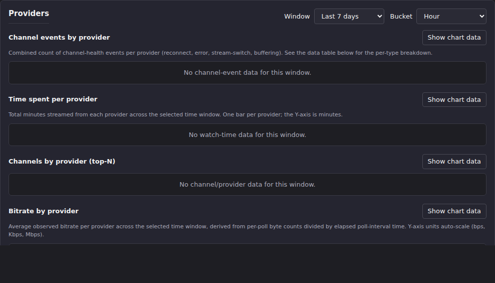

# Stats: Providers

Stats has two provider-focused sections. **Providers** is admin-only
viewing telemetry: buffering/reconnect/error events, watch time,
top channels, and bitrate, all broken out per provider over a
configurable time window. **Provider Stream Usage** is a different kind
of data entirely: not viewing telemetry but *catalog* data (how many of
each provider's streams are actually assigned to a channel), and it's
visible to any operator, not just admins.

## Common tasks

### Check per-provider health over a time window (admin)

1. Scroll to **Providers** (`#stats-section-providers`).
2. Set **Window** (Last 7 / 30 / 90 days) and **Bucket** (Hour / Day) to
   control the range and granularity of every chart below.
3. Read the four charts, each with a **Show chart data** toggle that
   reveals the exact numbers behind the lines/bars in a table:
   - **Channel events by provider**: combined reconnect + error +
     stream-switch + buffering counts per provider, per time bucket.
   - **Time spent per provider**: total minutes streamed from each
     provider in the window.
   - **Channels by provider (top-N)**: which channels are pulling from
     which provider, with the latest stream and bytes transferred.
   - **Bitrate by provider**: average observed bitrate per provider per
     time bucket.

   

**Result:** a per-provider view of the same data the
[metric glossary](metric-glossary.md) defines: `buffer_event_count`,
`bitrate_bps`, and `provider_id` (with its "Unknown" bucket for
observations that couldn't be attributed to a provider). A sustained
rise in a provider's Channel events chart, or a sustained drop in its
Bitrate chart, is the signal that provider is degrading.
**On this instance:** all four charts read "No data for this window" at
the default 7-day/hourly setting. No Stats v2 telemetry has been
recorded yet. **This panel requires admin access.** A non-admin
account sees "Provider statistics require admin access." instead of the
charts; the account used to verify this page (`e2e_test`) is an admin,
so the empty state above is the real no-data state, not the admin gate.

### See how much of a provider's catalog is actually used

1. Scroll to **Provider Stream Usage** (`#stats-section-provider-stream-usage`).
2. Click any column header to sort by it (**Assigned streams**, **Total
   assignments**, **Total streams**, or **Utilization**); click again to
   flip direction.

   

**Result:** one row per M3U provider, answering "of everything this
provider offers, how much did I actually put into a channel?"
**Assigned streams** counts each stream once even if it's reused across
multiple channels; **Total assignments** counts every channel membership
(so a stream reused 3 times counts 3 times); **Total streams** and
**Utilization** give the provider's full catalog size and the
assigned/total ratio, for scale.
**On this instance:** this table is populated with real data. For
example, a lightly-used provider might show 100 assigned streams (100
total assignments, so no stream is reused across channels) out of a
10,000-stream catalog: about 1% utilization. Two other providers in the
same table could show 0 assigned streams despite carrying catalogs of
similar size: their entire catalog sits unused. Unlike the Providers
panel above, this table needs no admin access. It's configuration data
(stream-to-channel assignments), not viewing telemetry, so it carries
the same trust tier as the Active Channels section on the
[overview](overview-top-watched.md#check-whats-streaming-right-now).

## Going deeper

- [Overview, Top Watched, and Channel Drill-Down](overview-top-watched.md):
  the per-provider connection badges in the live-counts header use the
  same provider attribution these panels chart historically.
- [Metric glossary](metric-glossary.md): `provider_id`, the "Unknown"
  bucket, `buffer_event_count`, and `bitrate_bps` definitions.
- [Bandwidth](bandwidth.md): account-wide bandwidth totals, if the
  question is "how much total" rather than "which provider."
