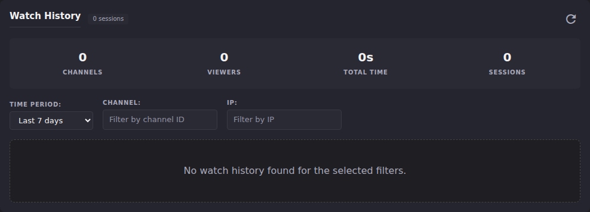

# Stats: Watch History

**Watch History** (`#stats-section-watch-history`) is a paginated log of
individual viewing sessions: one row per connect-to-disconnect (or
still-connected) session, filterable by time period, channel, or IP
address. Use it when a summary count isn't enough and you need to see
the actual sessions behind it.

## Common tasks

### Filter the log by time period, channel, or IP

1. Scroll to **Watch History**.
2. Set **Time Period** (Last 24 hours / 7 days / 30 days / 90 days / All
   time; defaults to 7 days).
3. Optionally narrow by **Channel** (channel ID) or **IP**.
4. A **Clear Filters** button appears once any filter differs from the
   default, resetting Time Period to 7 days and clearing Channel/IP.

   

**Result:** the summary row above the filters (**Channels**,
**Viewers**, **Total Time**, **Sessions**) updates to match whatever the
current filters return, and the table below lists matching sessions:
Time, Channel, User, Viewer IP, Duration, and Status (**Watching** for
an open session, **Completed** for a closed one).
**On this instance:** the default 7-day filter returns zero sessions:
"No watch history found for the selected filters." This matches the
zeroed summary row shown above.

### Inspect one session in detail

1. Click any row in the table to expand it.
2. The expanded row shows exact connect/disconnect timestamps, the raw
   channel ID, the user ID (if attributed), and the session's date.
3. Use the **Filter by Channel** or **Filter by IP** buttons inside the
   expanded row to jump straight to every other session on that same
   channel or from that same IP.

**Result:** a one-click path from a single session to "show me
everything else like this." **On this instance:** there were no rows to
expand, so this step has not been confirmed against a live render.

## Going deeper

- [Metric glossary](metric-glossary.md): how `total_watch_seconds` and
  `session_count` are computed from the same underlying poll
  observations this log lists individually.
- [Users panel](users-panel.md): per-user totals, if you want a summary
  by viewer rather than a session-by-session log.
- [`docs/api.md`](https://github.com/MotWakorb/enhancedchannelmanager/blob/main/docs/api.md#enhanced-stats): the API reference for this log
  (paginated, filterable by channel/IP/days, includes user attribution), useful if you want to query it programmatically instead of through the UI.
