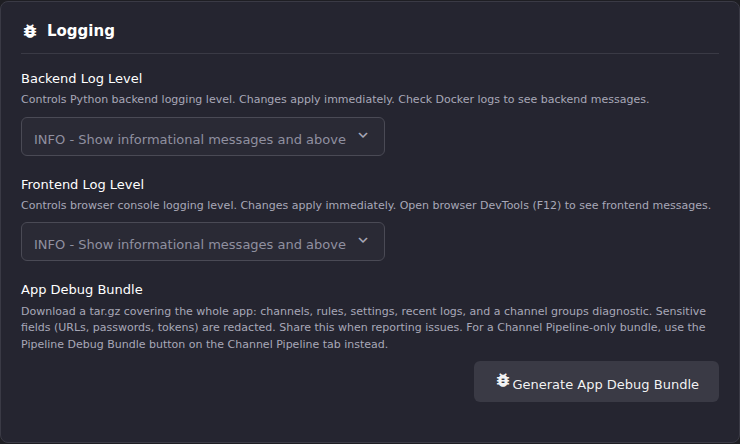

# Read the Logs

ECM's logs are the primary diagnostic surface. This article gets you from
"something is wrong" to the handful of lines that explain it.

## Where the logs are

ECM writes everything to the container's standard output. There is no log file
inside the container to go looking for.

```bash
# The last 200 lines
docker logs --tail 200 <container>

# Everything since a point in time
docker logs --since 30m <container>

# Follow live
docker logs -f <container>
```

Two of these matter more than the rest in practice. `--since` is what you want
when you know roughly when the problem happened, and `--tail` is what you want
when it is happening now. ECM is chatty at `INFO`, so an unbounded `docker logs`
on a long-running container will return more than you can read.

Log output goes to stderr as well as stdout, so redirect both when you pipe:

```bash
docker logs --since 1h <container> 2>&1 | grep ERROR
```

## The line format

Application log records are emitted as **one JSON object per line**:

```json
{"ts":"2026-08-02T02:02:27.248Z","level":"WARNING","logger":"main","msg":"[RAPID-POLLING] GET /api/notifications hit 20 times in 10s - possible polling issue!","trace_id":"b651b014-9600-4e34-91b3-d827e1b11845"}
```

Five fields are always present:

| Field | What it is |
|-|-|
| `ts` | UTC timestamp, millisecond precision. |
| `level` | `DEBUG`, `INFO`, `WARNING`, `ERROR`, or `CRITICAL`. |
| `logger` | The module that emitted the record, for example `main`, `database`, `bandwidth_tracker`. |
| `msg` | The message, usually starting with a `[TAG]` (see below). |
| `trace_id` | Correlation id for the request that produced the record, or `-` for records outside a request. |

Records can carry extra fields beyond those five. Request records from the
`ecm.access` logger, for example, add the method, path, status, and duration as
their own keys, so you can read them without parsing the message text:

```json
{"ts":"2026-08-02T02:02:26.221Z","level":"INFO","logger":"ecm.access","msg":"GET /api/notifications -> 200 in 3.5ms","trace_id":"1c717fa7-2d60-46e6-b20f-b023bcb58a7b","event":"http_request","method":"GET","path":"/api/notifications","status":"200","duration_ms":3.49}
```

Not everything in the stream is JSON. Two other shapes appear:

- **Startup preflight output**, which is plain coloured text printed before the
  application starts. This is where `All preflight checks passed!` and the
  per-check `✓` / `✗` lines live.
- **uvicorn's own lines**, which are plain text with no tag. The access line
  `INFO:     127.0.0.1:34330 - "GET /api/notifications HTTP/1.1" 200 OK` and the
  warning `Exceeded concurrency limit.` both come from uvicorn, not from ECM.

## Severity levels, and what they mean here

| Level | What ECM uses it for |
|-|-|
| `DEBUG` | Per-request timing, evaluation traces. Off by default; expensive to leave on. |
| `INFO` | Normal operation: startup, task starts and completions, request access lines, slow-request notices. |
| `WARNING` | Something is off but ECM carried on: a rejected regex, a rate-limited endpoint, a failed metric emit. |
| `ERROR` | An operation failed. Usually accompanied by an `exc_info` field carrying the traceback. |
| `CRITICAL` | Rare. Treat as an incident. |

A `WARNING` is not automatically a problem to chase. `INFO` and `WARNING` are
where ECM narrates itself; `ERROR` is where it admits something did not work.
When triaging an unfamiliar failure, filter to `ERROR` first:

```bash
docker logs --since 1h <container> 2>&1 | grep '"level":"ERROR"'
```

## Changing the log level

Two levels are configurable from the UI, on **Settings → General** under
**Logging**. Both apply immediately, with no restart.



- **Backend Log Level** controls what reaches the container logs.
- **Frontend Log Level** controls what reaches the browser console. Open your
  browser's developer tools (F12) to see those.

The backend level also has an environment-variable seed, `LOG_LEVEL`, read at
startup and defaulting to `INFO`. The saved setting takes over once ECM starts,
so use the UI for a running instance and the environment variable only when you
need debug output from startup itself.

Turn `DEBUG` back off when you are done. At `DEBUG` the backend logs a record
per request, which will bury the thing you are looking for on any instance with
real traffic. Two loggers stay pinned at `WARNING` regardless of your setting,
deliberately: SQLAlchemy and `httpcore`, both of which would otherwise dump
every query and every socket operation.

## The `[TAG]` convention

Almost every ECM log message begins with a bracketed uppercase tag naming the
subsystem. Grepping for a tag is the fastest way to narrow a large log to one
concern:

```bash
docker logs --since 6h <container> 2>&1 | grep '\[AUTO-CREATE-ENGINE\]'
```

The tags you are most likely to need:

| Tag | Subsystem |
|-|-|
| `[MAIN]` | Application startup and lifecycle. |
| `[CONFIG]` | Settings loading and validation. |
| `[DATABASE]` | SQLite: migrations, integrity checks, WAL checkpoints. |
| `[HEALTH]` | Readiness transitions and readiness sub-check failures. |
| `[DISPATCHARR]` | Calls out to Dispatcharr. |
| `[SETTINGS]` / `[SETTINGS-TEST]` | Settings writes, and the Test Connection probes. |
| `[M3U]`, `[M3U-REFRESH]`, `[M3U-CHANGE]` | Provider playlist fetch, refresh, and change detection. |
| `[EPG]`, `[EPG-REFRESH]`, `[EPG-MATCH]` | EPG sources, refreshes, and channel matching. |
| `[AUTO-CREATE]`, `[AUTO-CREATE-ENGINE]`, `[AUTO-CREATE-EXEC]`, `[AUTO-CREATE-EVAL]` | The Channel Pipeline. These tags predate the current name; the feature is the same one. |
| `[EVENT-SYNC]` | Event Sync rules. |
| `[NORMALIZE]` | The normalization engine. |
| `[CHANNELS]`, `[CHANNELS-BULK]`, `[GROUPS]` | Channel and group writes. |
| `[STREAM-PROBE]`, `[STREAM-STATS]` | Stream probing and probe results. |
| `[TASKS]`, `[TASK-ENGINE]`, `[TASK-REGISTRY]` | The scheduled-task engine. |
| `[ALERTS]`, `[ALERTS-SMTP]`, `[ALERTS-DISCORD]`, `[ALERTS-TELEGRAM]` | Alert dispatch, per destination. |
| `[BACKUP]`, `[DBAS-RESTORE]`, `[DBAS_SYNC]` | Backup, restore, and cross-instance sync. |
| `[JOURNAL]` | Journal writes. |
| `[SAFE_REGEX]` | The regex safety guard (see below). |
| `[CLIENT-ERROR]` | Errors reported by the browser, when error telemetry is on. |

## Four messages worth recognising

### `[SAFE_REGEX]`

ECM runs user-supplied regular expressions through a guard that refuses patterns
which are too long or which take too long to evaluate. When the guard fires it
emits a `WARNING`:

```
[SAFE_REGEX] pattern timed out pattern_sha256=... pattern_excerpt='...' text_len=... timeout_ms=... caller=...
[SAFE_REGEX] oversize pattern rejected pattern_sha256=... pattern_excerpt='...' text_len=... pattern_len=... max_pattern_len=...
```

The **full pattern is deliberately never logged**, because patterns can contain
text ECM did not author. You get a SHA-256 for cross-referencing and a
50-character excerpt. If you see this, one of your rule conditions has a
pathological pattern: find it by the excerpt, and simplify it.

### `[RAPID-POLLING]`

```
[RAPID-POLLING] GET /api/notifications hit 20 times in 10s - possible polling issue!
```

An endpoint is being called far more often than expected. In normal use this
usually means a browser tab is stuck in a refresh loop; reloading the page
clears it. If it persists with no browser open, report it.

### `[SLOW-REQUEST]`

```
[SLOW-REQUEST] GET /api/channels took 3421.7ms
```

Emitted at `INFO` for any request taking more than one second. One of these
during a large refresh is normal. A steady stream of them is the signal to read
the [request-timeout runbook](https://github.com/MotWakorb/enhancedchannelmanager/blob/main/docs/runbooks/request-timeout.md) in the ECM
repository.

### `Exceeded concurrency limit.`

Not an ECM message at all: this is uvicorn refusing a request with a 503 because
too many were in flight at once. It is the tell for the reverse-proxy burst
problem described in
[Common Issues](common-issues.md#requests-fail-in-bursts-behind-a-reverse-proxy).

## Following one request through the logs

Every request gets a `trace_id`, and every log record produced while handling
that request carries it. That makes a failing request tractable even in a busy
log: find any one line from it, then filter on its id.

```bash
docker logs --since 15m <container> 2>&1 | grep '3152e6b5-6e18-4cef-88a3-20d771fe0082'
```

The same value is returned to the browser in the `X-Request-ID` response header,
so you can pull it from your browser's network panel for a request that failed
in the UI, then search the container logs for exactly that request. Records
produced outside a request context carry `trace_id: "-"`.

## If manual triage is too slow

The repository ships an agent command, `logs`, that reads either the live
container logs or a captured log file and produces a triage summary: error
grouping, tag breakdown, and anomalies. It is available to operators running
Claude Code against a checkout of the ECM repository. It is a convenience over
the same `docker logs` output described above, not a separate source of truth.

## Before you paste a log excerpt anywhere

ECM's logs can contain your Dispatcharr hostname, internal IP addresses, and
provider account names. Stream URLs can carry credentials in the query string.
Scrub those before pasting into an issue, a chat, or anywhere else public. The
App Debug Bundle does this scrubbing for you; see
[Gather support information](gather-support-information.md).

## Going deeper

- [Common Issues](common-issues.md): the failure modes these tags usually accompany.
- [General Settings](../settings/general-settings.md): the Logging controls in their own settings context.
- [Gather support information](gather-support-information.md): turning a log slice into a support request.
- [`docs/runbooks/`](https://github.com/MotWakorb/enhancedchannelmanager/blob/main/docs/runbooks/README.md): what to do when the log tells you something is broken at scale.
