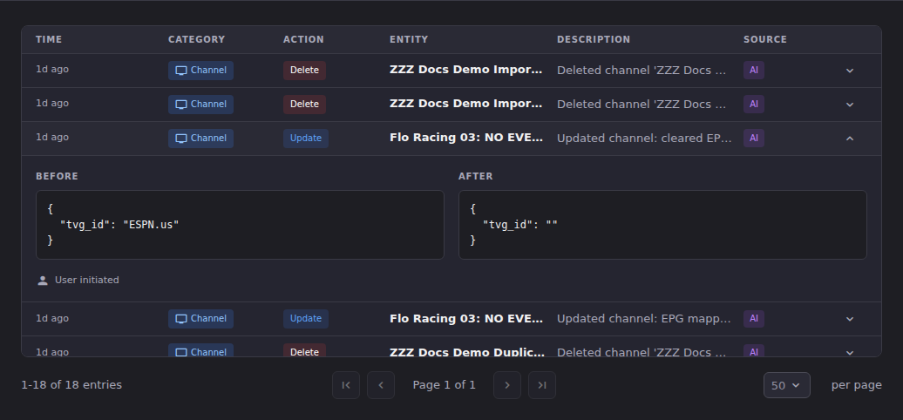

# Recovery Patterns

"I made a change I want to undo." This article tells you which recovery
mechanism applies, and, just as importantly, when none of them do.

Read the next section before you start clicking. ECM has real undo in some
places and none at all in others, and knowing which you are in changes what you
should do next.

## Pick the right mechanism

| What you did | What to reach for |
|-|-|
| Edited or renumbered channels in the workspace, in this browser session | [Undo and redo](#undo-and-redo-in-channel-manager) |
| Staged edits in Edit Mode and have not committed them | [Discard staged changes](#discard-staged-changes) |
| Ran the Channel Pipeline and it did the wrong thing | [Undo a pipeline run](#undo-a-pipeline-run) |
| Applied normalization to existing channels | No undo. See [When there is no undo](#when-there-is-no-undo) |
| Merged or deleted channels | No undo. See [When there is no undo](#when-there-is-no-undo) |
| Anything else, or you are past the windows above | [Restore from a backup](#restore-from-a-backup) |
| You do not yet know what changed | [Read the Journal first](#find-out-what-changed-first) |

## Find out what changed first

Do not undo something until you know what it was. The **Journal** is ECM's
forensic record of channel, EPG, provider, task, Channel Pipeline, and Event Sync
changes. Filter it to the category and time window you care about, then expand an
entry to see the before and after values side by side.

Two columns carry most of the diagnostic weight: **Source**, which tells you
whether a change came from the UI, an automation, or an integration, and the
expanded before/after pair, which tells you the exact old value.

**The Journal is read-only.** There is no revert button on an entry, and there is
no endpoint behind one. Its role in recovery is to tell you the value to type
back in. For changes with no automated undo, that breadcrumb is the whole
recovery path.

See [Journal](../journal/index.md).

## Undo and redo in Channel Manager

Channel Manager keeps an undo history, up to 100 steps, for changes made in the
current browser session.

- **Undo** is Ctrl+Z (Cmd+Z on a Mac).
- **Redo** is Ctrl+Shift+Z (Cmd+Shift+Z).

The visible toolbar carrying these controls, along with **Create checkpoint** and
a **Checkpoints** list you can revert to, appears **only while Edit Mode is on**.
Outside Edit Mode the history still works, but only through the keyboard
shortcuts.

Two limits matter:

- **It is session-local.** Reloading the page or closing the browser discards the
  history and the checkpoints. This is not a durable undo log.
- **It covers what you did in the UI**, not what an automation did. A Channel
  Pipeline run is not on this stack.

## Discard staged changes

Edit Mode stages your changes rather than applying them immediately. While they
are still staged, discarding them is free and complete: choose **Cancel**, then
confirm at the **Discard Changes?** prompt, which tells you how many pending
changes will be lost.

Once you commit, this route is gone and you are into the mechanisms below.

## Undo a pipeline run

Open **Channel Pipeline** and look at **Execution History**.

Rows carry an action icon on the right when the run can be undone. Which one you
get depends on whether the run captured a snapshot before it started:

- **Undo this run** restores every channel the run touched to its pre-run state:
  its streams and its metadata. This is the good case.
- **Rollback** is the older mechanism, offered on runs that have no snapshot. It
  deletes the channels the run created and reverts the ones it modified, working
  from the run's own record of what it did.

Dry runs cannot be undone because they changed nothing.

### What undoing a pipeline run does not cover

Read this list before you rely on the undo.

- **It is an overwrite, not a merge.** Restoring a snapshot overwrites the
  current stream assignments of every channel in it with the state captured
  before the run. Anything that happened since, whether a manual edit, an
  automatic merge, or a Dispatcharr-side update, is lost. The confirmation
  dialog says so explicitly.
- **Channel-profile membership is not reversible.** If the run changed which
  channel profiles channels belong to, the undo will not put that back. ECM warns
  you about this on the run and in the confirmation.
- **The snapshot does not carry everything.** It records each channel's id, name,
  group, EPG mapping, tvg-id, and stream ids. It does not record logos or channel
  numbers, and it deliberately does not record stream URLs.
- **Snapshots expire.** They are pruned after 30 days, and only the 50 newest are
  kept, whichever limit is reached first.
- **The panel shows the five most recent runs.** An older run may still have a
  usable snapshot, but you will not see it here.
- **Dispatcharr group settings are not reverted.** If a run changed those, the
  Journal entry is your record of the old values.

Every one of these is a reason to check the Journal before undoing rather than
after.

## Restore from a backup

This is the general-purpose recovery mechanism, and the only one that covers the
cases with no targeted undo. It is also the most disruptive: a restore replaces
current settings, database records, and uploaded files, and the page reloads
when it finishes.

Restore entry points live on **Settings → Backup & Restore**:

| Card | Use it for |
|-|-|
| **Restore from YAML Export** | A selective, section-by-section restore of configuration. |
| **Saved Backups** | Backups ECM already holds on the server. |
| **Restore DBAS Backup** | An artifact you upload. Runs a dry run before applying, and accepts a passphrase for encrypted artifacts. |
| **Restore Full Backup** | A full ECM backup ZIP you upload. |

Two things to know before you start:

- **ECM does not take an automatic safety backup before a restore.** If the
  current state has anything in it you might want back, take a backup first.
- **Cloud targets are upload destinations only.** You cannot restore directly
  from one. Download the artifact, then use one of the paths above.

The DBAS path runs a compensating rollback if the restore itself fails partway,
which is not the same thing as being able to undo a restore that succeeded.
There is no undo for a successful restore.

See [Restore a Backup](../backup-restore/restore-a-backup.md) for the full
walkthrough, and [Troubleshoot a Restore](../backup-restore/troubleshoot-restore.md)
when one refuses.

## When there is no undo

These operations are irreversible in ECM. The only route back is a backup taken
before them.

| Operation | Why there is no undo |
|-|-|
| **Applying normalization to existing channels** | The renames are journaled with their before values, so you can read what each channel was called, but there is no bulk revert. The only undo in that flow is *before* you commit: the preview lets you revert individual rows to their original names. |
| **Merging channels** | Reversing a merge means recreating the source channel and re-linking its streams by hand. |
| **Deleting a channel** | There is no trash and no soft delete. Deleting is a hard delete in Dispatcharr. |
| **Removing struck-out streams** | The operation strips the stream from every channel that carried it and keeps no record of which channels those were. Re-adding is manual. |
| **Dismissing a pending merge** | Dismissal is final. Re-dismissing does nothing and accepting a dismissed pairing is refused. The recovery is to make detection produce the pairing again, not to un-dismiss. |
| **Converting auto-created channels to manual** | Nothing sets the auto-created flag back. |

Two habits make this list much less painful:

1. **Take a backup before any bulk operation.** Bulk normalization, bulk merges,
   and bulk deletes are exactly the operations with no undo, and they are also
   the ones that touch the most rows.
2. **Preview first.** The Channel Pipeline has a dry run, normalization has a
   preview, and the DBAS restore has a dry run. Each of them is cheaper than the
   recovery it prevents.

## Going deeper

- [Journal](../journal/index.md): filtering, reading a diff, and purging old entries.
- [Backup & Restore](../backup-restore/index.md): taking, verifying, and restoring backups.
- [Test a Rule (Dry Run)](../channel-pipeline/test-a-rule.md): the preview that avoids needing this article.
- [Common Issues](common-issues.md): if you are here because something broke rather than because you changed your mind.
